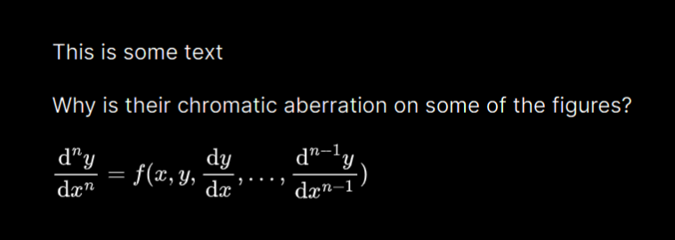
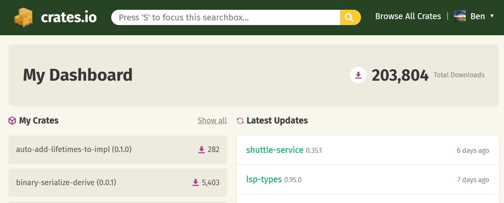

I thought a good way to see the year out would be to show some appreciation for some tools and projects that I think made the *good list* this year as well as some things I am looking for and forward to next year.

### Tools

#### Figma
Been using [Figma](https://www.figma.com/) as my main *graphics editor* for a little over a year now. Here are some things I think are well designed:
- Components for composition
- Simple controls (such as `k` for scaling, `space` for moving)
- The pencil drawing tool. **Although** I wish you could define the number of points it creates, I often want less vertices and detail and often get lag when there are a lot on the page.
- Auto layout options
- The outline/layers/elements panel. I like you can modify individual objects in unions and intersections.
- Plugins such as [lorem-ipsum](https://www.figma.com/community/plugin/736000994034548392/lorem-ipsum), [swap](https://www.figma.com/community/plugin/739493471028643540), [quick-tracing](https://www.figma.com/community/plugin/1161618766697969707) and for more advanced things [scripter](https://www.figma.com/community/plugin/757836922707087381)
- The free tier is enough to have infinite pages

I also have been learning more about at pen/Bézier tool. Did you know you can press `ctrl` to break out of a spline and also click on the node to get out of *curvy* mode/make one-sided influence.

<video src="../../media/demos/figma-bezier-tool.mp4" controls title="Figma"></video>{.small}

> Also a tip here: if you are exporting a design to After Effects. As After Effects can't import SVGs you can instead export a EPS using [this plugin](https://www.figma.com/community/plugin/849159306117999028) and then import that into After Effects and break into a shape layer to keep the vector-ness of the graphics.

#### Obsidian
[Obsidian is a markdown editor](https://obsidian.md/). It is what I am currently using to write what you are currently reading. I will skip to the key things I like
- LaTeX support. As someone who writes lots of mathematics notes it is great that I can do `$\Gamma (z)=\int _{0}^{\infty }t^{z-1}e^{-t}{\text{ d}}t$` and it renders inline in the editor as \Gamma (z)=\int _{0}^{\infty }t^{z-1}e^{-t}{\text{ d}}t
- Plugins and theming support
   	- [LaTeX shortcut plugin](https://github.com/artisticat1/obsidian-latex-suite) is a must-have for writing mathematical formulas. I don't think I can go back to writing latex character by character. [My snippets are here](https://gist.github.com/kaleidawave/9b332bfd6274862907d9db259fd8681f#file-snippets-jsonc)
   	- [Zen mode](https://github.com/Maxymillion/zen) is also great. Using Zen mode and full-screen seems to be the best non-distraction mode for writing
   	- [Surfing extension](https://github.com/PKM-er/Obsidian-Surfing) is also a great way to find things without tabbing between windows
   	- One of the benefits of it being built using Electron is the ability to easily add custom CSS for the UI. My [custom darker-than-dark CSS is here](https://gist.github.com/kaleidawave/9b332bfd6274862907d9db259fd8681f#file-snippets-css)
- Canvas is nice for structuring ideas (I need to use this feature more). Although I normally find nested lists to be the best way to get ideas out of my brain
- Exporting to PDF (unfortunately no dark mode export)
- Split editors/panels are great
- Mobile app (although debugging Obsidian plug-ins on mobile is impossible)
- I always leave a couple of `TODO`s tags in each document. It is nice it highlights it and can search it easily across documents. Although it really annoys me that an open parenthesis followed by hashtag doesn't create a tag. Hopefully, [despite being brought up years ago](https://forum.obsidian.md/t/parenthesis-and-more-will-block-hashtag-parsing/18479), it will be improved in the future
- Viewing PDFs in the editor is incredibly useful. Although I wish it could natively render in dark mode (figures in white, background in black). I have tried with custom CSS with `filter: invert(1);` it works, but I get weird/annoying chromatic aberration (see image below) and has the comedic but slightly annoying effect of inverting any images. Also had issues with scrolling PDFs losing their position and going into a weird state when the native one first came out. Hopefully, that has been fixed



Problems I have in Obsidian are
- Opening files can close a file I was working on. I wish it worked the same way as vscode
- Saving every keystroke. It makes my laptop fan spin up to max if I write files while the 11ty live reloading is on. Wish there was an option to add a timeout from 10ms-60s.
- Some way to split up a file by headings. I like big files, I don't want them rendered all at once.
- Sometimes slow, especially when it is the 3rd chromium based editor open

So when I don't use Obsidian to edit I use

#### Helix
[Helix](https://helix-editor.com/) is a code and text editor. It works in the command line similar to `vim` and `emacs`. Things I like
- Simple to set up, seems like most things work out of the box or are connected automatically
- Controls are a little opinionated but in a good way (although I still have to look up most of the advanced ones)
- Line wrapping
- Lots of (good) themes
- Split editors are good
- Finding in a file is good (I wish the global one was a little better and I really want a better global search and replace as I use that in vscode a lot)
- Multiple cursors in a column (`C` or `shift+c` ) and extending selection (`*` to `v` to `n`) is good (what in vscode is `ctrl+d`). Although I have had a few times where I also had another cursor down the page which I didn't realise (and clear cursors with `,`) and ended up messing up a bunch of things offscreen
- The editor can be a bit slow sometimes, keystrokes lag in larger files. I think it might have to do with syntax highlighting. [They recently improved fuzzing when searching](https://helix-editor.com/news/release-23-10-highlights/#fuzzy-matching-with-nucleo) which I found a lot snappier afterwards

Some improvements I would like to see in Helix
- Don't show images in the file picker. It also doesn't show files in `.gitignore`d paths which is annoying
- I don't use the LSP integrations, as I find the placement of the diagnostics a little strange and sometimes slow. For quick edits to files and just drafting things it is really useful though

#### Rust
I have [written a lot of Rust](https://github.com/kaleidawave/ezno/graphs/contributors) this year across a [number of projects](https://github.com/kaleidawave?tab=repositories&q=&type=&language=rust). What has been amazing to see is some of the minor crates I have built being used in other people's projects. Somehow the total downloads across my crates are [now over 200k](https://crates.io/users/kaleidawave?sort=downloads). Will be interesting to see the stats next year.



I also recently [received a PR that enabled clippy lints](https://github.com/kaleidawave/ezno/pull/91). I hadn't tried [`clippy`](https://doc.rust-lang.org/stable/clippy/usage.html) before, beyond its default mode. The PR tidied up a lot of Ezno's internal code and [also found a bug](https://github.com/kaleidawave/ezno/pull/91#discussion_r1409312732). If you use Rust you should check out the [page that lists all of the clippy lints](https://rust-lang.github.io/rust-clippy/stable/index.html) and consider turning on more by default.

[Rust's online playground](https://play.rust-lang.org/?version=stable&mode=debug&edition=2021) is still golden. It is a great way to start as a beginner or to test whether something works without spinning up a whole project. The option to build on nightly and do formatting are nice touches.

### Lean
A slightly niche one. Excited to see [Lean 4 *released* this year](https://github.com/leanprover/lean4). A really interesting language, and when I don't get too try-hard about code golfing every proof it can be really fun. The main [manual](https://lean-lang.org/lean4/doc/) is okay, but the [theorem-proving](https://lean-lang.org/theorem_proving_in_lean4/title_page.html) and [functional programming](https://lean-lang.org/functional_programming_in_lean/) books go into much better detail. Would love to see an official blog (similar to Rust the release blog) to stay up to date with its development.

[Mathlib](https://leanprover-community.github.io/mathlib4_docs/), a huge project [aimed at formalising a huge amount of mathematics](https://www.quantamagazine.org/building-the-mathematical-library-of-the-future-20201001/) is now on Lean 4. While it is a great foundation for proving things. I wish there was more intermediate material and codebases. I played around with Lean 3 a while ago and [I have just open-sourced some things I wrote](https://github.com/kaleidawave/mathematics). You are only allowed to make fun of my proofs if you also put in a PR to shorten them 😆😉.

> I also think the [OpenAI's usage of Lean](https://openai.com/research/formal-math) is incredible interesting. Mixing the output of AI with the formalisation foundations of type theory for validating output might be a big thing in the future. Anyway hopefully ChatGPT's cut off date gets sooner so that I can use it more for the newer syntax and features that arrived in the fourth version of Lean rather than from the third version.

#### DuckDB
Earlier in the year I built a [Python application with predictive text](https://github.com/kaleidawave/duckdb-dictionary). I used the [DuckDB](https://duckdb.org/) CLI to do some [modifications to a CSV file](https://gist.github.com/kaleidawave/d51829a1209c87fa3fffb436a59c0a83) that [I took from a Kaggle](https://www.kaggle.com/datasets/soumendrak/dictionary-english-odia-word-pairs) ([my updated fork is here](https://www.kaggle.com/datasets/kaleidawave/english-dictionary)). Although it was a medium size dataset, running the data commands felt instant. Seems like a really good way to play with SQL on the client, it has [better documentation](https://duckdb.org/docs/) than I could find compared to SQLite and has some useful [internal functions](https://duckdb.org/docs/sql/functions/overview).

### GitHub actions
The great thing about GitHub repositories is the single public source of truth. One of the troubles I had before using actions was deploying. Before, I had to get the latest repo, deploy from my own machine (checking I had all the keys/credentials) and then commit with the updated version and state.

With GitHub actions, on all my Rust projects I have set up [a workflow for deploying crates](https://github.com/kaleidawave/crates-release-gh-action) (crates = Rust packages) that not only deploys specific crates with certain versions given as inputs but also automates the tagging and committing of updated manifests. Any pull requests to the projects run lint checks and tests so I can see whether they are valid without cloning the changes locally ([I think I have now perfected my Rust setup](https://gist.github.com/kaleidawave/16b0fc93459dd4dddc05d91955a40816#file-rust-yml)).

The other good thing about Repositories being centralised is benchmarking. If you do publish benchmarks it should be required that the methodology is public. With GitHub actions not only can you make the testing script public but also the exact logs and run using actions. I now have [a benchmarking repository](https://github.com/kaleidawave/benchmarks) that is all automated so anyone can go and test out benchmarks for themselves and PR to make corrections and improvements.

One feature I want is: it would be nice if there was a way to have actions in a central place. Every time I set up a Rust repository I use the same workflows. Rather than [having the same bunch of files across repositories](https://github.com/search?q=user%3Akaleidawave+language%3AYAML+%22cargo+check%22&type=code). It would be nice if you could do something like this in a `.github/workflows.yml`.

```yaml
include:
	- "gist file here"
	- "maybe a repository link"
	- "someway to include a bunch of workflows on the main branch here"
```

> A tip for all those having difficulties wrangling GH actions: Create a private repository for testing and just go wild on there. By trying certain workflows and wrangling yaml syntax on there I have mostly avoided creating clutter on main repositories.

#### On the command line
Here are some other tools that I use (when I remember what their parameters are)
- [SCC counts source code lines](https://github.com/boyter/scc). Other than some silly statistics by default, it is great and I use it (with its JSON output) to [keep track of how many lines I write in projects](https://github.com/kaleidawave/ezno/blob/main/.github/workflows/lines-of-code.yml)
- [bat](https://github.com/sharkdp/bat) prints the code for files **with highlighting**. I wish `-pp` was the default for <40 LOC files, but it's quite easy to remember 😆
- [JQ, a JSON processor](https://github.com/jqlang/jq), selector and transformer. [The playground](https://jqplay.org/) for it is great
- [FX, a JSON viewer](https://github.com/antonmedv/fx)
- [GitHub CLI](https://cli.github.com/). I always get mixed up between the `run` and `workflows` commands, but apart from that very good

### JavaScript and the web

#### Natto
Sometimes I just want to do a quick calculation. Maybe split some text and get the fifth line etc. Then sometimes I realise I now want that to be uppercase. Later, I might come back and depending on where I saved it have the following problems
- A shell session: where if it was saved, I now have to trawl through a bunch of unorganised lines and I can't edit functions because that isn't how REPLs work
- A file: which is sometimes easy to lose and then often hits the weird limit of being a file too large for the screen that is a mess of logic. Then I have to start up a runtime in watch mode and remember to log everything
- An online service (Replit, Codepen, etc): which can often be slow and often tricky to do things locally for privacy reasons (wouldn't want to accidentally copy an access token out to the world)

Now instead of any of the above, I always go for [Natto](https://natto.dev/). Natto has a unique design in that all the code is contained in blocks that have outputs that can be connected to other blocks as inputs. I have found that this node-based design is an ideal way to express demos and small pieces of code that are beyond the one expression mark, but before the point when it starts requiring sub-directories, a git repo and a linter.

Here is a fun demo ([which you can even try here](https://natto.dev/@kaleidawave/49901c79ce564c2f9196423913aab52f)) I made where I used Natto to structure something I was experimenting with

<video src="../../media/demos/natto-slider.mp4" controls title="Natto slider"></video>

It has a nice interface (despite no dark mode, which should be a minimum for developer tools after the advent of CSS variables) and it is always instant to start. You can develop both private local nattos (which are saved as JSON files) as well as the option to publish them online. For one-offs, the default evaluation block prints the expression (rather than having to remember to `console.log` it). It also can render HTML directly which is great.

However, I have problems with the following
- I can't figure out a way to do timed iterations/run code at intervals. I think Natto is all built off React, so when using non-pure things like `setTimeout`, I need to add special clean-up logic
- I wish there was an easier way to switch evaluation block type (aka just type `/functionbody/html` in the editor)
- `console.log` goes off to the left of the screen when evaluation blocks are fully windowed

Unfortunately I don't think it is maintained anymore :/

#### Val Town
"[Val Town](https://www.val.town) is a social website to write, run, and deploy code". Similar to Natto, ValTown is a great playground for JavaScript code. Unlike Natto, its playground code can be deployed to servers to run on a schedule or a HTTP endpoint. I think it is the easiest and quickest way to get server-side code up and running.

A while back I wrote some simple automation scripts that would generate and store SVGs after being called by a HTTP endpoint. It took a while to find a free service that could also store data and then I had to create a project locally and deal with bundling for my <50 LOC scripts. I now have no idea where those are on my filesystem, when they are run etc. Looking at ValTown it seems like it would have been perfect for hosting a bunch of my small automation scripts. It has a generous free tier, KV storage, logs and best of all is in this centralised store of code **which can be made public**. [With lots of features dropping](https://blog.val.town/blog/val-town-newsletter-14/) I am interested to see where it goes!

There are some [really interesting examples and use cases](https://www.val.town/examples/use-cases) and [you can also try Ezno's checking API](https://www.val.town/?folderId=14715747-8ed3-41db-806f-f66c997c7102) (which uses WASM behind the scenes).

#### WASM
Web ASseMbly is a low-level format that can be run in [various runtimes](https://github.com/appcypher/awesome-wasm-runtimes) including JavaScript on the server and browser. Despite [Ezno](https://github.com/kaleidawave/ezno) being written in Rust [it can run in the browser and server runtimes](https://github.com/kaleidawave/ezno/tree/main/src/js-cli-and-library) thanks to the Rust compiler supporting WASM as a target and [wasm-bindgen](https://rustwasm.github.io/docs/wasm-bindgen/).

[WAT](https://github.com/eliben/wasm-wat-samples) (WAsm Text representation) is a great way to play with the WASM format but I have also tried out [wasmati](https://github.com/zksecurity/wasmati) a DSL-like library for writing web assembly and it's pretty good. [WASI](https://wasi.dev/) is also an interesting development. It adds native system calls to the runtime, which if enables the [reduction of language-specific glue code](https://github.com/kaleidawave/ezno/blob/baa3a79126d33d54c24b60a03ce8c40d16b09cf1/src/js-cli-and-library/src/cli.js#L16-L31) might be great.

Next year I would like to see [the component proposal](https://component-model.bytecodealliance.org/design/why-component-model.html) make some progress. I would like to see more exploration of how to make a WASM module that can manipulate strings in the host language without the overhead of copying memory in and out of the sandbox. And maybe I am being naive here, but I wonder whether there could be a WASM to machine code compiler, as I think the runtimes are at most JIT rather than AOT. I might be wrong about this, so feel free to correct me in the comments at the bottom of the page.

### Cloudflare web analytics
I use [Cloudflare web analytics](https://www.cloudflare.com/en-gb/web-analytics/) on this site. Numbers shouldn't matter, but if it is possible I would like to know whether my blog got 5 views of 5000. Unfortunately, the web portal is a pain as it requires 2FA every time (I wish it was only every two weeks), so I normally just read the email notifications (which have the benefit of being stored forever rather than expiring after three months).

#### Other cool things for the web
- [HydraActive](https://github.com/dgp1130/HydroActive) looks incredibly cool. A [slightly different attempt to what I attempted a few years ago](/posts/prism-one-point-five/#hydration). Seems like a much simpler way to do what I attempted with less compilation and static analysis using what seems to be signals!
- [Million.js](https://million.dev/): Looks like a great and simple library to implement in existing React applications that run on the client. Maybe one day VDOM will be over, but for now this looks to be a great [way to speed up some updates in React land](https://krausest.github.io/js-framework-benchmark/current.html) and since it is only a plugin it should be easy to add without big changes to existing code
- [Wing](https://github.com/winglang/wing) a programming language orientated for cloud specific things looks cool. I wish there were more experimental languages experimenting with things other than syntax, logic and runtime
- additionally [unison](https://www.unison-lang.org/docs/fundamentals/abilities/) is another language that has interesting *effect* detection
- [Arktype](https://github.com/arktypeio/arktype) looks cool. Maybe the best implementation of types at runtime
- [Oxc](https://github.com/oxc-project/oxc) toolchain. Some [incredible engineering has been put into the parser](https://rustmagazine.org/issue-3/javascript-compiler/)
- The [giscus](https://giscus.app/) comments box (despite being a next app in an iframe, which I unfortunately have to grit my teeth through). I found it incredibly simple to add to this site
- A few standards for JavaScript I have seen that I hope could simplify development
   	- pattern matching [IF AND ONLY IF IT IS BASED ON THIS](https://github.com/tc39/proposal-pattern-matching/issues/309)
   	- [defer import eval](https://github.com/tc39/proposal-defer-import-eval) hopefully we can get rid of dynamic imports (at least the non-static ones that are ridiculous)
   	- and [type annotations](https://github.com/tc39/proposal-type-annotations) if they [don't include `satisfies`](https://github.com/tc39/proposal-type-annotations/issues/197). Although I think there are lots of alternative approaches to reducing the problems from type annotations, if it means publishing code with type annotations to NPM is possible, then that would be great.
- [11ty](https://www.11ty.dev/docs/) still powers this blog, haven't had any problems with it
- and [Jampack](https://github.com/divriots/jampack) optimises the output. A great SSG **agnostic** optimiser!
- [Leptos](https://github.com/leptos-rs/leptos) is a reactive rendering library written in Rust. Looks like a great way to build client applications using all of the language and tooling of Rust
- [Shuttle](https://www.shuttle.rs/) is still the best way to start deploying Rust applications
- With a new build tool for JS written every week now. [unplugin](https://github.com/unjs/unplugin) is a great abstraction for building transformers and other tools for JS that can be used (almost) everywhere.

### Things I am on the lookout for
If you can find these (or make them), leave them in the comments below 👍

- A terminal that renders markdown. More than a notebook. [VS Code added images](https://code.visualstudio.com/docs/terminal/advanced#_image-support), I need more such as italic and bold decorations, links, code blocks, tables and for the whole nine yards LaTeX rendering.

- I would like an email function as a service. Similar to an edge function with a HTTP endpoint. I want one that can email and it replies to that email with some information.

- Maybe shouting into the void but I still can't grasp how for iOS alarms there isn't a mode with doesn't make sounds and excessively vibrate. How come such a simple feature doesn't exist??? Keep having to check the clock every five minutes in libraries.

- I am always using the browser mini-player. It unfortunately only includes controls to pause with no feature for going back and forward ten seconds :(

- I also want GitHub for databases. As mentioned above I uploaded a dictionary dataset to [Kaggle](https://www.kaggle.com/) but there doesn't seem to be a way to make pull requests on it to add, fix or remove data. Maybe [HuggingFace](https://huggingface.co/datasets) might be the place for that but I am not sure. GitHub doesn't seem like the best place and doesn't have the same interactive tables that Kaggle and HuggingFace do.

- I also really want a GitHub action/bot to apply `clippy --fix` and `rustfmt format` on the current PR. I don't know how I feel asking the author to do the sort of *bookkeeping* in a project if simple checks fail. It would be nice if I could comment `@my-bot try fix lints and formatting` and it runs it and commits the fixes (rather than me having to checkout and do it manually). Is this even a good idea, does it change who authored it when it appears in `git` blame`? If you know a simple solution [feel free to PR it](https://github.com/kaleidawave/ezno/compare).

- Artificial intelligence has been a big thing this year, although I haven't observed anything cool wasn't from the previous year. I still really like: Dalle (they should give more free credits out now though) for generating artwork and ChatGTP is occasionally useful for finding synonyms of phrases and shell scripts but still isn't perfect. I would like an AI that can find songs from snippets and one to generate the one minute instrumentals from snippets would be amazing 🙏. I wish that more of the LLM chatbots were more up-to-date. They continue to be useless for anything that has happened in the last 18 months.

And that's it, to 2024 🎆🎇. If you worked on anything cool or something leave it in the comments!
