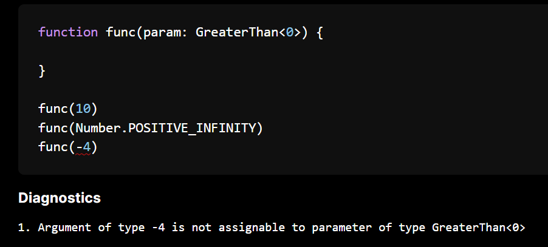

Over this summer, while working on increasing TypeScript compatibility in the checker and tackling more advanced type problems, I had an escapade with some experimental types! These types expand on what is currently representable in TypeScript. This blog post will introduce them, when they come about and things they catch.

> For those who haven't heard of it before, the [Ezno](https://github.com/kaleidawave/ezno) type checker is a work-in-progress but fast and correct TypeScript type checker and compiler with additional experiments.

### The missing operation
Set theory is based on three operations: unions, intersections and *one other*. We can build a union of a type with `|` and intersections with `&` but this third operation is less common and does not exist in the TypeScript type system.

This means that the types of some expressions are hard to represent. We can see this here

```ts
function func(param: string) {
  if (param !== "") {
    console.log(param)
    //          ^^^^^
  }
}
```

Here we know that `param` is a string (by the parameter type annotation) **but we additionally know** from the conditional statement it is **not** an empty string `""` because of the condition (`param !== ""`). While this state doesn't cause any type problems and treating as `string` is mostly fine, it does miss out on information that it has a *negated member*. For example if we only have the `string` information, the type checker doesn't raise an disjoint error for the following equalities

```ts
function func(param: string) {
  if (param !== "") {
    // ...
    return param === "" ? 2 : 1;
    //     ^^^^^^^^^^^^ <- this equality is always **false** because `param !== ""`
  }
}

// or slightly more complex via control flow
function func(param: string) {
  if (param === "") {
    return 0;
  }
  // ...
  return param === "" ? 2 : 1;
  //     ^^^^^^^^^^^^ <- this equality is always false because `param !== ""`
}
```

While these examples are short and the cases are obvious, you can see how in longer functions with more conditions and other things going on these cases are get more difficult for a user to observe.

> More on reachability and narrowing in a future blog post!


So we want **a new kind of type** which can represent the *negation* of some properties or members. This type is called the `Not` type and transforms a single type.


#### The `Not` type
So we now want to construct a type which can wrap an existing type and *negate* it.

A simple way that avoids changing the [checkers `Type` declaration](https://github.com/kaleidawave/ezno/blob/main/checker/src/types/mod.rs) is to introduce a new *intrinsic type*. [TSC already has string intrinsic types](https://www.typescriptlang.org/docs/handbook/utility-types.html#intrinsic-string-manipulation-types) (and `NoInfer`). We can define another special internal type alias intrinsic called `Not` that wraps another type using the type parameter, similar to how regular *generic* type alias types work *(but without eager specialisation, because it is in its final form)*.

Using a intrinsic type here
1. Avoids new syntax
2. Is consistent in implementation to other intrinsic types in the checker


With our new type at hand we can represent the type of our parameter **inside** the condition to be `param: string & Not<"">`. (Here `""` is the empty string).


#### Creating a negated type through narrowing
In the checker expressions in branching structures can refine types in a process known as narrowing.

There will be more on narrowing in a future blog post but for now we can say that the function that produces *narrowed facts* from a expression also takes a `negated` parameter.

```typescript
typeof x === string --> narrow(negated: false, expression: ...) => NarrowedFacts

typeof x !== string --> narrow(negated: true, expression: ...) => NarrowedFacts
                                        ^^^^
```

For the first case we say `x: string`. In the second case where negated is true, when we produce the facts we wrap them all in `Not`, so get `x: Not<string>`.

> For most unions (`1 | 2`) we can actually filter the members and don't introduce a `Not` type. We only introduce this for the *large* unions such as `number`, `string` etc. If you have any questions about narrowing that could be covered in that post, leave them in the comments below!

#### Exposing negated types type to annotations
While having it picked up by narrowing and the `!==` operator is cool, I will also be generous and [add this special type to the root context](https://github.com/kaleidawave/ezno/blob/9088496e28796fa0a4a8c938ee261c6611e695bb/checker/src/context/root.rs#L83) for use in your programs.

We will come onto how subtyping of this negated type works in a minute, but for now we can modify a functions parameter definition to force callers of our function to **not** take zero as an argument.

```ts
function divide(numerator: number, denominator: number & Not<0>) { ... }
```

[](https://kaleidawave.github.io/ezno/playground/?id=mhai)

> You can try this example out in the [online checker playground](https://kaleidawave.github.io/ezno/playground/?id=mhai).

#### Subtyping and disjoint-ness of negated types
So far everything seems quite straightforward: register our intrinsic type, map negated narrows and put it in root so you can reference and use it. So you might be expecting that the usage of it in the type system is where the complexity comes? But you would be wrong, the `Not` mechanism can be entirely based on existing functionality.

An example of the assignment case could be passing a `string` argument to a parameter typed as `Not<number>`. If you like set theory you might have guessed already, but **subtyping a `Not` type is based on [disjoint-ness](/posts/sets-types-and-type-checking/#disjoint-ness)!**.

For string to be a subtype of `Not<number>` (`string <: Not<number>`) is for the `number` and `string` types to be disjoint! And this is true, there is element that satisfies the contracts of both **string** and **number**.


And we already have a implementation of [disjoint checking]((https://github.com/kaleidawave/ezno/blob/main/checker/src/types/disjoint.rs)), which is used for the equality operator `===` etc.

So we have covered subtyping, but lets get back to the first example

```ts
function func(param: string) {
  if (param !== "") {
    // ...
    return param === "" ? 2 : 1;
    //     ^^^^^^^^^^^^ <- this equality is always **false** because `param !== ""`
  }
}
```

Here we want to test whether `Not<"">` is disjoint with `""`. And it turns out this is also a really simple operation, now in reverse: for `Not<"">` to be disjoint with `""` is for the empty string to be a subtype of the empty string (`"" <: ""`) which is true as subtyping is a reflexive relation (`T = T => subtype`).

As another example testing whether `Not<string>` is disjoint with `"hello"` is testing whether `"hello"` is a subtype of `string`. Thus if we have a strict equal operate check in TypeScript we know that `(x satisfies Not<string>) === "hello"` is **always going to return false** and we can emit this as a warning during our type checking procedure (technically a linting warning, based of type information).


In summary: when left subtyping `Not` then we test disjoint and when disjoint with `Not` we test subtyping.


Some other details
- When `Not` is the super-type, it is never a subtype.
- In many usages `Not` drops down to being a `any` type
- **The really important thing is through set theory to be assignable to `Not<0>` implies that it is disjoint from `0`**. It is not simply denying the `0` type but all types that have `0` as a member
- Most types are of the form `T & Not<U>` where we have properties of `T` but we want to remove the properties of `U`.

> Because this type reuses the intrinsic system and the fact that subtyping and disjoint are already implemented. This addition is a <100 LOC addition.

> [See the disjoint function here](https://github.com/kaleidawave/ezno/blob/main/checker/src/types/disjoint.rs)

> Disjoint is currently not implemented for functions and objects. [You can read issue if you want to tackle it!](https://github.com/kaleidawave/ezno/issues/212)

#### Aside: `Not` vs `Exclude`
`Exclude` can be used to *negate* members. However it only works for unions and so only simple cases. The `Not` type is much more complex and can *pick* out constant from larger types.

> From a language purity standpoint *intrinsic*s are not great. Common utilities like this I think are fine though as long as the internal type list doesn't break 100 it should be fine.

> You can see the negated types feature request in TSC [here](https://github.com/microsoft/TypeScript/issues/4196) which would be similar to the `Not` type described above.

### Numeric restrictions
With the new negated types, we have `Not<0>` and `Not<NaN>`, which can be helpful in restricting APIs to deal which can help when doing math without the crazy-ness of floating point mathematics and with the `x !== 7`, the `Not<7>` type can help catch disjoint errors **based on single values**.

However, there is still some common cases involving numbers where we could have more accurate types. For example we know that the result of a `Math.sin` call will never return a `2` as the range is between `-1` to `1` (unfortunately JS does not support the  complex datatype).

So similar to the `Not` addition we can add some more behaviour here, so without further ado we have ranged types.

#### Implementation
Similar to negated types we can add this with intrinsic. We implement this with two new intrinsic types `LessThan` and `GreaterThan`.

Unlike `Not`, these intrinsic have a bit more involved implementation that can't reuse much. When subtyping we check that the argument as a range fits inside the parameter type, for disjoint we check that they don't overlap as ranges. Unfortunately this is quite manual.

#### Narrowing numbers
We can extend the narrowing implementation to also handle cases from inequalities.

```ts
function func(param: number) {
	if (param < 10) {
		// param.
	}
}
```

[And in the block we have `param: LessThan<10>`](https://kaleidawave.github.io/ezno/playground/?id=2rvxtu) !!!

> More on narrowing in the future. Hiding a lot of the complexities of `<=` and building up number types that have the form `LessThan<floor> & GreaterThan<ceiling>`.

#### Annotations and ranges
Similar to `Not` we will [add `LessThan` and `GreaterThan` to the root](https://github.com/kaleidawave/ezno/blob/16f7779b157dea4da2b618d8e192492a09d1acb9/checker/src/context/root.rs#L79-L80). From these primitives we can define ranges as intersections of these types and we can make endpoints inclusive with unions.

```typescript
type GreaterThanOrEqual<T extends number> = T | GreaterThan<T>;
type ExclusiveRange<F extends number, C extends number> = GreaterThan<F> & LessThan<C>;
```

> These are defined in the standard `lib.d.ts`

> The implementation for them is pretty nasty. It is nicer to deal with them in terms of ranges (for example checking disjoint-ness) but it is an abstraction that breaks down.

And we can actually use this type in the standard library, for example [`Math.sin` returns a `InclusiveRange<-1, 1>`](https://github.com/kaleidawave/ezno/blob/8ce921e39c3d4e947063f206347b2932cee456ec/checker/definitions/simple.d.ts#L230).

### What you can do with them
We can do some pretty simple things with them for annotations. For example requiring that positive numbers in places.

[](https://kaleidawave.github.io/ezno/playground/?id=28j85e)

The cool things come from narrowing and operations. For example we can catch equality as they have an implementation for disjoint-ness.

[](https://kaleidawave.github.io/ezno/playground/?id=2siewy)

We can add more logic to our inequalities testing whether a range is always above or below.

[](https://kaleidawave.github.io/ezno/playground/?id=27wr2i)

Also transitivity kind of works (this is with the bounds not being known numbers)

[](https://kaleidawave.github.io/ezno/playground/?id=2rvxu2)

### `MultipleOf`

Similar to `LessThan` and `GreaterThan`, `MultipleOf` is another new intrinsic number type that can be used to narrow down on the value of numbers.

We again expose this through a type annotation such as `MultipleOf<5>` and also through narrowing with `x % 5 === 0`. I won't go through the details of it all here.

[](https://kaleidawave.github.io/ezno/playground/?id=28j85m)

### Integers
Integers can be created by `MultipleOf<1>`. This is because these number intrinsic are based on the `number` type which at runtime is floating point number.

#### Integers with arrays / strings?
My intuition is that this can help with array/string indexing. For example we know that if a value is in `0 & LessThan<this.length> & Integer`, we know it is not `undefined`. This can help for indexing an array (or a string) in `for (let i = 0`  loops (which do come up). There is some problems with holey arrays though and so I haven't done added anything around this.

> (although holey arrays seem user driven with `delete`, I don't think they can come from external APIs)

There are a lot of things we could extract from floats. It could assit with WASM generation where there exists whole numbers. But investigating all of these takes time and is a bit out of scope for the moment.

### More restrictions with the `Literal` type
Another intrinsic type which I added ages ago is `Literal`. This constrains the user to only be able to write known constants to this value.

This can help with some things. For example you can *lock* down `fetch` calls to only use fixed URLs, custom element registration etc.

Unfortunately, this doesn't add any safety... but it could be some using in adding rules into the language. Here JavaScript will always let you create a property under the key of the current weather in the UK.

```typescript
const obj = {};
Reflect.set(obj, await fetch("https://uk-weather.api").then(resp => resp.text()))

// Property always exists
console.log(obj.cloudy)
// okay sometimes this
console.log(obj.sunny)
```

but we can create a better way using `Literal<...>` types

```typescript
class ReflectingOnReflect {
	static better_set(
    obj: Literal<object>, 
    property: Literal<string>, 
    value: any
  ) { 
    // ... 
  }
}
```

[](https://kaleidawave.github.io/ezno/playground/?id=2siex6)

### Testing and feedback
Hopefully you found something interesting. All of this is open source, you can play with them in the playground and if you find any bugs with the new experimental items, post them on the issue tracker.

And if you have found anything difficult to represent as types, that is still not covered by these new types, let me know in the comments below!

### Direction of the project
While this stuff is fun, there is probably a number of you asking whether you can begin using this is projects. The unfortunate answer is that the **ezno-checker is not currently usable on projects because of the lack of many TSC features or partially implemented features**.

The checker has been crawling along slowly, passing more and more specification tests and working on more complex parts. I now somewhat confident in the foundation and that many of TSC's features have been somewhat reimplemented. You will see in the next two blog posts that cover mapped types and narrowing respectively.

While these experiments like this are interesting, they don't necessarily work perfectly under all the edge cases. In some cases a number of the features have been relegated behind the `--advanced-numbers` flag.

The biggest experiment in the checker has been side-effects recording and replaying. There have been some huge progress with respect to that, most of which I have not currently shared (but maybe soon). A lot of that stuff is currently very delicate and so I think the next steps will be to put that behind a flag. Once that is mostly out of the way for default, the actually usability can be attempted.

Currently allocation of resources is a bit of a constraint, but that only affects the timelines of these things and not the achievability. However there is still more to share and I have a blog post on mapped types and one on narrowing (on more than just number types) that should be ready for publishing soon!

---

This blog post was sent out to sponsors early. As well as supporting the development of the project you also get early access on information on the project and access to the LSP! As well as monetary contributions, you can also contribute code. There are some [good-first-issues](https://github.com/kaleidawave/ezno/issues?q=sort%3Aupdated-desc+is%3Aissue+is%3Aopen+label%3Agood-first-issue) and [many have already been completed](https://github.com/kaleidawave/ezno/issues?q=sort%3Aupdated-desc+is%3Aissue+label%3Agood-first-issue+is%3Aclosed) by some awesome contributors!
