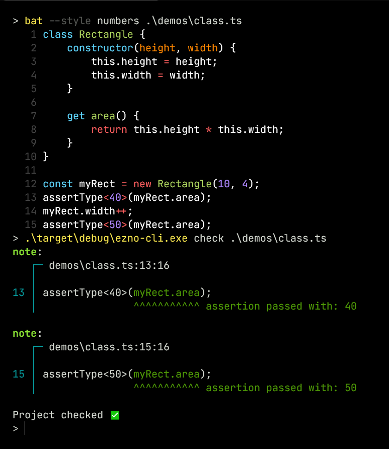

It's been a minute since the previous announcement so I thought would give some updates and share some upcoming problems. This follows the initial announcement and includes some smaller things I [shared on Twitter](https://twitter.com/kaleidawave) since the announcement post.

Never heard of Ezno? It is a parser, partial executor, optimizer and type checker for JavaScript! [Read the initial announcement](/posts/introducing-ezno).

## New changes
### Classes, getters and setters
I added support for classes, getters and setters

{.invertible}

This required some changes to the definition of types and how they handle prototypes. I also added handling for the cases when a property is a getter or setter when doing property access and assignments. This addition also added support for getters and setters in object literals.

#### Tree shaking methods
When adding classes I extended the tree-shaking mechanism (present but not mentioned in the announcement post) to class methods. Because of object tracing and call detection, if a method on a class is never called then the code is never included in the output.

{.invertible}
{.invertible}

This is one of the reasons for not following TypeScript's rules around `any`. If even a single call like `(x as any)["method" as any]()` was treated with type annotations being the source of truth then any sort of method removal could remove called code.

**The perhaps underrated benefit here it is not just class code being removed, it is all functions that might be referenced in a class method that can now be removed.**

#### Custom element registration event
{.invertible}

Putting aside any of my opinions on custom elements. Calling [`CustomElementRegistry.define()`](https://developer.mozilla.org/en-US/docs/Web/API/CustomElementRegistry/define) results in running an effect that adds a mapping to the [`HTMLElementTagNameMap`](https://github.com/microsoft/TypeScript/blob/9c9d4b029d71fc6b56598b0ff201c2a271c31c06/lib/lib.dom.d.ts#L17630) type and thus can get type safety in some more tricky scenarios.

### A REPL
A REPL (read evaluate print loop) is an interactive code executor. Similar to [ts-node](https://www.npmjs.com/package/ts-node), the Ezno REPL wraps an existing REPL with a checker. This required a few changes and while still a long way from perfect the checker can do a little more incrementally.

{.invertible}

There is also a mode that prints the type output.

{.invertible}

This is mostly to help me with debugging what Ezno does. But maybe it will be useful generally for working out the arguments for functions etc.

You can see the [wrapper code for Deno here](https://gist.github.com/kaleidawave/807747b31458bad6540da976529c4d3d).

#### The `satisfies` operator

There are two interesting things I slipped into the first code snippet that ran in the REPL.

*The first was a divides operator. I was just playing around, it won't be in the published tool. 😀*

The second one is revealed if you try [running the code in TSC](https://www.typescriptlang.org/play?#code/JYOwLgpgTgZghgYwgAgCoE9kG9kAcoD2uAXMgM5hSgDmyAPsiAK4C2ARtMgL4CwAUPwQEQFZAA9SGZAF5seQiWQBmbgG5+g4aMyyAsnDAALAHS4CAdwAUY0woA0yAEwBKZAGpkADlVA).

---
I was recently asked whether Ezno supported the recent TypeScript addition, the `satisfies` operator. The `satisfies` binary operator is a compile-time assertion that the left expression operand is typeable under the right type reference operand. It has almost identical behaviour to the `assertType` identity function trick that was shown in the original announcement.

The existence of this piece of syntax seems to be handling a problem that occurs with variable declarations in TypeScript. With the statement `let x: A = b`, variable reference `x` is considered to have all the properties of type `A`. While that is fine and how every nominal type system works, it can cause problems when `A` is a larger type than the type of `b` and loses some properties.

In the code shown in the REPL, TS treats `x.prop` as `string | number`. However looking at the code it is clear that the `x.prop` is a number at the point of the `Math.pow` call, never a `string`. What `satisfies` allows for is checking without *widening* the type (as widening loses information).

So how does this check under Ezno? Although `Math.pow` can take a string argument in JS, it is typed as `(a: number, b: number) => number;`. So it has approved `x.prop` as a number.

In Ezno variables have two pieces of type data attached to them:
1. A *current* value
2. A space the value can operate in (defined using the variable type annotation)

**The current value type is used when checking usage and the space type is used when checking reassignments.**

{.invertible}

Therefore the `Math.pow` call checks `x` using the current value (which is a number here). It does not use the reassignment constraint.

This was present early in Ezno (before I had heard of the `satisfies` operator). This behaviour was needed to be able to detect dead code here:

```typescript
let x: number = 2;
if (x !== 2) {
	bigFunction()
}
```

The problem I have with satisfies is that isn't a drop in replacement. There doesn't seem to be a way to retain the value information while constraining variable value for reassignment. That is something that is the default with Ezno's point-in-a-space system.

---
I am glad that TypeScript is pursuing more into dependent/literal types checking. And I can see why variable declarations are checked that way in TSC. Ezno's implementation only works because of effect tracking, which allows it to identify variable mutations from functions. Effect tracking is tricky to do (as will be shown later), so I understand why TypeScript doesn't do it.

So `satisfies` doesn't have any effect on checking in Ezno. Similarly things like `as const` don't help Ezno. They don't have any effect on the system as it is all inferred or treated computationally.

Is there a limit to how much TypeScript can tighten up by adding additional syntax? Does Ezno's effect tracking make it more approachable for beginners?

### Binary context/definition files
I added a binary serialized form of contexts just before the announcement went up but didn't have a lot of space to include it. These are an alternative form to `.d.ts` files and are more compact and include direct references to the identifiers used in Ezno.

{.invertible}

In TSC cold start time is not great. One of the bottlenecks (I think) for performance, is the parsing and synthesizing initial contexts stage. Definition files are large, contain lots of unused information in terms of comments (only useful when using TSC in LSP mode) and are a format that is intensive to parse. On the other hand, Ezno's additional low-level byte definition files (that can be generated from an existing context) can be synthesized without having to build up an abstract syntax tree and are much smaller with no whitespace and extracted comments. The format is split up the same way the data structures are arranged in the checker. Regular definition files are dense with information, the binary form has sections for type name mapping, variable mapping, function types, etc which could be processed in parallel for further improvement.

These results are only for `simple.d.ts` which is a subset of the declarations in `lib.d.ts`. It's about 6x times smaller as it only includes the definitions that Ezno currently understands. However, the benefits are looking promising at around ~14x faster creating initial contexts:

```shell
Parsing .d.ts: 4.4306ms
Synthesizing .d.ts: 10.4137ms

Reading from binary 988.5μs
```

One of the benefits of being written in Rust  is that dealing with low-level byte processing and access is nice and simple!

Still unsure how the distribution of these will work. Also currently it only supports root contexts, haven't figured source splitting and referencing for child contexts yet.

## Upcoming changes
Here I some things I am going to start tackling over the next couple of months. They all relate to effects.

### Internal object effects
One of the upcoming problems to solve is arrays and mutations.

```typescript
const x = [1, 2, 3];
x.push(4);
if (x.at(-1) !== 4) {
	console.log("Hi")
}
```

Here `.push` mutates `x`. Just looking at the TS definition for the method, `push(...items: T[]): number`, it doesn't give much information about what it does. Without knowing what `.push` mutates the `x.get(-1)` call can't return accurate information. If it did know, the checker could find `4 !== 4` is always false and the if branch never fires.

Therefore the type declaration needs to include more information. Currently, this is done using decorators on the method declaration, which Ezno interprets specially. However, there may be a more descriptive way to register this information:

```typescript
interface Array<T> {
	@Effects(
		"sets [this.length] on this to T",
		"sets 'length' on this to Add<this['length'], 1>"
	)
	push(t: T): Add<this["length"], 1>;

	// Maybe it is more readable to do something like
	push(t: T) performs {
		this[this.length] = t;
		return ++this.length;
	}
}
```

This shouldn't be impossible to add to declarations. There isn't a huge amount in the standard library and not a huge amount in DOM API. It isn't a hugely complex task for these to be added but is very beneficial.

### Asynchronous effects
There are several different types of effects. One is modifying a variable (or property), this fixes several problems with [issues with control flow analysis in TypeScript](https://github.com/microsoft/TypeScript/issues/9998).

So far synchronous situations are covered:

```typescript
let x = 2;
(() => x++)();
assertType<3>(x);
```

Asynchronous code (where the order of execution isn't trivial) is next to implement:

```typescript
let x = 3;
setTimeout(() => { x++; }, 0);
// Function will be called but not until it has reached a point where the event loop runs
assertType<3>(x)
```

To support this, it shouldn't be too difficult:
1. Determining when functions are queued or registered to an event loop (such as `setTimeout`, `addEventListener`) vs immediately called (such as in `Array.prototype.map`)
2. Running function effects at the end of synchronisation. Whether that is the end of the script or some `await` expressions.

### Handling errors
In TS, functions that throw can be typed using a return type of `never`. However, there is no information in the type system to depict what type is thrown. In Ezno `throw` statements current queue special `throw` effects. There are two things left before this system becomes usable:
- Expressions that always throw and are not in a catch-able structure should produce an error
- In a try-catch statement, the checker needs to collect possible objects thrown to form a type of `err` in `catch (err)`. This makes catch branches TypeSafe™. Or alternatively, if no throw effects in the try block the checker should emit a warning.

And in code that is generic:

```typescript
function safeEval<T extends () => void>(t: T) {
	try {
		t()
	} catch (err) {
		console.log(err.message)
	}
}
```

There needs to exist a `Thrown<T>` internal helper type that can extract what is thrown from a function.

## Is it open source? Where's the binary?
[**UPDATE**, Ezno is now open-source](https://github.com/kaleidawave/ezno)

Open source is more than switching a GitHub repo from private to public. IMO large public repositories should have some sort of stable roadmap or design that contributors can follow. Time needs to be put in to follow issues through. And currently, for the checker, I don't have any of that soo. I think it will be best if it is incrementally made public. The parser is nearly at a point I would consider publishable so hopefully there will be a release soon!

In terms of the executable binary, I want to release it when it can check an actual useful program. Once the above issues with effects are solved then, it will open up more real-world demos. After then, it should be good to go!

### Other things coming up
- I work on a few other [crates](https://crates.io/users/kaleidawave?sort=recent-updates). Some of those will be getting updates soon.
- I have two posts coming out soon about Rust  and procedural macros.
