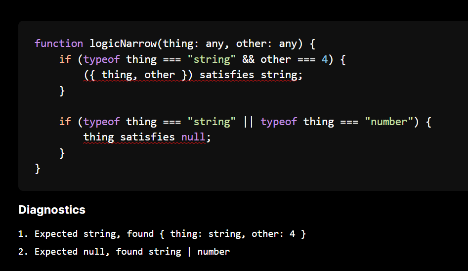
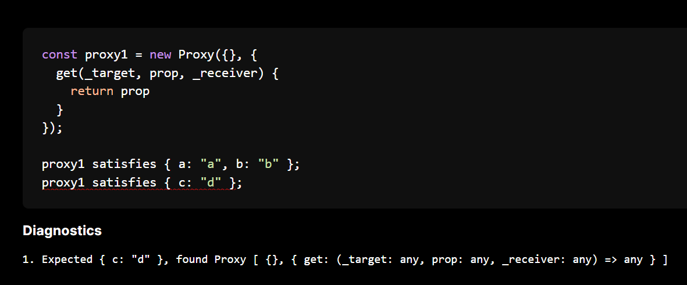
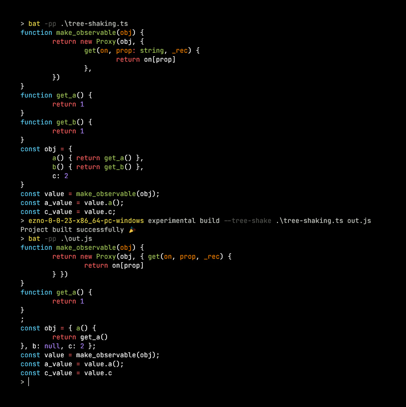
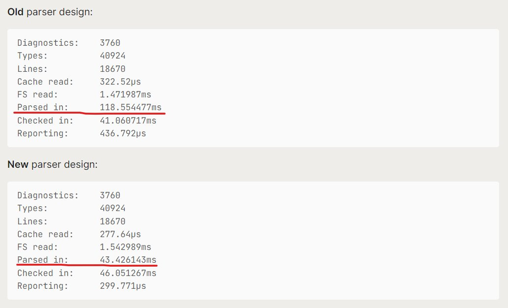
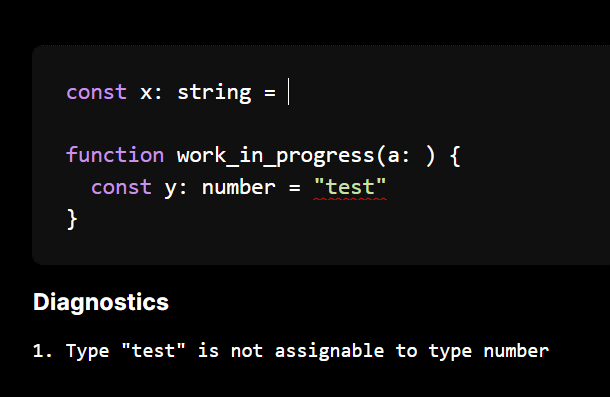

It has been over 6 months since the last post and after a break I have a *little* bit of time again to work on my [type checker and compiler project](https://github.com/kaleidawave/ezno)!

Firstly some random achievements from last year (2024) that I have not got around to sharing yet.

## Not-so-recent achievements

### Adding narrowing

Narrowing is the modification of the "backing" type of parameters and variables based on runtime expressions. It is now implemented in the checker.

[](https://kaleidawave.github.io/ezno/playground/?id=9g8o3s)

> This marks **the last big feature** of the TypeScript type system to be implemented. Remaining blockers in the type checker are either related to synthesis across modules, async and generator code and the finishing of my other crazy type system experiments.

> If there is interest I may do a dedicated post on the process of *implementing type narrowing*.

### Support for `Proxy`

My arch-nemesis in the JavaScript language, [`Proxy` is a special object](https://developer.mozilla.org/en-US/docs/Web/JavaScript/Reference/Global_Objects/Proxy) that can have custom behaviour when used. Basic partial application and *some* subtyping checks (*but not all*) are implemented in the checker.

[](https://kaleidawave.github.io/ezno/playground/?id=8w9hc8)

> Additionally thanks to a PR, [support for `RegExp`s also works](https://github.com/kaleidawave/ezno/blob/main/checker/specification/specification.md#regular-expressions). At some point I write a blog summarising how custom objects such as `Proxy` and `RegExp` work in the checker.

### Tree-shaking

While the parser and type-checker make up most of the code in the project, there are other tools that use the generated AST and type checking information. Thanks to behavior in the checker, it does not become too difficult to add tree-shaking to the output. Because of support for the `Proxy` above, the following becomes possible.

[](https://github.com/kaleidawave/ezno/blob/506be8be8b6f1de2423ecab6413b31e3cb0ce58c/src/build.rs#L185)

> While this is based on results from the type checker, it is not the actual types that enable this behaviour.

### New *lexer* design

A parser turns strings into a tree-like data structure representing the program. Typically this is done by first "tokenising" the input string and then passing that off to a *recursive-descent-parser* to construct the data structure.

Previously I got a bit carried away with an over-engineered design that produced tokens in one thread and read them in a second. This had lots of problems with edge case syntax where [the lexer required information from the higher level parsing](https://github.com/kaleidawave/ezno/issues/199).

In an on-going effort to take learnings to make the project simpler, I removed this system in terms of a more basic implementation wrapper [for a string reader](https://github.com/kaleidawave/ezno/blob/506be8be8b6f1de2423ecab6413b31e3cb0ce58c/parser/src/lexer.rs#L122). 

...and often simplification leads to improved performance.

[](https://x.com/kaleidawave/status/1846238071026487560)

> this has been merged but is not yet released under the [parser crate](https://crates.io/crates/ezno-parser) at the time of writing

### More on the parser

On the topic of the parser I have been experimenting with more features including

- [A compile time macro for AST generation](https://github.com/kaleidawave/ezno/blob/main/parser/generator/tests/structures.rs)
- [Implementing a visitor pattern using derive macros](https://github.com/kaleidawave/ezno/tree/main/parser/visitable-derive)
- [*Pretty* formatting](https://github.com/kaleidawave/ezno/blob/main/parser/examples/pretty_printing.rs)

...and [partial syntax](https://github.com/kaleidawave/ezno/blob/main/parser/tests/partial.rs), which enables the checker to still function while editing the source.

[](https://kaleidawave.github.io/ezno/playground/?id=95mlmo)

> In the future there should be variable name suggestions at the cursor

> Again if there is interest I may do a dedicated blog post on the whole of the parser

## Immediately next up

Here are some things I have started but have not completed yet

### Updating the specification

["The specification" is a markdown document that contains a bunch of tests for type-checking behavior](https://github.com/kaleidawave/ezno/blob/main/checker/specification/specification.md).

This document is invaluable for describing the state of the project as avoiding regressions with changes to the codebase.

However, I am not satisfied with the current state. [So I have started to work on updating it](https://github.com/kaleidawave/ezno/pull/230). The updates are as follows

- [Splitting the 5k LOC file into multiple files](https://github.com/kaleidawave/ezno/tree/specification-two/specification/02-checker)
- [Adding additional implementation information to sections](https://github.com/kaleidawave/ezno/blob/specification-two/specification/02-checker/01-types/03-generics/01-inference-and-substitution.md#implementation)
- [Moving the implementation to its own CLI tool](https://github.com/kaleidawave/experiments/pull/2)

> Again I may write a blog post on my approach to testing the checker and some ideas I have for this tool!

### Add a flag to disable the events and partial application system

The events system is a unique part of the type checker and has major consequences for checking behavior.

While it has solved some of the hard problems I have wanted to solve with this checker, it is unfortuantly quite complex and current falls short to be effective in real world projects.

Because the system does not currently work in many scenarios, it is holding back the other type checker features from being used. 

[So last year I started on moving the system behing a flag](https://github.com/kaleidawave/ezno/blob/15ef12e1a640d27e52cdf6314bcd4447c3023eab/src/cli.rs#L124-L126). With some more testing a opt in `--basic` flag would disable events on the project and the checker would use a simpler variable and object system that is more on par with TypeScript.

> I have been wanting to do a blog post on the state of this partial implemented partial application feature but I think for now it would better as a talk. If you run a meetup and interested in this [then get in contact](https://twitter.com/kaleidawave)!

### Finish the inference addition

[Last year I had spent some time on adding a constraint inference implementation](https://github.com/kaleidawave/ezno/pull/197). [A feature that the Hegel type checker had](https://hegel.js.org/docs/type-inference#arguments).

[I have a few things working](https://github.com/kaleidawave/ezno/blob/constraint-inference/checker/specification/staging.md) but there is still more to do. It would also be good to work with some real world untyped code in parralel with specific cases.

> I ended up binning the original implementation ([from the announcement](https://kaleidawave.github.io/posts/introducing-ezno/#untyped-parameters)) as it did a lot of mutation that breaks thing in conditional branches and elsewhere. The newer implementation is now to *collect requirements* at the end of scope, rather than modifying the type of parameters as the parameter is being used. 

### Add test262 checking

For JavaScript there exists a test suite of JavaScript code. It is mainly designed for engines that evaluate the code. But we can use the over 50 000 tests cases for the parser in this project.

On my WIP branch, the parser [passes 91.8% of these](https://github.com/kaleidawave/ezno/actions/runs/16058235661/job/45317842768#step:3:373). I should note that of the 4111 *failing* tests, 2395 are "parsed when should have failed". They could be duplicate parameter names, regular expressions or others. The first two are implemented at the type checker level, but could be up the chain under a flag. Now that this statistic is tracked it should only go upwards!

While the current tests only run parsing, the type checker could also be run on the files. This could uncover any crashes or places where it might not terminate. Some of these tests could also be used to test the partial application system!

### An API for the type system

I think the most developed part of this project is the subtyping and disjoint code. [You can see an example of how it is used here](https://github.com/kaleidawave/ezno/blob/15ef12e1a640d27e52cdf6314bcd4447c3023eab/checker/examples/calculate_subtypes.rs). 

As that functionality is pretty much ready, it could be exposed to other project through an API.

```rust
let mut space = Space::new();

assert!(space.is_assignable_to("number", "number | string"));
assert!(!space.is_assignable_to("number | string", "number"));
```

If you are interested in using subtype logic, you can [leave feedback for developing an API for it here](https://github.com/kaleidawave/ezno/pull/232).

## Future

Other ideas that are on backburner

### Continue on improving performance and architecture

While the tool is fast enough, it is a personal endeavour to learn new ways to make it even faster.

I have been working on a few things

- Investigating the size of types. [I have created a parser for type size information from the Rust compiler](https://github.com/kaleidawave/experiments/pull/10) and the hope is to add some more analysis to the output to aid in the changes needed to shrink certain enums.
- Performance mainly comes from structure of the data and large rewrites can be cumbersome. I have given some transformation tools a spin but I have found them too general, so [I am building my own tool using tree-sitter](https://github.com/kaleidawave/experiments/pull/9). The hope is that it can make changes to enum and struct definitions and change corresponding usage in the parsing, to-string, checking and transformation functions.
- To see whether changes have some effect I have been building on GitHub actions to track changes and run benchmarks. [This includes comparing existing binaries as well as memory and CPU instructions tracking](https://github.com/kaleidawave/ezno/actions/runs/16058398083), which gives an accurate picture of performance changes.

### More complete-ness: `async`, `Promise`s, reading `.d.ts` files etc and focus more on examples

Now that narrowing has been finished, the last parts of checking are `async` code, generators and the whole module system.

I have been pushing back some of these later features for a while. With a mode that disables the events system, it could become alot easier to get basic support working for these final items.

### Releasing syntax ideas (under flags)

I have had some ideas for syntax extensions. They have been sitting in my *private experiments folder* but maybe it is worth posting them, less as a feature to go out and use but as some interesting ideas of what can be done with types!

## Other information

Soon I will be even more available, I am looking for short-term/internship opportunities!

- I have experience with: Rust, parsers/compilers, things that involve "types" and web (frontend/backend)
- Random other current interests: natural language processing, *internal tooling*, databases and *video*

And again if there is a place that would be good to host a talk on the progress on the events system (or any other Rust and TypeScript stuff)! [You can contact me here](/about).

---

Thanks for reading the update! and all going well, more features soon!