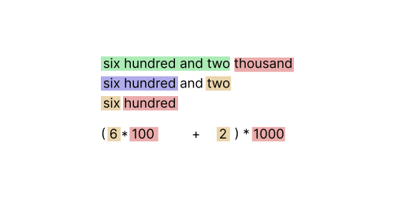

I have been recently working on a few one-off random libraries and tools. Here are a few interesting findings from building one of those: a library for formatting and parsing various representations of numbers.

This post covers some representations for numbers and how we can write a formatting function `u32 -> String` and (the partial inverse of that function) that parses the format `String -> u32`.

> The term "number" in the post refers to a 32-bit or 64-bit fixed point unsigned integer. We will not be covering negative or fractional values for now. Additionally, the theory and logic is the focus of the post but the code and library is written in Rust.

### Base two and base ten

Computers work on electricity. They store and transmit numbers through high and low voltages.


There are two states high and low. This is known as **bi**nary with **bi** [the numeric prefix for two](https://en.wikipedia.org/wiki/Numeral_prefix?wprov=sfti1#Table_of_number_prefixes_in_English). We store each part as a bit. We can store zero as low `0` and one as high `1`. However, we see the successive number two cannot be represented in one signal. So it becomes in a sequence where we start with  so we shift over to the left. `10`. The general pattern is when we add one to a something where the right starts with a zero, we set all trailing ones to zero and set one before said block.

```shell
> ./format-number 0 --binary         > ./format-number 6 --binary
0                                    110
> ./format-number 1 --binary         > ./format-number 7 --binary
1                                    111
> ./format-number 2 --binary         > ./format-number 8 --binary
10                                   1000
> ./format-number 3 --binary         > ./format-number 9 --binary
11                                   1001
> ./format-number 4 --binary         > ./format-number 10 --binary
100                                  1010
> ./format-number 5 --binary         > ./format-number 11 --binary
101                                  1011
```

We depict these values in fixed amounts such as 32 bits to discern when the line is inactive and when it is representing zeros.

All formats covered here will have larger-to-smallest for numbers. For example `100 > 010 > 001`

> We can represent 2^32^ in 32 bits (4 bytes). Four billion values

We can format or print a `u32` value (into a `String`) through the following.

- We calculate how many zero or one characters it takes to represent a number by taking counting leading zeros (equivalent to `log2`). Using `std::cmp::max`, we choose the length to be one if the value is `value=0` so we print `0` (rather than an empty string). 
- We then test each bit with `0b1 & (value << i)`
- If the result of the bitwise and is zero (no match) then we append the `0` character else `1`.

```rust
pub fn to_binary(value: usize) -> String {
    let mut buf = String::new();
    let start = std::cmp::max(usize::BITS - value.leading_zeros(), 1);
    for i in (0..start).rev() {
        let bit_set = value & (0b1 << i);
        buf.push(if bit_set == 0 { '0' } else { '1' });
    }
    buf
}
```

> There are a few other ways of doing this, but this seemed the neatest

Parsing is the reverse of this, we take each character in the string, checking if it is `0` and add the result (through bitwise or). Each iteration we shift the accumulator value one bit to the left (equivalent to multiplying by two).

```rust
pub fn parse_binary(on: &str) -> Result<usize, ()> {
    let mut value = 0usize;
    for byte in on.bytes() {
        value <<= 1;
        if let b'0' | b'1' = byte {
            value |= (byte == b'1') as usize;
        } else {
            return Err(());
        }
    }
    Ok(value)
}
```

---

Moving on, in the real world we use base 10 or [denary](https://en.wikipedia.org/wiki/Decimal). Likely because most of the population has ten fingers.

The logic is similar but because 10 is not a power of 2 we use division instead of shifts and modulo instead of bitwise and for testing bits.

```rust
pub fn to_denary(value: usize, separator: &str) -> String {
    if value == 0 {
        return "0".to_owned();
    }
    let mut buf = String::new();
    for i in (0..=value.ilog10()).rev() {
        let j = (value / 10i32.pow(i) as usize) % 10;
        buf.push(b"0123456789"[j] as char);

        if i > 0 && i % 3 == 0 {
            buf.push_str(separator);
        }
    }
    buf
}
```

> Here this function also takes a separator paramter. This allows formatting `123456789` to return in more readable `123 456 789` form when `separator=" "`.

Parsing is similar. Again because 10 is not a power of 2 we use multiplication instead of shifts and addition rather than bitwise ors.

```rust
pub fn parse_denary(on: &str) -> Result<usize, ()> {
    let mut value = 0usize;
    for byte in on.bytes() {
        value *= 10;
        if let b'0'..=b'9' = byte {
            value += usize::from(byte - b'0')
        } else {
            return Err(());
        }
    }
    Ok(value)
}
```

> Other radix are also commonly used such as base 8, 16 and 64. These are respectively named octal, hexadecimal and base64 (it needs a better new name). 
> 
> These use similar logic to that of binary (as they are powers of 2). Hex has an extended alphabet beyond the 9 character introducing `ABCDEF`. Additionally, these formats formatting and parsing logic inspects more than one bit at a time during formatting.

### Natural language

Moving past symbols, we can use words to spell out numbers. As we will see it isn’t as simple as printing 135 as one three five.


We have various scales: digits (`1`), tens (`10`), hundreds (`100`) and thousands (`1000`). Larger values then break into combinations with tens of thousands (`10 000`) and hundreds of thousands (`100 000`). When we get to thousands and thousands it starts to become confusing, so we break into a new term: the millions. 

Thousands of millions is billions and millions of thousands of billions is trillions. We notice that millions has a **m** prefix and for **bi**llions we are at the 2 prefix that is used from **bi**nary. Successive quantaties are **tri**llions, **quad**rillions.

In the following, we see that a number formatted to English roughy follows a form where we have a list of triples. A term between 1-999 followed by a magnitude. There is no magnitude for one, so we leave it out.


In English we have names for `0-10` and additionally `11-13`. `14-20` is + "teen". twenty has tw-o prefix. and so on. All  have names

```rust
fn under_100_to_str(value: usize) -> &'static str {
  match value {
    0 => "",
    1 => "one",
    2 => "two",
    3 => "three",
    4 => "four",
    5 => "five",
    6 => "six",
    7 => "seven",
    8 => "eight",
    9 => "nine",
    10 => "ten",
    11 => "eleven",
    12 => "twelve",
    13 => "thirteen",
    14 => "fourteen",
    15 => "fifthteen",
    16 => "sixteen",
    17 => "seventeen",
    18 => "eighteen",
    19 => "nineteen",
    20 => "twenty",
    30 => "thirty",
    40 => "fourty",
    50 => "fifty",
    60 => "sixty",
    70 => "seventy",
    80 => "eighty",
    90 => "ninety",
    number => unreachable!("{number}"),
  }
}
```

> Interestingly, in French 80 is quatre vingts which translates to four twenties ().

Now we have an idea about the composition, we can start working on formatting and printing. We split the input into triples with prefixes of 0-999, print this as the prefix and then append a magnitude (thousands, millions etc)

We have a few conditions for edge cases such as not printing "one million, zero thousand and zero".

```rust
pub fn to_english(value: usize) -> String {
    fn format_part(part: usize, is_last: bool, buf: &mut String) {
        let hundred = part / 100;
        if hundred != 0 {
            if !buf.is_empty() {
                buf.push_str(", ");
            }
            buf.push_str(under_100_to_str(hundred));
            buf.push_str(" hundred");
        }
        let part = part % 100;
        if part != 0 {
            if !buf.is_empty() {
                if is_last || hundred != 0 {
                    buf.push_str(" and ");
                } else {
                    buf.push_str(", ");
                }
            }
            if part <= 20 {
                buf.push_str(under_100_to_str(part));
            } else {
                let digit = part % 10;
                let tens = part - digit;
                buf.push_str(under_100_to_str(tens));
                if digit != 0 {
                    buf.push(' ');
                    buf.push_str(under_100_to_str(digit));
                }
            }
        }
    }

    const PART_WIDTH: u32 = 3;
    const MAGNITUDES: &[&str] = &[
        "",
        " thousand",
        " million",
        " billion",
        " trillion",
        " quadrillion",
        " quintillion",
    ];

    if value == 0 {
        return "zero".to_owned();
    }

    let mut buf = String::new();
    for i in (0..=value.ilog10() / PART_WIDTH).rev() {
        let size = 10_usize.pow(i * PART_WIDTH);
        let left = value / size;
        let part = left % 1000;
        let after = value - (left * size);
        let is_last = after == 0;
        format_part(part, is_last, &mut buf);
        if !buf.is_empty() && part != 0 {
            buf.push_str(MAGNITUDES[i as usize]);
        }
    }
    buf
}
```

We do similar for parsing, we break the input string into parts (where each part lines up with the triple structure) and do reverse lookup. [The code is a bit longer so is skipped for this post](https://github.com/kaleidawave/experiments/blob/daf25161d49dd3700b97d091d7ee2397df19810f/number-utilities/src/parse.rs#L47).

Notenote `and` refers to addition and each item prefixes a magnitude (with a lower precedence) which is multipied by the magnitude.



### Roman numerals

On to the title and raison d'etre for this post. [Roman numerals](https://en.wikipedia.org/wiki/Roman_numerals) are an ancient form of denoting amounts.


The crop up in analog clock faces, television production dates and enumerating royals with the same forename. The traditional dialect is limited to representing the numbers between 1-3999.

Their design uses several uppercase characters. `I=1` being the smallest, then `V=5`, `X=10`, `L=50`, `C=100`, `D=500` and finally `M=1000`. We see that all *digits* take the form of  or . 

Similar to the above systems we sum each part, so `DLV` is `500 + 50 + 5 = 555`.

**However**, we can prefix digits to make them smaller. We refer to 9 as `IX` and 14 as `XIV`. The prefix can only precede digits up to then next  so 99 is `XCIX` (`XC + IX = 90 + 9`) and not `IC`.

Formatting is similar to denary. Then the logic picks a certain sequence for each character

```rust
pub fn to_roman_numeral(value: usize) -> String {
    let mut buf = String::new();
    if value == 0 {
        return String::default();
    }

    assert!(value < 4000, "cannot format after 3999");

    const PARTS: &[(&str, &str, &str, &str)] = &[
        // ("III", "IIII", "VIII", "IX"), if clock
        ("III", "IV", "VIII", "IX"),
        ("XXX", "XL", "LXXX", "XC"),
        ("CCC", "CD", "DCCC", "CM"),
        ("MMM", "", "", ""),
    ];

    for i in (0..=value.ilog10()).rev() {
        let digit = (value / 10_usize.pow(i)) % 10;
        let (zero_to_three, four, five_to_eight, nine) = PARTS[i as usize];
        let value = match digit {
            0..4 => &zero_to_three[..digit],
            4 => four,
            5..9 => &five_to_eight[..digit - 4],
            9 => nine,
            value => unreachable!("{value}"),
        };
        buf.push_str(value);
    }
    buf
}
```

---

Now we can *generate* them, we can perform the inverse and parse them.

When parsing a roman numeral, we first turn each  and  item into its respective character and then process each `letter` in the sequence either by

- Incrementing the accumulator by some amount
- Decrement some future (larger) letter

And here is where the neat two line of code snippet I landed on comes in

```rust
acc += letter;
acc -= 2 * (acc % letter);
```

We increment the value as standard, then if the letter leaves a *remainder* with `acc` we subtract two of the *remainder* from the accumular. 

For example for `IX`, after then `I` we are left with `1` in the accumulator. We add the value of `X`, leaving `11` in the accumulator. We then find `11 % 10` is `1`. We subtract `2 * 1` from `11` arriving at `9`!

> This isn't a true a roman numeral parsing, it supports a superset. It does not check that only one prefix is allowed and the prefix needs to be one less order of ten than the rest. This allows non-unique identifiers as `./parse-number IIX --roman` and `./parse-number VIII --roman` both return `8`. A future improvement would be to add more logic to enforce the rule if required.

### Try it out

 [You can download the command line binaries: parse-number and format-number to try it out for yourself](https://buy.polar.sh/polar_cl_kzjvIbQBgDJSsD6hLDpMxnsXUxQvtTWP4UUzv300liA). 

### Testing and benchmarking (Bonus)

Now we have our library we want to make sure that the logic is not complete baloney.

We will employ some techniques that a contributor showed me when [adding fuzzing to one of my projects](https://github.com/kaleidawave/ezno/pull/3).

The first is the concept of a round trip. As formatting and parsing are inverse operations, we can tests that `number = parse(format(number))`.

As Roman numerals are limited to representing the 1-4000 [we can just test them individually](https://github.com/kaleidawave/experiments/blob/daf25161d49dd3700b97d091d7ee2397df19810f/number-utilities/tests/roman_numerals.rs#L5). We also have to test that it doesn't just print and parse `zero` each time [so we will add a few unit tests as well](https://github.com/kaleidawave/experiments/blob/daf25161d49dd3700b97d091d7ee2397df19810f/number-utilities/tests/roman_numerals.rs#L14).

However, for other formats we want to test a much larger range. While we could test `for i in 0..=4_000_000_000` this takes a lot of compute and slows down our testing cycle (especially if we are test each representation). Instead, we will take a large sample of numbers by picking random numbers in this range.

We do not require the results to be secure so we will use the `Mulberry32` generator with an initial seed by the system time and we will run the generator one hundred thousand times.

```rust
let elapsed = SystemTime::now()
    .duration_since(SystemTime::UNIX_EPOCH)
    .unwrap();

let value = (elapsed.as_micros() % 1000) as u32;
let mut random = Mulberry32 { seed: value };

for _ in 0..100_000 {
    let random_value = random.next_value();
    let pow: u32 = 10_u32.pow((random_value.rotate_left(16) % 8) + 1);
    let value = (random_value % pow) as usize;

    let value_english = to_english(value);
    let out_value = parse_english(&value_english).unwrap();

    assert_eq!(value, out_value, "{value_english} parsed as {out_value}");
}
```

> We also randomise the magnitude of the values, because with ranges in the billions it is a one in a million that we get a number <1000 and we want a few of those to be tested in the parse to make sure parsing with a single part works.

> [See the full testing here](https://github.com/kaleidawave/experiments/blob/daf25161d49dd3700b97d091d7ee2397df19810f/number-utilities/tests/english.rs#L1-L38)

#### Benchmarking

This random sample also gives a good dataset of values to time the checker on. [Splitting the logic for testing English values up and wrapping each with `std::time::Instant::now` and `elapsed()`](https://github.com/kaleidawave/experiments/blob/number-utilities/number-utilities/examples/benchmark.rs), [we can see that for `100 000` numbers](https://github.com/kaleidawave/experiments/actions/runs/16966393754/job/48091590819#step:4:12)

```
format 37.444574ms. parse 89.915595ms
```

> In the future we could in benchmark different bases and experiment with SIMD for parsing values

### Conclusion

Hopefully this was an interesting post covering number representations and logic for formatting and parsing them.

You can use the functions in your projects [through the crate on crates.io here](https://crates.io/crates/number-utilities) and [you can view more of the code in its (temporary) home here](https://github.com/kaleidawave/experiments/tree/number-utilities).

More blog posts to come. I wrote down outlines for 25 blog posts last week then wrote this (#XXVI) instead lol

---

I am currently looking for short-term/internship opportunities!

- I have experience with: Rust, parsers/compilers, things that involve "types" and web (frontend/backend)
- Random other current interests: natural language processing, *internal tooling*, databases and *video*

