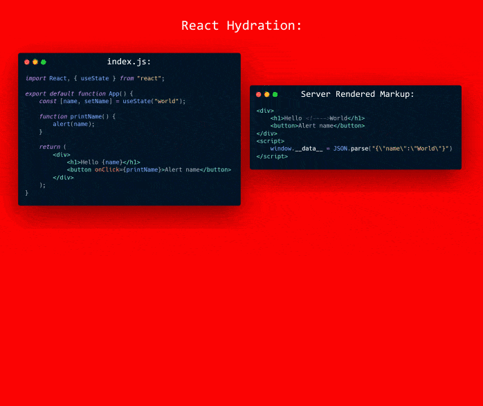

What is hydration? It typically refers to the act of making statically rendered markup interactive.

But what is interactive? Interactivity is added by attaching event listeners and setting the scene for those listeners to be able to change the view. The step aims to make the page indifferent to it being client-side rendered.

So how do frameworks add event listeners to the existing markup?

Many frameworks do this by rendering the markup again. The rendering identifies where the elements with listeners are. And from knowing their position they can attach to existing markup. To render the application first requires hydrating the state. For example with React:



*(Something like that I think)*

But the issue here is to add the event listeners the component needs to be *rendered* **and for it to be rendered it needs to its data/state**.

This is where hydration comes in. To render this "frame" it needs some data.

Standard client-side rendered sites would make a HTTP request to the backend API to get the data on the initial mount. But this is a separate request, there may have been changes to the data in the time between rendering the page, getting it to the client and the client parsing and running the script. The difference in the data could break things. The other issue is that this is a totally new request and (without backend caching) would have to make another request to the database which is expensive.

#### So the solution a lot of frameworks use is to send the data down as a JSON blob with the request {#double-data}

```html{data-highlight=6,15}
<head>
    <script>
        window.__data__ = JSON.parse(`
            {
                "articles": [
                    {
                        "title": "Tips for performant TypeScript"
                    }
                ]
            }
        `);
    </script>
</head>
<body>
    ...
    <h1>Tips for performant TypeScript</h1>
    ...
</body>
```

##### [This has some overhead because the data is effectively sent down twice](https://youtu.be/CQaDl9Fu0W0?t=365)

There is also the fact JSON is difficult to work with due to its difficulty in representing complex types such as [`Date`](https://developer.mozilla.org/en-US/docs/Web/JavaScript/Reference/Global_Objects/Date) and other things like cyclic references etc. Also, some JSON blobs are quite large especially if there are long lists of objects. And using raw JS object literals can be slow [due to the way they are parsed](https://www.youtube.com/watch?v=ff4fgQxPaO0).

Additionally, some parts of this object were not used in the render and so will not be needed in the re-render. In a large number of cases, this object contains more data than was needed.

The 'Time to interactive' measurement can be decreased because the whole state has to be parsed evaluated and the application rendered before a single event listener has been added. This problem also occurs for static site generation as well. Any sort of process of generating markup beforehand (which is beneficial) where that markup needs client-side reactivity needs to do some sort of hydration.

This issue is something framework authors and developers are aware of and actively working on:

- [Evan You, Creator of Vue](https://twitter.com/youyuxi/status/1274834284826763265)
- [Google post on the issue](https://developers.google.com/web/updates/2019/02/rendering-on-the-web#rehydration-issues)

[Partial hydration](https://medium.com/@luke_schmuke/how-we-achieved-the-best-web-performance-with-partial-hydration-20fab9c808d5#94ad) is one technique that is being considered. Using partial hydration in an app you split up the application so there are multiple sources. Instead of a single `hydrate` call, there are multiple invocations under some components. This way you can prioritize reactive elements and ignore static elements. See popular RFCs from these frameworks; [Svelte](https://github.com/sveltejs/svelte/issues/4308), [react](https://github.com/facebook/react/pull/14717), [angular](https://github.com/angular/angular/issues/13446).

But most implementations seem quite manual to implement. It also seems difficult to how this plays out with what is a static element and what needs to be reactive.

### But today I'll introduce a different approach: JIT hydration {#jit-hydration}

The fastest interactivity would be prioritizing adding event listeners. A non VDOM system doesn't need state to find event listeners. Instead, the framework's compiler could mark elements with event listeners and these could be added with the combination of local state in custom elements and `this.querySelector("#element_identifier").addEventListener`.

The state still needs to be hydrated to be accessible at the JS runtime. **But to prevent the double data problem the values would be hydrated from the rendered DOM and they could be done on access just in time (JIT)**.

This is what I have implemented into my framework [Prism](https://github.com/kaleidawave/prism). One of the features is JIT hydration:


#### And this is working quite well here on my [Hacker News clone](https://github.com/kaleidawave/hackernews-prism) {#demo}


It is compiled with the Prism compiler and all the rendered data can be JIT hydrated while none of the payloads send any sort of JS(ON) state blobs.

You can read more about the Hacker News clone [here](/posts/hackernews-clone-prism-rust)

JIT hydration has the effect of a fully hydrated page but at a lower cost to the client.

### So what are the features and benefits of Prism's JIT hydration? {#benefits}

- On load, the only logic is attaching event listeners. This leads to a decrease in the 'time-to-interactive' (TTI)
- Loading state is deferred until needed
- Loading in state is done on a per-property basis rather than everything at once so the lazy-ness does not come at a significant cost
- Smaller HTML payload sizes due to not needing JSON state
- Resolved complications for objects that cannot be represented in JSON (looking at you [`Date`](https://developer.mozilla.org/en-US/docs/Web/JavaScript/Reference/Global_Objects/Date) 👀), cycles etc

Although values in the DOM are all strings, Prism converts the strings to the correct types. As can be seen from the `id` and `score` values on each story in the state. Values are also cached after being pulled in during hydration, so later accessors don't have to go back to the DOM. The logic for doing this is invariant to the page and so JS is cached between requests. The JSON blob is different and so is sent down on every new full page.



### JSON based hydration

```html
<body>
    ...
    <h1 class="title">*post title*</h1>
    ...
    <script id="data" type="application/json">
        {..., "title": "*post title*", ...}
    </script>
    <script>
        const data = 
            document.getElementById('data');
        const state = 
            JSON.parse(data.textContent);
    </script>
</body>
```

> Data twice in response, parse done after load

---

### With Prism compiler

```html
<body>
    ...
    <h1 class="title" id="p2312">*post title*</h1>
    ...
    <script>
        const state = {
            get title() {
                const element = 
                    document.querySelector("p2312");
                return element.innerText;
            }
        }
    </script>
</body>
```

> Data loaded from markup and only when requested



### Conclusion

While it has its benefits, JIT hydration is difficult to implement. For it to work effectively there needs to be more analysis and code generation work done at build time. It needs to be established where the state is interpolated and how that can be reversed to be read at runtime.

There are also complications as components now have a *virtualized* or computed state. Another fact is that child components can have the state before the parent does. To do the immediate event listeners addition without state there needs to be markers in the markup as where elements are. Prism does this with a combination of classes added at build time and custom elements. Using these markers alleviates the need to "render" the whole application.

There are also complexities around values that are not represented literally in the DOM. For example, the `href` on the link tags is interpreted as `/i/${id}`. Prism has a limited expression reversal and here creates a `slice` expression to get the `id` value. But for more complex expressions it breaks down, especially for not 1:1 expressions where it is impossible.

So yeah, this is super early and experimental stuff. If you have any questions or feedback it would be great to leave them in the comments.

You can follow me and the development of Prism [@kaleidawave](https://twitter.com/kaleidawave)
