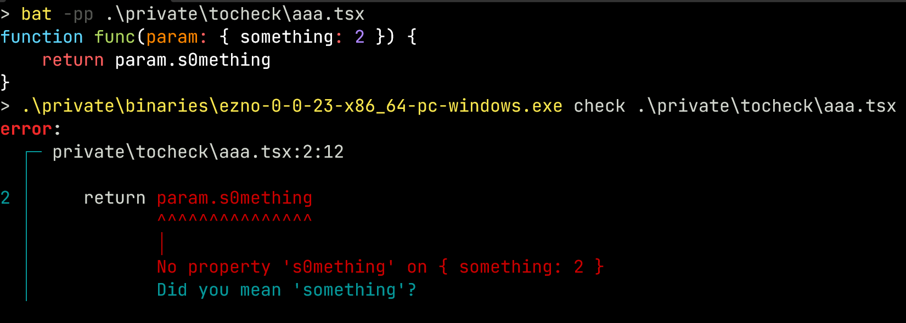

At the start of this year, I started on implementing checking for [TypeScript's mapped type feature](https://www.typescriptlang.org/docs/handbook/2/mapped-types.html). I always had it the back of my mind that this would be some of the hardest logic in TSC to re-implement. While I could have just skipped types using this mapped feature and treated them as `any`, I instead thought that having worked on some more realistic subtype and typed things, it would be an interesting challenge to get this complicated system verified by the Ezno type checker.

> For those who haven't heard of it before, the [Ezno](https://github.com/kaleidawave/ezno) type checker is a work-in-progress but fast and correct TypeScript type checker and compiler with additional experiments.

This post covers what mapped types are, a deep dive on generic checking and representing object types and finishes up covering some advanced property features that the type checker covers. You can read see an [overview the additions in the specification](https://github.com/kaleidawave/ezno/blob/main/checker/specification/specification.md#mapped-types).

> The Ezno type checker is built from the ground up. "Implementing" means getting *mostly* the same behaviour/output. No code or logic is copied from TSC. This post covers my approach to implementing mapped types, which may be different (or the same) as the TSC implementation. [Infact there are many different behaviors in Ezno compared to TSC](https://kaleidawave.github.io/ezno/comparison/).

> Much like many of the things in checker, there are still edge cases and a few other things that don't quite work at the moment. If you find them, then feel free to [raise an issue](https://github.com/kaleidawave/ezno/issues/new).

## The basics of object properties
In TypeScript, we can define objects with *fixed* keys

```typescript
type Event = {
	id: string,
	name: string,
	time: Date
}

function formatDate(date: Date): string { /* ... */ }

function renderEvent(event: Event) {
	const url = `/events/${event.identifer}`;
	const formattedDate = formatDate(event.name);
	return `<a href="${url}">
		${event.name} @ ${formattedDate}
	</a>`;
}
```

Here we define a `Event` type with an object. We represent properties as a list of key-value pair tuples.

```typescript
properties = [
	("id",   *string*),
	("name", *string*),
	("date", *Date*  ),
]
```

> This representation of events is greatly simplified for now but will be built on later.

There are several parts of the `renderEvent` function where we have to inspect the properties of `Event`.

First we see `event.identifer`. With this access expression we want to attempt to get the value associated with the `"identifier"` property key from the property list above. Finding the associate property value is quite straightforward to do in Rust using iterators.

```rust
let want_key = "identifier";
let value = properties
	.iter()
	.rev()
	.find_map(|(key, value)| 
		(key == want_key).then_some(value)
	);
```

However, when we run the above, we do not find any property pair whose key (the first item in the pair) is `"identifier"`. From this we raise a type error.

> We also return `any` here, [so we can continue type checking](/posts/sets-types-and-type-checking/#short-circuiting-and-continuing-on-errors).

Later on in the function we see `event.name` passed as an argument to `formatDate`. Again we run our search and this time it finds a key `== "time"`. The RHS value in this pair is the `string` type. As it used as argument we check it against the `date: Date` parameter of `formatDate` and therefore find another error as we cannot assign `string` to `Date`.

[](https://kaleidawave.github.io/ezno/playground/?id=32i0aq)

Raising these type errors hints the programmer at how to correct the code. In this fixed version we can correct the access to use an actual property.

```ts
function renderEvent(event: Event) {
	const url = `/events/${event.id}`;
	const formattedDate = formatDate(event.time);
	return `<a href="${url}">
		${event.name} @ ${formattedDate}
	</a>`;
}
```

### More advanced shapes of objects
This first example is relatively simple. However, keys can get more complex than this. For example the `Array` type has the `number` type as a property key.

```typescript
interface Array<T> {
	[number]: T,
	// ...
	push(t: T): number,
	// ...
}
```

There are some complications this brings
- This key is not singleton: many keys match to this property value `T`. e.g. We want `x[0]`, `x[5]` etc to both yield `T`
- This key is not a string: we have to do a bit analysis to see if the key matches the `number` type. `===` does not cut the mustard
- Additionally we want to keep existing string key behaviour on the same type. Will still want accesses such as `x["push"]` to yield actual methods on the `Array` type.

> [In JavaScript all keys are strings (or symbols)](https://developer.mozilla.org/en-US/docs/Web/JavaScript/Guide/Working_with_objects#objects_and_properties). When we have a type here, it either depicts some generic, a string or something that coerces simple to a string (such as `number` and `boolean`).

To support types as properties we need to expand the variants of key beyond a `String`.

```diff
- type PropertyKey = String;
+ enum PropertyKey<'a> {
+     Constant(Cow<'a, str>),
+     Type(TypeId)
+ }
```

> While we could have `PropertyKey = Constant(String) | NumberLike`. We will use the `TypeId` as it will handle more complex scenarios when we move on to the next part and further into mapped types.

> We use `Cow<'a, str>` because we use the `PropertyKey` type in two places, one for storing properties where it `'static` (owned) and one for lookup where it uses an existing `&'a str` slice from the AST. Using `Cow<'a, str>` instead of `String` makes it simple to reuse the definitions for both storage and lookup without cloning bytes unnecessarily (if we had a string member, we would have to `.to_owned()` on AST just to perform a byte equality).

### Generic types with generic property keys
Now that property key can point to a `Type` (`TypeId` is a pointer to a `Type`) we can have a look at implementing the following [`Record` helper type](https://www.typescriptlang.org/docs/handbook/utility-types.html#recordkeys-type). A `Record` is object type who has keys of the type of generic `K` with values in generic `V`.

```typescript
type Record<K extends string, V> = { [P in K]: V }
```

Here the `Record` type is represented in the system as a type alias with two generic parameters and a *single* properties with the pairing `(PropertyKey::Type(*K*), *V*)`. In this pseudo-representation.

```typescript
Record *100* = Type::Alias {
	name = "Record",
	parameters = Some([ 
		// 5 is type id string
		("K" extends *5*, id=*101*), 
		// 1 is type id any/unknown. 
		("V" extends *1*, id=*102*) 
	])
	value = Type::AnonomousObjectLiteral(
		[
			(
				// key of type K
				PropertyKey::Type(*101*), 
				// value of type V
				*102*,
			)
		]
	)
}
```

Now with our type we can instate it with some specific types. Let's say we are getting some data from an API which returns JSON. Once we have parsed the JSON we know from some assumptions that the results are `number`. So we have a `Record<string, number>`. We represent this using a [partially applied generic](/posts/sets-types-and-type-checking/#partially-applied-generics).

```typescript
Record<string, number> = Type::PartiallyAppliedGeneric {
	on: *100* // Record type without generic arguments
	arguments: [
		(*101* = *5*), // K = string
		(*102* = *4*), // V = number
	]
}
```

> A [`Map`](https://developer.mozilla.org/en-US/docs/Web/JavaScript/Reference/Global_Objects/Map) would be a better data structure to use here, but we are doing working in the bounds of JavaScript with the untransformed output of `JSON.parse`.

> During instantiation we also check that the first type argument `string` extends `string` (obviously holds as [subtyping is a reflexive relation](/posts/sets-types-and-type-checking/#the-details))

Using the partially applied generic, we don't create a whole new object and substitute values, we just pair the `Record` *template* with some values.

> This step is exactly the same as regular generic objects, nothing new for mapped types just yet.

### Recording generics with the generic chain
Before we can understand how we can access property keys that are generic types, will take a short deep dive into how reading the wrapped generics works.

We know that `Box<number>` is a pairing of the `Box` type with a map of type arguments to type parameters (e.g. `Box<number> = (Box, T = number)`). When we get a property from this type, we split off the generic arguments and store them in a table. We then look for the property on the *naked* generic type. If we find a value here we return it with the current chain table. For the following

```typescript
interface Box<T> { inner: T }

function getInner(box: Box<number>) {
	return box.inner
}
```

The process is something like
- We start by requesting the `"inner"` property on `Box<number>`
- We unfold the type arguments and so we now look for `"inner"` on `Box` with `substitutions: [(T, number)]`.
- In this example `"inner"` **does** exist on `Box` so we return `Logical::Implies { result: PropertyValue::Value(T), substitutions }` where we also send our `substitutions` chain with the result
- After lookup we found a valid result `T`. We find there are some substitutions we scan `T` and follow any lookups from the `substitutions: [(T, number)]` list.
- We find a `T` can be substituted with `number` and so return `number`

> We return a `Logical::Implies` adjoined with substitutions in a middle step because it works better in Rust's borrow checking. While in this case the substitution was a simple swap, in other cases we need to register new types and is easiest to create new types (mutate the store) only **after** the traversal of current types has finished.

### Subtyping with generics
Above we used the `GenericChain` for lookup. We also use this structure for subtyping of generic items.

```ts
interface Box<T> { inner: T }

const numbers: Box<number> = { inner: "not number" };
```

When checking (subtyping) the following happens with the table. (each line *somewhat* represents call to the [`is_subtype` function](https://github.com/kaleidawave/ezno/blob/16f7779b157dea4da2b618d8e192492a09d1acb9/checker/src/types/subtyping.rs#L221))

```ts
Box<number>                            :> { inner: "not number" }

// Unfold the `number` argument
{ inner: T }         (with T = number) :> { inner: "not number" }

// iterating over properties on the LHS. We only have `inner` property
{ inner: T }.inner   (with T = number) :> { inner: "not number" }.inner
T                    (with T = number) :> "not number"
// Replace T with number here using this chain
number               (with T = number) :> "not number" // <- subtyping returns here
```

In the above we see that the LHS unfolds its generics and so we can reduce them out to checking on the *leaves*.

> Note the RHS can also produce a table if it is generic.

In the above example I simplified `substitutions` to just be a list. In the actual code this is called `GenericChain` and is a linked list of substitution lists. This allows it to do nested generics. So the following is valid.

```typescript
interface Box<T> {
	parent: Box<number> | null
	inner: T
}

const myBox: Box<string> = { parent: { parent: null, inner: 6 }, inner: "heya" }
```

```typescript
// Checking
Box<string>                            :> { ... }
{ ... } with (T = string)

{ ... } with (T = string) (T = number) :> { ... }
T       with (T = string) (T = number) :> 6
// We pick the first from the right
number                                 :> 6
```

> Additionally `GenericChain` uses lifetimes of arguments rather than cloning lists (and thus allocating).

### Testing generic keys
Given we now have these generics basics out of the way, we have to define what these type representations contain.

It starts to get more complicated for type keys. One case of this is the `Array` type. As previously stated the `Array` type has a numeric property and for this we can't really use equality. :/

```typescript
PropertyKey::Type(TypeId::NUMBER_TYPE) 
  == PropertyKey::String(Cow::Borrowed("1"))
```

So instead we need to make a special function for key validity that we can put into the lookup function.

This is where the complications start. While we could use `type_is_subtype` we don't have two `TypeId`s as we sometimes have a `PropertyKey::String` on a side. We also have a problem in the above example. `"1"` is string not a number, so we have to add catch for the implicit conversion JavaScript when assigning and reading properties with keys that are numbers.

Unfortunately we do have a have some duplication of some logic but we have a function like

```rust
fn key_matches(
	base: PropertyKey,
	want: PropertyKey,
) -> bool {
	// simple case
	if (
		PropertyKey::String(base), 
		PropertyKey::String(want))
	) = (base, want) {
		return base == want
	}

	// catch for number
	if let (
		PropertyKey::Type(TypeId::NUMBER_TYPE), 
		PropertyKey::String(want)
	) = (base, want) {
		return want.parse::<usize>().is_ok();
	}

	// delegate to regular subtyping
	if let (
		PropertyKey::Type(base), 
		PropertyKey::Type(want)
	) = (base, want) {
		return type_is_subtype(base, want).is_subtype();
	}
}
```

> Full `key_matches` function [here](https://github.com/kaleidawave/ezno/blob/e6f6ffd7cb48285cdaaf7e57e4d636bbaf038b03/checker/src/types/subtyping.rs#L2460-L2462)

> We could create `PartialEq` implementation but 1) it is not equality, as it involves subtyping and 2) as we will see in a minute this function will start to take a few more parameters and as we are only fixed to LHS and RHS parameters in `PartialEq::eq` we will we use a function instead

#### Passing generics through `key_matches`
In our initial `Record` example we have a key that is a generic parameter. With the above we have a problem as we do subtyping on `K` but we don't have a value for `K`. Our `key_matches` function isn't aware of type parameters.

So we modify `key_matches` function to allow generic arguments down. This base generics will contain a list which has the `K=string` pair in. When we do subtyping we find a `K` on the LHS, and using our list we pass down, [we look up the argument for `K`](https://github.com/kaleidawave/ezno/blob/e6f6ffd7cb48285cdaaf7e57e4d636bbaf038b03/checker/src/types/subtyping.rs#L2500) and find `string`. Therefore if `want` is a string like property key then the `key_matches` function returns in this example `true`!

```rust
fn key_matches(
	(base, base_generics): (PropertyKey, GenericChain),
	(want, want_generics): (PropertyKey, GenericChain),
) -> bool {
	// ...

	if let (PropertyKey::Type(base), PropertyKey::Type(want)) = (base, want) {
		return type_is_subtype((base, base_generics), (want, want_generics)).is_subtype();
	}
}
```

When this returns `true` we now have the following lookup. As it returns true, we yield the value and this in turn is returned with the chain so that we can substitute values in.

```rust
// From `Record<string, number>`
let base_generic_chain = *[(K, TypeId::STRING_TYPE), (V, TypeId::NUMBER_TYPE)]*;
let want_key = PropertyKey::String(Cow::Borrowed("something"));
let value = base_properties
	.iter()
	.rev()
	.find_map(|(key, value)| 
		key_matches((key, base_generic_chain), (want_key, None)).then_some(value)
	);

return value.map(|value| Result {
	 value,
	 substitutions: base_generic_chain
})
```

This is how `Record<string, numbers>` works. It isn't quite a mapped type yet, but hopefully you have a bit more of an understanding of generics to see how this works now.

> Additionally I hope you can see why the properties are stored as a `Vec` here (rather than a `HashMap`). Not only is it a little overkill for the average < 10 key based object. There isn't a simple hash and equality relation for when keys based on types are in the picture.

## On to mapped keys
### Real mapped types
So far we have covered constant keys and keys that are passed from above via a generic.


(real) Mapped types are when the property value is based on the type of a property key.


We do this using the `[ParameterName in ...]: Value` syntax for a property. Here `ParameterName` is a new generic parameter (similar to that on functions or interfaces). It is can be used as a value in the `Value` type annotation.

For example, in the following we build a type that *maps* over the keys of `Event` and builds a **new** type where each field might be `null`. We can see it uses type `P` as a inline property generic. We use `in` to say it must extend the type `keyof Event` (covered more in a minute). We use this generic `P` in the property value to depict the result is the associate value of `Event[P]`.

```typescript
type Event = {
	id: string,
	name: string,
	time: Date
}

type EventButFieldsPossiblyNull = {
	[P in keyof Event]: Event[P] | null
}
```

We have **mapped** each property to a new value using `P` as a parameter.

This practise is normally parameterised and used for utility types.

```typescript
type TButFieldsPossiblyNull<T> = {
	[P in keyof T]: T[P] | null
}
```

They are a niche feature, but like many other abstractions they can be useful when
- Don't want to copy out definitions of existing items
- Keeping definitions up-to date/inline within related definitions
- Working on top of definitions we don't own (external or generated etc)

> Again this partial applied. "creating" a mapped type does not walk the properties, it just creates a partially applied generic. This reduces overhead on instantiation, but moves complexity to usage and means that each usage has to do some work.

#### Important functionality: Inferring type argument values
Before talking about the access part. I will talk about a new kind **kind** of generic recording. We previously saw how type arguments on a structure are passed down through access and subtyping with `GenericChain` the table like structure.

There are cases where we have a generic but don't have a value for it. Instead we need to **infer its value based on usage**. This is where `Contributions` comes in.

For example given the function

```ts
declare function idString<T extends string>(t: T): T;
```

When we call it with `idString("Hello World")` we want to find a type for this expression and this requires knowing figuring out the returned type. In this example we need to infer `T` to have the value `"Hello World"`, which we will then use to substitute as the return type.

The implementation to do lies in ~~making~~ subtyping ~~more complex~~. When we call a function we subtype each argument value against its respective parameter type. In this case we run `(T extends string) :> "Hello World"`. The inner steps are as follows
- We find that the LHS `T` is a (substitutable) generic parameter
- **We find that it does not have a value in the LHS `GenericChain` so continue to subtype the generic** (there is no `GenericChain` in this example).
- We also do not find for this `FunctionGeneric` that there is a explicit call side type argument in `state.call_site_type_arguments` so continue to subtype the generic
- For generics [we check the extends constraint](https://github.com/kaleidawave/ezno/blob/16f7779b157dea4da2b618d8e192492a09d1acb9/checker/src/types/subtyping.rs#L615-L620) (if there was no extends annotation, this annotation would extend `any` and so this check always passes)
- We find the constraint check passed (`"Hello World"` does indeed extend `string`!)
- The important part: take our LHS generic type `T` and RHS type `"Hello World"` and **we append `T="Hello World"` as a tuple pair into the `contributions` list in state**. Something like [`contributions.push((lhs, rhs))`](https://github.com/kaleidawave/ezno/blob/16f7779b157dea4da2b618d8e192492a09d1acb9/checker/src/types/subtyping.rs#L628-L629).

> `Contributions` is inside the `subtyping::State` structure which is passed through the `is_subtype` function (as well as the generic chains).

> There are some fun details with contributions such as dropping cases with union types when a branch fails. We can also see that through the `NoInfer` intrinsic the results are dropped. This is why they are internally held as `Vec` because that is easy to drop ranges from as it is ordered.

By doing it this way it allows inference to be done in the same *scan* by the type checker. Although this if faster and simpler, it does have *complications* (not impossible though) for inference that uses parameters before a value to the right has been checked and inferred.

#### Mapped keys: The identity key case
After you have passed inference 101 above, you should be good to go for getting you head around how mapped types work.

We will start of with the *identity* mapped type.

```ts
type IdOnKeys = { [P in string]: P }
```

When accessing `["a"]` it goes through the steps outlined above
- First as one of the side is `key_matches` it goes to subtype (or something like subtyping),
- There is no value for `P` in the `GenericChain` (it is not passed from above and also it is marked as a `MappedGeneric` type) so we go to generic contributions
- `P in string` implies `P extends string` and we have that `"a"` is a string so we continue
- In this case we add `P = "a"` to the contributions! The argument for generic parameter `P` is inferred to be the type `"a"`

Now we have our pairing we need to make the access aware of this value. To do this we expand on our `GenericChain` table and pass `*[(P, "a")]*` to the value resolution.

[](https://kaleidawave.github.io/ezno/playground/?id=2hwcga)

> One of the problems when attempting the addition of this feature is that inference/contributions is a a `TypeId` to `TypeId` paring. When accessing a property key we can have be passed `PropertyKey::String` which is not a type. We are a bit stuck as we cannot create a new type during subtyping as that would conflicts with the borrow checker (we would require a mutable reference to `TypeStore` and during subtyping we only have a immutable reference to the bank of types). So like so many problems faced with types, it turned out the checker needed a new pseudo type.

> To work around allowing `TypeId <- String` contributions I introduced the new **`CovariantContribution` enum to the contribution system**. This structure has more variants and so is effectively `TypeId | String | ...` and like other things delegates later steps to creating a type.

#### Mapped types: the identity map case
The above shows a basic example of the mapping parameter keys. We will now step up in complexity to cover some more useful mapped types. The first is the identity map on objects. It takes a object and producing another object with the same keys mapping to the same values.

```typescript
type IdentityOnObject<T> = {
	[P in keyof T]: T[P]
}
```

While this has no effect, we can see how we can now modify this above example to give it more use by applying type operations to the property key or value type.

```typescript
type Pick<T, ToPick extends string> = {
	[P in (keyof T & ToPick)]: T[P]
}

type Omit<T, ToOmit extends string> = {
	[P in (keyof T & Not<ToOmit>)]: T[P]
}

type MakeArray<T> = {
	[P in keyof T]: Array<T[P]>
}
```

> While you can use the TypeScript `Exclude` type and [it works in Ezno](https://github.com/kaleidawave/ezno/blob/main/checker/specification/specification.md#infer-and-extends-distribution), I think it is simpler to use the new [`Not`](/posts/experimental-types/#the-not-type).

#### Key type modifiers: `in` and `as` syntax
Mapped types can have special syntax in the property position.

In the first example, it is quite simple to see [`K in T` implies `K extends T`](https://github.com/kaleidawave/ezno/blob/16f7779b157dea4da2b618d8e192492a09d1acb9/checker/src/synthesis/interfaces.rs#L321-L331).

The harder code syntax is `as`. At first it got me scratching my head. But I figured that rewrites the key.

```typescript
type PrefixKeys<T> = {
    [P in ((keyof T) & string) as `property_${P}`]: T[P];
};
```

For the identity on properties we have the property key as `infer P`, for the identity on objects we have a key of type `infer P extends keyof T`. For this example we put insert `P` into the RHS type and so have `property_${infer P extends ((keyof T) & string)}`. In total this is a [three line addition](https://github.com/kaleidawave/ezno/blob/16f7779b157dea4da2b618d8e192492a09d1acb9/checker/src/synthesis/interfaces.rs#L336-L339) we already have the `P` type in the namespace for the RHS type synthesis.
## More advanced property values

So far we have only seen properties having the value being a exact type. To discuss the last parts of mapped types we need to expand on the variants of `PropertyValue`.

```diff
- type PropertyValue = TypeId;
+ enum PropertyValue {
+     /// Simple
+     Value(TypeId),
+     /// from `get` and `set`
+     GetterSetter {
+         getter: Box<FunctionType>,
+         setter: Box<FunctionType>,
+     }
+ 
+     ///
+     ConditionallyExists {
+         condition: TypeId,
+         value: Box<Self>
+     }
+ 
+     ///
+     Configured {
+         writable: TypeId,
+         // ...
+         value: Box<Self>
+     }
+ }
```

The simple case becomes the main variant. We also introduce `get` and `set` functions in here, we handle them specially but that is for another blog post.

The two newer additions are `PropertyValue::ConditionallyExists` and `PropertyValue::Configured`.

### `PropertyValue::ConditionallyExists`
A property can conditionally exist via adding the `?` prefix modifier to property declaration.

```ts
interface MappedTypes {
	fun?: "YES!"
}
```

> This declaration is different to `fun: "YES!" | undefined` as in this case `fun in obj` is always `true`, whereas in the above example it is conditional. Here we say that condition for it existing is *unknown* and use the `boolean` type in its place.

This variant can represent actual JavaScript code

```ts
const obj = {};
if (condition) {
	obj.prop = 2;
}
// obj.prop conditionally exists (value = 2) based on `condition`
```

Here we see that `"prop" in obj` is only `true` when `condition` is truthy. When we access this property we allow retrieve it but we do union the result with `undefined` for the user to account for later.

### `PropertyValue::Configured`
The second new `PropertyValue` variant is a configured wrapper. In JavaScript [every property has a descriptor](https://developer.mozilla.org/en-US/docs/Web/JavaScript/Reference/Global_Objects/Object/getOwnPropertyDescriptor). The usage of the these descriptors is quite low. However they crop up in standard library items ([normally causing problems](https://developer.chrome.com/blog/smooshgate/)).

We can (ab)use the `writable` value of a property to mark a property as readonly. We say that when `writable` is `false` we cannot assign to it. For example if the `x` property is not writable, then `.x = 2` will fail.

So given a property declaration prefixed with `readonly`

```typescript
interface Item {
	readonly id: string,
	count: number,
}
```

we define the properties as something like

```typescript
[
	("id", PropertyValue::Configured { 
		value: PropertyValue::Type(TypeId::STRING_TYPE),
		writable: TypeId::FALSE
	})
	("count", PropertyValue::Type(TypeId::NUMBER_TYPE))
]
```

and do not allow writing to it

[](https://kaleidawave.github.io/ezno/playground/?id=2rvy0y)

> There is a bit of nuance here around TypeScript `readonly` and JavaScript `writeable`. TypeScript's `readonly` is a developer abstraction, which has no effect on compile time. `writeable` on the other hand is part of JavaScript execution and has runtime behaviour when looked up `Object.getPropertyDescriptor`.

> Most people prefer the upfront warnings of readonly, rather than marking it as immutable. JavaScript `writable` is hard to do compile introspection (but not impossible as showcased later), so TypeScript added their own syntax and system to add this case.

> There are others here, but we skip over them for now

### Mapping Modifiers: Default behaviour

When we have a mapped key that uses extends, **we have to carry over these conditional and writeable modifiers**. For example given

```ts
type AllValuesString<T> = {
	[P in keyof T]: string
}
```

Then if we have `AllValuesString<{ a?: number, readonly b: boolean }>` then the resulting type **is actually `{ a?: string, readonly b: string }`**!

This seems incredible complicated to implement at first, but it is possible.

In the implementation in Ezno, at the mapped type definition: if the key extends a `keyof ...` modifier, the resultant property is modified to be based on two special parameters `TypeId::WRITABLE_KEY_ARGUMENT` and `TypeId::NON_OPTIONAL_KEY_ARGUMENT`.

```rust
let mut rhs = PropertyValue::Value(...);

if references_key_of(mapped_type.extends) {
	rhs = PropertyValue::ConditionallyExists {
		condition: TypeId::NON_OPTIONAL_KEY_ARGUMENT,
		value: Box::new(PropertyValue::Configured { 
			on: rhs, 
			writeable: TypeId::WRITABLE_KEY_ARGUMENT 
		})
	};
}
```

Here the property is made conditional and configured based on two special types. We can treat them as parameters. We need to infer whether they are true or false based om `keyof` returns.

So the next part is to connect this up from the other side. When doing subtyping for key matching, if we test against a `keyof` type, [two arguments are set into the inferred table against for these internal parameters `TypeId::WRITABLE_KEY_ARGUMENT` and `TypeId::NON_OPTIONAL_KEY_ARGUMENT`](https://github.com/kaleidawave/ezno/blob/16f7779b157dea4da2b618d8e192492a09d1acb9/checker/src/types/subtyping.rs#L2851-L2891).

When we get a property out the [other side we match these up and specialise them](https://github.com/kaleidawave/ezno/blob/16f7779b157dea4da2b618d8e192492a09d1acb9/checker/src/types/properties/access.rs#L966-L977).

### Mapped type modifiers: Property descriptor and conditionally exists

So we have the default case out of the way. We can change the mapping-ness and enforce cases using special syntax.

For optionality with `?:`, we set `condition: TypeId::TRUE` in the conditional wrapper (rather than the special mapping parameter type)

```ts
type Partial<T> = {
	[P in keyof T]?: T[P];
};
```

Here because of the `-?:` we **do not add** the conditional wrapper

```typescript
type Required<T> = {
	[P in keyof T]-?: T[P];
};
```

Here with the `readonly` prefix we set `readonly: TypeId::TRUE` in the configurable wrapper (rather than the special mapping parameter type)

```ts
type Immutable<T> = {
	readonly [P in keyof T]: T[P];
};
```

Here because of `-readonly` we **do not add** the configurable readonly wrapper!

```typescript
type Mutable<T> = {
	-readonly [P in keyof T]: T[P];
};
```

> [Full logic here](https://github.com/kaleidawave/ezno/blob/16f7779b157dea4da2b618d8e192492a09d1acb9/checker/src/synthesis/interfaces.rs#L364-L395)

And that concludes the mapped type section. Let me know in the comments if there is any mapped type feature I have missed.

The next parts go into some really interesting and important things about properties and more types!

## String intrinsics: `Uppercase`, `Lowercase`, etc

When working on mapped types, I noticed some examples used [special string transforms](https://www.typescriptlang.org/docs/handbook/utility-types.html#intrinsic-string-manipulation-types) in their `as` clause. We can pass constant strings to these transformer types.

```ts
const x: Uppercase<"hi"> = "HI";
const y: Lowercase<"Hello"> = "hello";
// Type error: "example" is not assignable to "EXAMPLE"
const z: Uppercase<"Example"> = "example";
```

There are a few things that were implemented during this step
1. Eagerly apply the transformation, including through union types (`Uppercase<"a" | "b"> = "A" | "B"`).
2. Apply when used on a generic for a return type
3. Subtyping.

Similar to other intrinsics, when we encounter this we have custom logic for these situations.

> If anyone has a neat way to do case insensitive string equality that is better than [`lhs.to_lowercase() == rhs.to_lowercase()`](https://github.com/kaleidawave/ezno/blob/16f7779b157dea4da2b618d8e192492a09d1acb9/checker/src/types/subtyping.rs#L2614C5-L2614C55) then [please send a PR 😁🙏](https://github.com/kaleidawave/ezno/compare).

### Introducing my own intrinsic: `CaseInsensitive`
One example that got me confused.

```typescript
type Item = {
    id: string,
    iD: number
}

type MappedItem = {
    [P in keyof Item as Uppercase<P>]: Item[P]
}
```

Here we have a property of type `Uppercase<infer P extends keyof Event>`. We can pull out the problem here and I will give you an equivalent problem: what the return type is here?.

```typescript
declare function func<T extends string>(param: Uppercase<T>) -> T;
```

We see that we have to infer through this `Uppercase` boundary. For it to be valid you expect `func("hi")` to return all four valid values for `T`: `"hi", "Hi", "hI", "HI"`. To support this I added `CaseInsensitive`. The result is that if a inferred pair is found inside one of these case transformations then we wrap the output in `CaseInsensitive` to pick up all valid cases.

After adding similar subtyping logic, this fixes the problem.

> I think I had to do it this way because I am doing it via inference via `key_matches` whereas TypeScript eagerly evaluates mapped types and so eagerly generates these variants.

> If you like intrinsics, check out the [last blog post](/posts/experimental-types).

Switching it up, here are some other things I have been working on properties.
## Functions and `Object.keys`
We will now take a peek at the crazier side of the checker. One of the biggest experimental features is the *observance of side-effects*.

In some *linear* code we can apply *mutations* to *types* as the program progresses.

```ts
const obj = {}
obj.property = 2;
obj satisfies string; // fails as 2 is not a string
```

This simple case is quite simple to implement. But problems occur when using functions. A huge experiment in Ezno is for functions to record *special properties* not representable by just types. [We can see this in the following example](https://kaleidawave.github.io/ezno/playground/?id=2iitje).

```ts
function setAt(obj, at: number, value) {
	obj[at] = value
}

debug_effects_rust(setAt)
```

We will skip over a lot here but jumping straight into the deep end and the front of this experiment [the specification has an example which shows the application of some of the `Array.prototype.push` mutation information](https://github.com/kaleidawave/ezno/blob/main/checker/specification/specification.md#array-push). This gives us more precise information on values after mutations.

WW also account for mutations in `for ... in ...` loop. Again glossing over a lot here, but the assignments in the loop get collected and when we call some functions which use this, we inspect the object that is `in`'d and we run each assignment for each (enumerable) property key in the object.

In fact this is also how `Object.entries`, `Object.values` and `Object.assign` work. We define them as

```typescript
declare class Object {
    static keys(on: { [s: string]: any }): Array<string> {
        const keys: Array<string> = [];
        for (const key in on) {
            keys.push(key);
        }
        return keys
    }

    static values(on: { [s: string]: any }): Array<any> {
        const values: Array<any> = [];
        for (const key in on) {
            values.push(on[key]);
        }
        return values
    }

    static entries(on: { [s: string]: any }): Array<[string, any]> {
        const entries: Array<[string, any]> = [];
        for (const key in on) {
            entries.push([key, on[key]]);
        }
        return entries
    }
}
```

and we get the following results (at least on ezno `0.0.22`, it is broken in the latest Ezno and we seem to miss out on the first iteration. Hopefully I can find some time to track down what is broken here soon)


> This may seems like a lot of work but this mechanism has a lot of other benefits and I think it is the coolest part of Ezno. I will eventually share the whole system and some really interesting things I have discovered.

### Complications with  `Object.defineProperty`
These inferred side-effect things are cool. However for some things we can't use mutations based on JavaScript code, these being
1. Internal APIs (aren't possible just using JS syntax)
2. APIs that would be quite complex to write in terms of events (also don't make sense for all inputs). For example `Math.sin`.

> This is similar with JavaScript runtimes. For certain things they use special native code for these functions rather than just JavaScript.

The function `Object.defineProperty` has this property. It isn't possible to write an alternative for this function just using `[key]` and `=`.

So rather than giving this function a body and using the events it has a different behaviour for a constant function. When `Object.defineProperty` is called, [it instead runs this internal logic in `constant_functions.rs`](https://github.com/kaleidawave/ezno/blob/16f7779b157dea4da2b618d8e192492a09d1acb9/checker/src/features/constant_functions.rs#L406-L528). It isn't perfect, but it does accept sensible usage of this API.

Previously we saw that we needed a `readonly` annotation this value. But we can do exactly the same in JavaScript

[](https://kaleidawave.github.io/ezno/playground/?id=32i0ay)

### Freeze and more
The initial mapped type PR included basic support for `freeze`. But thanks to an [external PR](https://github.com/kaleidawave/ezno/pull/213) the logic is not extended to cover `preventExtensions` and`seal`

[](https://kaleidawave.github.io/ezno/playground/?id=27wr9e)

## The current representation for properties: adding `Publicity`
Over the course of this blog post we have built up the representation of properties. The final piece is that this key-value pair is a actually a triple including `Publicity` ([public or private](https://developer.mozilla.org/en-US/docs/Web/JavaScript/Reference/Classes/Private_properties)), `PropertyKey` and `PropertyValue`. ([However full private and public property checking is unfinished](https://github.com/kaleidawave/ezno/issues/219)).

They are stored in a array (`Vec`), for example the type annotation `{ a: 0, b: 2 }` is represented something similar to

```rust
[
	(Publicity::Public, PropertyKey::String("a"), PropertyValue::Value(TypeId -> 0)),
	(Publicity::Public, PropertyKey::String("b"), PropertyValue::Value(TypeId -> 2))
]
```

As discussed the type checker in Ezno is mutation (technically fully side-effect) aware and dependent so traditional representing this as `obj = type with properties` doesn't quite work. Instead we say `obj = *object 100*` and then record properties onto each object for each context.

This is because objects can have difference properties in different contexts. *There isn't a globally true list of properties for a object*.

```ts
const obj = { property: 1 };
// ctx.properties = { 'obj': [["property", { value: 1 }]] }
if (condition) {
	obj.property = 2;
	// ctx.properties = { 'obj': [["property", { value: 1 }], ["property", { value: 2 }]] }
	// obj.property = 2 throughout here
} else {
	console.log("something")
	// obj.property = 1 still here
	// ctx.properties = { 'obj': [["property", { value: 1 }]] }
}
```

**The current system also enables interface merging. However not all types store their properties on the context. Thanks to a recent change, anonymous object type annotations store their properties actually on the type.**

> The eagle eyed among you will notice that in the first branch, `obj` has two properties named `property`. I am still unsure whether appending rather than replacing is the best approach. It does mean that assigning a property doesn't have to check the rest and not-implemented at the moment but it means that LSP hover could instead only print up-to some assignment. This system is fine though as access accounts for this finding the first match when walking right-to-left.

### Improvements to listing types
The PR also made some improvements for being able to get all properties on an object. Now [number properties are sorted and added first](https://github.com/kaleidawave/ezno/blob/16f7779b157dea4da2b618d8e192492a09d1acb9/checker/src/types/properties/list.rs#L105), [the `enumerable` property is checked](https://github.com/kaleidawave/ezno/blob/16f7779b157dea4da2b618d8e192492a09d1acb9/checker/src/types/properties/list.rs#L43-L45) and [properties with both `get`ter and `set`ter fixed](https://github.com/kaleidawave/ezno/blob/16f7779b157dea4da2b618d8e192492a09d1acb9/checker/src/types/properties/access.rs#L67-L84).

Additionally [thanks to an external PR](https://github.com/kaleidawave/ezno/pull/180) added a while back, when a property is not find it gives alternatives using the Levenshtein algorithm on these keys.



### Future changes to properties for consideration
> None of this adds anything. But there is still things that could be changed with regards to this representation of properties.

- Separate out `PropertyValue::Configured`
   	- Maybe this could be held separately on the context
- Adding *metadata* to properties
   	- This is needed for documentation comments in the LSP
- Restructuring the `LocalInformation.properties`
   	- Maybe removing `PropertyValue::Optional` for `{ a: string, b?: string } == { a: string } & ({ b: string } | {})`
- `Publicity` item absorbed in `PropertyKey` ?

---

Hopefully you enjoyed this blog post! If you haven't seen yet there are recent blog posts on [experimental types](/posts/experimental-types) and a [background on type theory](/posts/sets-types-and-type-checking).
