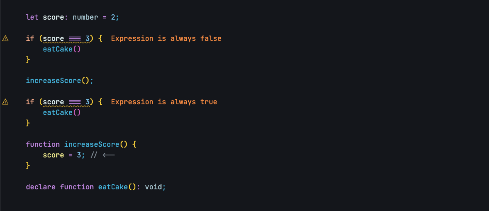
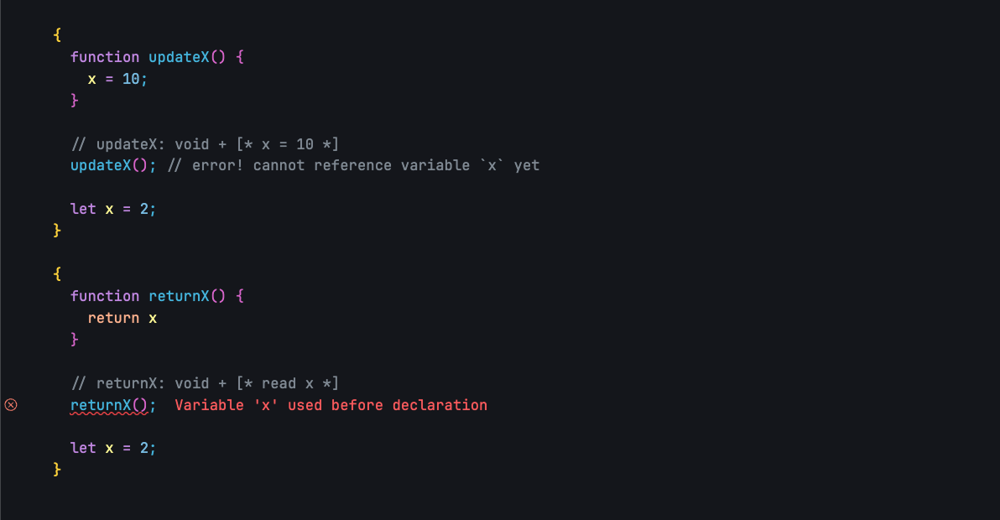
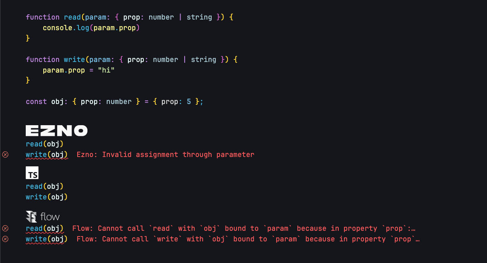
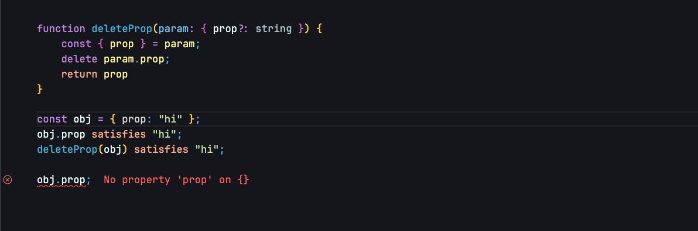
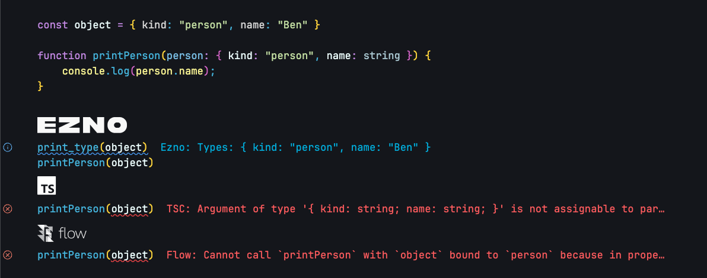
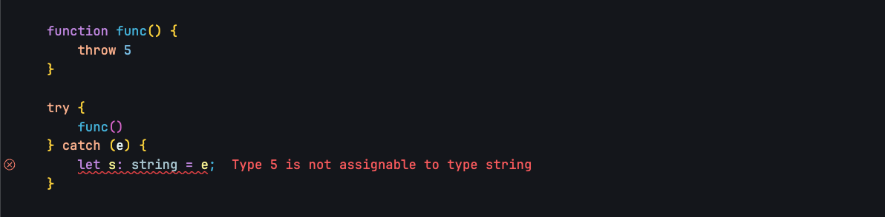
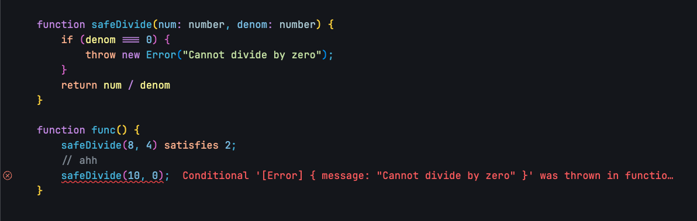
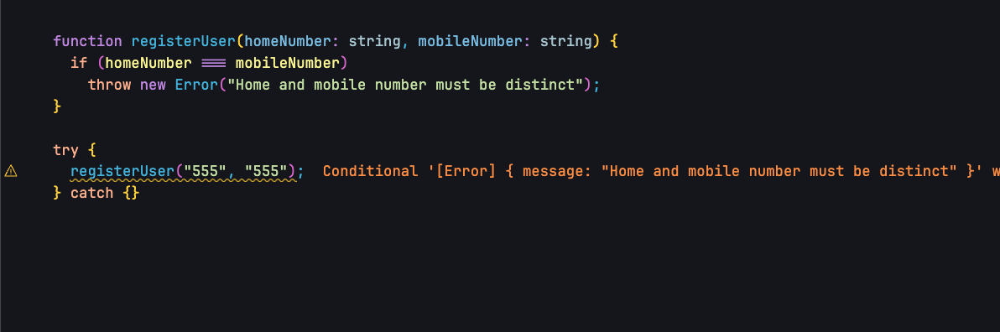
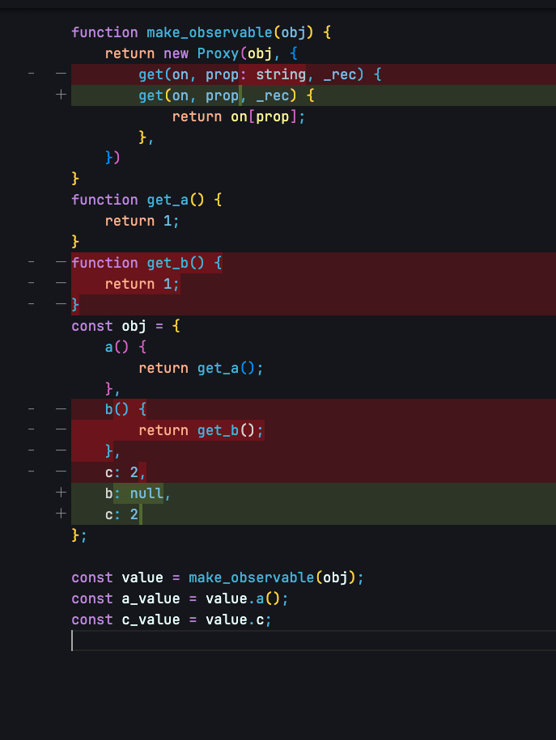
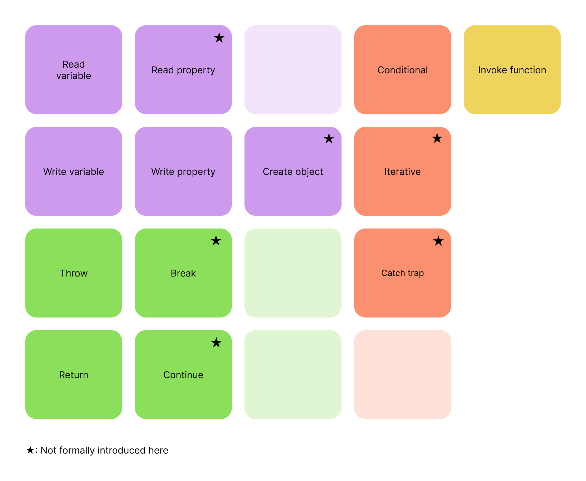

One of the biggest experiments in the Ezno type checker is the tracking of events inside functions.

I first started experimenting with the idea in early 2022 and gave a very brief introduction in the [announcement blog post](/posts/introducing-ezno/#effects%2Fevents). Apart from a few brief mentions [here](/posts/ezno-23/#internal-object-effects), [here](/posts/a-preview-of-the-checker/#events-and-effects) and [some hints elsewhere](https://github.com/kaleidawave/ezno/releases/tag/release%2Fezno-0.0.22), I have not totally introduced the feature. 

Between 2022 and 2024 the feature expanded scope, gained new uses and improved. However, it remains unfinished with incomplete functionality. Despite that I thought I would showcase what has been learnt and achieved so far.

> As said this is an **experimental addition**! Do not try it on your 50k LOC TypeScript codebases tomorrow.

### What is a type-checker and what is Ezno?

While the term "type-checker" is quite narrow, actual exhibitors are capable of a wide range of interactions.

The collection and analysis of types can be used for the following aspects 

1. 🟥 Correctness
2. 🟨 Warnings *(or linting)*
3. 🟦 Information
4. 🟧 Optimisations

Where

- 🟥 Correctness relates to problems where the semantics of values mean that the program is invalid
- 🟨 Warnings are similar problems but are cases where the program still completes/runs, although probably not in the way expected
- 🟦 Information relates to property autocompletion in a code editor or when the documentation for a library can tell you what a function returns (and more such as linking between types).
- 🟧 Finally, types can help find places where less can be done leading to a more optimised program

**My description for "Ezno" is: a correct and efficient TypeScript type-checker and compiler with additional experiments**. Fundamentally it is a compiler with a notable type-checker module. While it follows the baseline of TypeScript, there are some places in both the type-checker and compiler where there are additional features.

This post covers one such additional feature. Through a few small examples, we will see where and how events solve complex problems in a type-checker and provide benefit to each aspect mentioned above.

> To keep this blog post short, it will not cover the any of the implementation or the entirety of the features

## Variable assignment

### Starting simple...

Jumping in at the shallow end, here is a simple example of code.

```typescript
let score: number = 2;

if (score === 3) {
	eatCake()
}
```

Here we have some code and we see that the equality operation will always be `false` as the singleton types `2` and `3` are disjoint.

**It follows that `eatCake` will never be invoked**, *a property that is not desirable for this program*.

We want to catch and provide a compile-time diagnostic about this problem as part of the warning 🟨 aspect that our type-checker will implement.

### A fix?

We want the reference to `score` to resolve to `2` in our condition. We could ignore the `score: number` annotation and instead have `score: 2`. But that would break the following assignment

```typescript
let score: number /* although treat as 2 */ = 2;
score = 5 // Type 5 is not assignable to type 2
```

Eventually I arrived on the idea that a **variable has two types: a read type and a write type**.

Our context table looks like the following at the `score = 5` line.

| Variable name | Write type (constraint) | Read type (value) |
| ------------- | ----------------------- | ----------------- |
| `score`       | `number`                | `0`               |

When we assign to the variable (as an[ l-value](https://en.wikipedia.org/wiki/Value_(computer_science)#lrvalue)), we lookup (and check) its type using the *constraint table*. However, when we reference it (as an [r-value](https://en.wikipedia.org/wiki/Value_(computer_science)#lrvalue)), we answer with the type found in the *value table*.

```typescript
let score: number = 2;
score = 5; // 5 satisfies number :). we now set the value of x to 5
score satisfies 5;
```

### But sometimes assignment to variables, are not obvious...

```typescript
let score: number = 2; 

increaseScore(); 

// score is 3 after `increaseScore` is called

if (score === 3) {
	eatCake()
} 

function increaseScore() { 
	score = 3; // <--
}
```

#### Free variable assignments

In JavaScript a function can reference and assign to anything from a higher lexical environment. Here we see that after the `increaseScore` call our `score` value gets assigned to `3`.

> This sort of variable is called (and referred to in the checker) as a [free variable](https://en.wikipedia.org/wiki/Free_variables_and_bound_variables).

Unfortunately our table reacts to assignment-like expressions and not function invocations. This mutation is *sort of* hidden in the source. The value in the top scope changes *semantically* rather than syntactically. There are no type annotations or such that describe that `score` is updated.

#### What next?

While we could scrap the whole variable two-value idea... we should not get defeatist this early and lose the benefits of the more accurate types.

### Enter events

When inside a function, if we see a statement `score = 3`, not only do we check the *new* value is a `number`, but we also append an **event** that states that `3` is assigned to `score` to the *contexts sequence of events*.

```typescript
let score: number;
function increaseScore() {
	score = 3;
	/*
		find score variable (*it is in above scope*)
		(literal) type `3` passes `number` check
		(score value is 3 throughout rest of scope of function)
		score is in **above scope**, 
			so we add an event that score has changed
	*/
}
```

When we get to the end of the function and are *forming* the type for the function, [we add these **events** onto the function type](https://github.com/kaleidawave/ezno/blob/8a763a0a1e92317b4822a9ea1cfaaf150b036f12/checker/src/features/functions.rs#L982).

```
increaseScopre: *{
	parameters: []
	returns: void,
	events: [
		*assigns 3 to score*
	]
}*
```

#### Applying events

Now we have events stored on a type. When we type-check a function call, as well as checking the arguments on parameters, we also **specialise** and **apply** the events on the function type into the current context.

```typescript
let score: number = 2; 

// increaseScore: () => void + [* score = 3 *]
// score is 2
increaseScore();
// score is 3
```

Because we apply the mutations of functions, we update our value column with accurate values for variables. 

Here these *narrower* values improve the disjoint warnings 🟨 [we get around mutable variables](https://kaleidawave.github.io/ezno/playground/?id=2sif4a).

[](https://kaleidawave.blog/ezno/playground/?id=9692ww)

> We wanted more accurate types and adding another column to our variable context table got us there but we needed to know assignments inside functions to see it through. 
>
> So events entered the scene. We added a additional recording step to assignment checking in functions and we got there without requiring changes annotations or structural assignment etc

### More on referencing

A lie in the table was that there is a complete row. The first pass in the checker sets the `constraint` so we have a full constraint list **but nothing in value column**.

```typescript
// *here*
let x: number = 1;
let y: string = "yes";
let z: boolean = false;
```

| Variable | Constraint | Value  |
| -------- | ---------- | ------ |
| `x`      | `number`   | *none* |
| `y`      | `string`   | *none* |
| `z`      | `boolean`  | *none* |

It is only after each statement that `value` is set.

#### Catching temporal-dead-zone (TDZ)

This behaviour is allows us to catch the following problem

```typescript
let x: number = 1;
let y: string = "yes";

// Here we refence `z` before it has a value
z = true;

let z: boolean = false;
```

| Variable | Constraint | Value   |
| -------- | ---------- | ------- |
| `x`      | `number`   | `1`     |
| `y`      | `string`   | `"yes"` |
| `z`      | `boolean`  | *none*  |
	
When we come to write to the reference `z` on the RHS of the declaration expression. We find it has no value and thus we raise a "write before declaration of variable" error (TDZ).

TypeScript catches this case, but cannot do it across functions. Ezno can as it has an events system for the table.

```javascript
function updateX() {
	x = 10;
}

// updateX: void + [* x = 10 *]
updateX(); // error! cannot reference variable `x` yet

let x = 2;
```

Because invoke an assignment event invoke the assignment logic, we catch the error

> See [MDN](https://developer.mozilla.org/en-US/docs/Web/JavaScript/Reference/Statements/let#temporal_dead_zone_tdz) for more on TDZ, and how it affects `let`, `const` and `class` declarations

Further, alongside write events, we also have read events.

```javascript
function returnX() {
	return x
}

// returnX: void + [* read x *]
returnX(); // error! cannot reference variable `x` yet

let x = 2;
```

This allows us to catch both read and write before initialisation errors.

[](https://kaleidawave.blog/ezno/playground/?id=9plslk)

> The write case does not work at-the-moment ~~[but an easy fix that is a good first issue for anybody interested in contributing](https://github.com/kaleidawave/ezno/issues/239)~~. After only a few hours of the issue being posted [we have a bite](https://github.com/kaleidawave/ezno/pull/241) and with a slight alteration we have a fix, that will land in the next release 🎉

So after working on features for warnings 🟨 we have now a case where events improve correctness 🟥!

> Using the double table to catch TDZ was not planned. During development I found a crash from an [`.unwrap`](https://doc.rust-lang.org/stable/std/option/enum.Option.html#method.unwrap) . When I tested it on some code I found it to crash because the value was not assigned yet (and so not in the table). So, not only did I fix the *crash* I was able to add a diagnostic for an error that TSC cannot find!
>
> **Events bring the type-checker closer to how the runtime works, so it is non-unexpected to get something non-unexpected here**.

> For `var` statements they have the `Some(*undefined*)` value initially whereas `let` and `const` have no value until their statement is visited.

## Properties

### Property reads and writes

Alongside reads and writes to variables, the checker also records reads and writes to properties on objects.

```javascript
const data = { x: 0 };

function getFive(obj: { x: number }) {
    obj.x += 1;
    return 5;
}

/* 
	getFive: *{
		generics: [*T*] // T is inferred
		parameters: [obj: *T*],
		returns `5`,
		events: [
			*T*.x read
			*T*.x write
		]
	}*
*/
```

This means we catch the same sort of disjoint errors presented in the first example

```typescript
data.x satisfies 0;
getFive(data) satisfies 5;
data.x satisfies 1;
```

> This was originally shown in the [2022 demonstration](/posts/introducing-ezno/#effects%2Fevents)

#### Objects also have two columns

```typescript
const object: { prop: number } = { prop: 5 }
```

Each [object has a unique type](/posts/introducing-ezno/#objects), we will reference this type as `*obj*`. Similar to variables, there *are* tables on context, one for the *constraint* and one for the *value* of an object.

| type    | constraint         | value         |
| ------- | ------------------ | ------------- |
| `*obj*` | `{ prop: number }` | `["prop", 5]` |

> The constraint column may not exist. While constraint is a `Type`, the value is a list of key-value property pairs.

#### Object constraints

When we subtype an object we bring its constraints.

```typescript
const object: { prop: number | string } = { prop: 5 }
const alias: { prop: number } = object
```

| type    | constraint                                      | value         |
| ------- | ----------------------------------------------- | ------------- |
| `*obj*` | `{ prop: number \| string } & { prop: number }` | `["prop", 5]` |

So running `object.prop = "hiya"` after raises an error. 

> Unfortunately this example does not currently work, but the idea is there. And this only happens sometimes when the object is still *live* / reference-able.

### Catching variance errors

A problem arises with structurally typed languages that allow assignments through functions 

```typescript
const obj: { prop: number } = { prop: 5 }

function assign(param: { prop: number | string }) {
	param.prop = "Hiya"
}

// Problem below!
assign(obj);

Math.sin(obj.prop)
```

Here everything is valid in terms of structural typing, `{ prop: 5 }` is a subtype of `{ prop: number | string }`. 

The problem is that this widening after the assignment in the function is not picked up. This can affect usages after, where the compiler thinks that the object still keeps its original contract (`{ prop: 5 }`, rather that `prop` now being the string `"Hiya"`)

With events: when executing the assignment we check the constraint of the object (in the table) and so we can emit an error [if this assignment breaks the contract](https://kaleidawave.github.io/ezno/playground/?id=2hwcn6).

### Comparing type checkers

While, I do not like comparisons here is an interesting example to contemplate approaches to this issue.

```ts
function read(param: { prop: number | string }) {
	console.log(param.prop)
}

function write(param: { prop: number | string }) {
	param.prop = "hi"
}

// ---

const obj: { prop: number } = { prop: 5 };
read(obj)
write(obj)
```

[TypeScript does shows no issues](https://www.typescriptlang.org/play/?#code/GYVwdgxgLglg9mABAJwKYEMAmAKADu5dAWwC5EBvRXZOXMsEIgI1WUQB9EBnKZGMAOaIAvgEoKAKACQEBFzgAbVADoFcAXgLFl1WqInCJE0JFgJEAdz5RUmwqQpUadRA2asO3XvyFjJU-HsdZ0QAXkQAIgALGAiDI1kwHkQ4JgArMkpdFzcWNmEwx2yyAFYRAG4JNCxsVLT9KxgbWvTRIA), [Flow is strict in both cases](https://flow.org/try/#1N4Igxg9gdgZglgcxALlAIwIZoKYBsD6uEEAztvhgE6UYCe+JADpdhgCYowa5kA0I2KAFcAtiRQAXSkOz9sADwxgJ+NPTbYuQ3BMnTZA+Y2yU4IwRO4A6SFBIrGVDGM7c+h46fNRLuKxJIGWh8MeT0ZfhYlCStpHzNsFBAMIQkIEQwJODAQfiEyfBE4eWw2fDgofDBMsAALfAA3KjgsXGxxZC4eAw0G-GhcWn9aY3wWZldu-g1mbGqJUoBaCRHEzrcDEgBrbAk62kXhXFxJ923d-cPRHEpTgyEoMDaqZdW7vKgoOfaSKgOKpqmDA+d4gB5fMA-P6LCCMLLQbiLOoYCqgh6-GDYRYIXYLSgkRZkCR4jpddwPfJLZjpOBkO4AX34kA0SRgD2UcGgAAIomwABSOGgiZBc4Bc6mMEXCEQ3LkAHy59lMUAQXPpAEpRQAdShaqBavbQEgQNpWIgIAVOERWCXqnV6+n2-W62Ds+FQLkAd1MC0tQpFYolUuuJnliqkFVVGu1LoNgucNsosK5AF4uVqQLU4BmnY7Yy7bPYuRA0AArAPipOSrnS2X01OiyuwkUAVjVAG4nby+SXS3aXd64L7e+rciAGiYSJyoEkGgAGKwAJhbAE4rABGED0oA) (including the now ended Hegel [also suffers from this issue](https://hegel.js.org/try#GYVwdgxgLglg9mABAJwKYEMAmAKADu5dAWwC5EBvRXZOXMsEIgI1WUQB9EBnKZGMAOaIAvgEoKAKACQEBFzgAbVADoFcAXgLFl1WqInCJE0JFgJEAdz5RUmwqQpUadRA2asO3XvyFjJU-HsdZ0QAXkQAIgALGAiDI1kwHkQ4JgArMkpdFzcWNmEwx2yyAFYRAG4JNCxsVLT9KxgbWvTRIA)). 

[Ezno follows closer to what could happen at runtime](https://kaleidawave.github.io/ezno/playground/?id=2hwcne).

[](https://kaleidawave.blog/ezno/playground/?id=9692x4)

> Flow can pass the `read` call but requires `prop` to be marked `readonly`

> This example shows how Ezno can keep "compatibility" with TSC, while adding additional functionality but not overly different like Hegel or Flow.

> This general issue of structural type checking was brought to my attention [via this issue](https://github.com/kaleidawave/ezno/issues/18). If you have ideas please leave an issue

> The error emitted to the CLI includes positional information, thanks to [this contribution](https://github.com/kaleidawave/ezno/pull/69)

### More effects on property assignments

Alongside the variance problem. The events system will catch assigning to `readonly` properties through functions [will at some point be caught by this](https://kaleidawave.github.io/ezno/playground/?id=31vjey). The `RegExp` object [being *used*](https://developer.mozilla.org/en-US/docs/Web/JavaScript/Reference/Global_Objects/RegExp/lastIndex#avoiding_side_effects) is something this event application can handle. 

Currently the `delete` operator works in some cases.

[](https://kaleidawave.blog/ezno/playground/?id=95mlu0)

> `delete` is important because it is how `Array.prototype.pop` cleans up the original value 

> Additionally, this is how properties are attached to newly generated objects (but without the checking via the `initialisation` option)

#### More inference less annotation

With our object constraint and value separation, we get the following to pass the type-checker without needing `as const` or `satisfies` annotations.

```typescript
const object = { kind: "person", name: "Ben" }

function printPerson(person: { kind: "person", name: string }) {
	console.log(person.name);
}

printPerson(object)
```

[]()

Effectively we get the reference usage benefits of `as const` but still allow object mutations.

> This is feature is based on the same motivation for [inferred constraints](/posts/ideas-on-inference/) that I would also like to complete one-day.

## Exceptions

Moving on from data and assignments, events can also track other aspects of functions.

### `throw`ing

In JavaScript we can *raise* exceptions with the [`throw`](https://developer.mozilla.org/en-US/docs/Web/JavaScript/Reference/Statements/throw) statement. Raising an exception causes the current execution to break and go through the call-stack / function boundaries.

```typescript
function func() {
	throw new Error("Thingy")
}

try {
	func()
} catch (e) {
	let s: string = e;
}
```

Here with just standard return types we do not know what the function may `throw`. We can only know so much that the function `func` will raise an exception (or loop) through its return being the `never` type. The `never` type only represents the does not include any information about the error.

A function can throw any value on every call, never or under some condition.

> [For example, `fetch` can `throw` several kinds of exceptions](https://developer.mozilla.org/en-US/docs/Web/API/Window/fetch#exceptions) and this exception occurs conditionally (on factors exterior to the program).

### `throw` as an event

Alongside the three presented data events, we add a new event for when a function `throw`s a value.

```typescript
type Event =
	| ReadVariable { id: VariableId }
	| WriteToVariable { id: VariableId, value: TypeId }
	| WriteProperty { on: TypeId, property: string, value: TypeId }
	// New!
	| Throw { value: TypeId }
```

Similar to the data events, when we see `throw` statement in a function, we calculate the *thrown* type, create an event that contains the type and append the event to the events in the context.

> You can see a rough example [here using the `debug_effects` helper](https://kaleidawave.blog/ezno/playground/?id=2iitqi)

When applying the `throw` event, we modify the *current state* of the context.

> Alongside events we also have the context state. This catches regular statements after `break` etc.

#### `catch`ing the `throw`n type 

When we are in a `try` statement we collect these thrown values inside. With this information, we can either

1. Check the type annotation or
2. Infer what the value for the variable inside the `catch`


[](https://kaleidawave.blog/ezno/playground/?id=bniy2o)

> Thanks to [#131](https://github.com/kaleidawave/ezno/pull/131) [an error](https://github.com/kaleidawave/ezno/blob/main/checker/specification/specification.md#catch-annotation) works for `catch (e: string)`

There isn't a huge justification for these. You should be throwing an `Error` or something that extends an `Error`. The correctness 🟥 case is incredibly rare.

### Compiler time assertions

When throwing an error in a conditional block, we can raise a warning 🟨.

It effectively acts as a compile-time assertion

[](https://kaleidawave.blog/ezno/playground/?id=b3jrb4)

> [This enables giving compiler warnings for type guards without any annotations (the old way!)](https://kaleidawave.github.io/ezno/playground/?id=32i0i2).

Because this error is based of JavaScript expressions (and Ezno compile time logic around operators). You can get a bit wild and parameter-to-parameter constraints is especially [easy to do things at compile time](https://kaleidawave.github.io/ezno/playground/?id=8vn08w)

[](https://kaleidawave.blog/ezno/playground/?id=9q89oo)

> Some of these things you can do with [advanced intrinsic types, `Not`, `LessThan` and others](/posts/experimental-types/). But this allows not learning or adopting that system as well as things like the above equality where intrinsic types could be difficult to use.

### Improving information

Because information 🟦 of `throws` is recorded in events and these events are tied to functions. We can find **known** exceptions (ignoring call-backs for now) and this can be presented in the LSP or in generated documentation.

## Eventually: Optimisations

### Calling unknown functions

Up until now we have only focused on known functions, where we know **exactly** what the function is and what its events are. 

However in many cases the events of a function are unknown. These can come from call-backs.

```typescript
interface X {
	method1(param: string): void;
	method2(param: number): void;
}

function func(obj: X) {
	obj.method1("Hello world")
}
```

> Skipping over the unknown aspects on context modification for now. While some are in place, there are other that need finishing.

### An event for unknown events

We can't perform any event application inside `func` during the `.method1` call because its events are unknown. 

However, we still want the events to flow through when we have the following

```typescript
let x: string = "hi";
func({ 
	method1(param) { x = param }, 
	method2(_) {  } 
});
```

So back in the `func` function. We have this *meta event*: `CallsFunction { on: TypeId, arguments: Argument[] }`. 

```typescript
function func(obj: X) {
	obj.method1("Hello world")
}
/* 
	func: *{ 
		events: [
			*gets method1*,
			*calls method1 with "Hello world"*
		] 
	}*
*/
```

During event application we attempt to figure out a *known* function with events and if that has events we invoke this in the same context. [This is how we can still do all the same events logic across call-backs](https://kaleidawave.github.io/ezno/playground/?id=9fm70g).

### On functions and tree-shaking

Each function is the AST has an associated identifier (based of what file and what byte it starts in the source).

In the checker: when a known function is *called* we can add this identifier to a known set.

At the end of the program, we can walk the AST and if the function associated identifier is not in the set, we delete it.

This is how many tree shaking algorithms work. But in the type checker we have a better definition of *called* because of the fact unknowns flow through.

---

Here we can see we can remove code from the final build JavaScript output. This is example of an 🟧 optimisation, reducing the amount of JavaScript sent down the wire.



> [Currently there is only one tested example](https://github.com/kaleidawave/ezno/blob/8a763a0a1e92317b4822a9ea1cfaaf150b036f12/src/build.rs#L186). This additionally uses the `Proxy` special object!

> Note we only add functions to this *called* set when they are called from the main applier and not inside functions.

> We keep function as `null` as to not break `Object.keys`. Although further optimisations would be available in the future

### Method tree-shaking affects non-method tree-shaking

While this feature allows us to remote methods (object and class) and anonymous functions, it allows better non-method tree-shaking as well. In the above example `get_b` is also removed because its dependent method `b` can be removed.

### Conditional tree shaking

Consider a library you use that has optional logic. Through this partial-application based on types we can remove that stuff.

While methods and other call-backs aren't normally big functions. The bigger picture is the code they pull in. If you can't know whether a method is called you also have to pull in all the functions that it uses.

```typescript
function doSomething(option: bool, callback: () => void) { 
	if (option) callback();
}

doSomething(false, () => { myBigLibrary.doComplexThing() });
```

> This has better knowledge so can make safer assumptions and remove more compared to current tree shaking algorithms

## In conclusion

Certain operations in functions are recorded as events



These events are then applied in a context giving the following benefits

- Exact variable values
- TDZ across functions
- Object assignment variance
- The requirement for `satisfies` and `as const`
- Known when and what is `throw`n
- Adding compile time assertions catches
- Method tree shaking
- Constant configuration tree shaking

Because this is a core change we see benefits in warnings 🟨, errors 🟥, information 🟦 and optimisations 🟧.

Without compromising on

- Requiring changes to type-annotations or source code. The additionally benefit source without annotations
- The structural type-checking behaviour of TypeScript
- [Performance](/posts/specification-speed-schedule/)

Including some additions that are not included in this post

- `Object.keys`, `Object.values` and `Object.entries`
- `Array.prototype.push`, `Array.prototype.pop` and `Array.prototype.map`
- `Proxy` objects
- Closures
- Classes
- Getters and setters
- Module side effects

### The past and future

The downsides are that the event system is more work to implement, still work-in-progress and not one-to-one with TypeScript, which may provoke a negativity due to unfamiliarity with the system.

While there has not been considerable work since 2024, I still think the idea has legs. There are still more to explore around the idea. The compiler being written from the ground up and not being *foundational* makes this a perfect setting to explore these ideas.

Aside from fixing some of the nonworking examples in this post there is still more to implement

- Effects of mutation on narrowing
- Generators and `async`
- Debugging events for the user and other compilers
- Lifted IR for potential future use
- Recursion (direct and mutual)
- More conditional evaluation
- Unknown events

They were fun to work on at the time, it was a nice side effect to find new opportunities for catching errors ahead of time, which were not initially anticipated. But it is not unexpected that if your type-checker looks more like the JavaScript model then you incidentally solve other problems. While TDZ and such are JavaScript problems, this work also could apply to other languages both structurally typed and others. I am not sure what the name of the architecture it has arrived at, an interpreter where unknowns are types? 

There are other ideas and features to share from this project. Which may or not be coming soon. There will need to be a bunch of changes to the setup before the next release.

Join my [compiler-oriented technology-agnostic Discord](https://discord.gg/6TJpnhrk) if you want to discuss details further.

If you want to support the continuation of the project and experiments you can get in touch. If you are hiring in-person roles (short term and in person preferred) then also get in touch. While this was originally given as a talk I still have a few (less technical) talks to give. Contact information is available on my [about page](/about/).