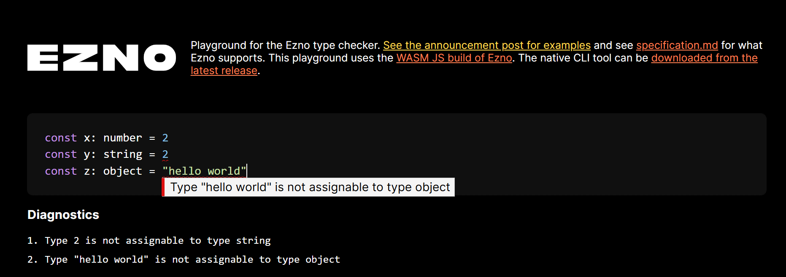
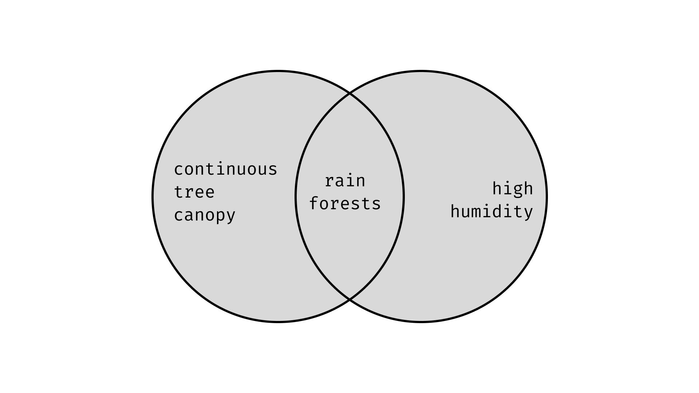
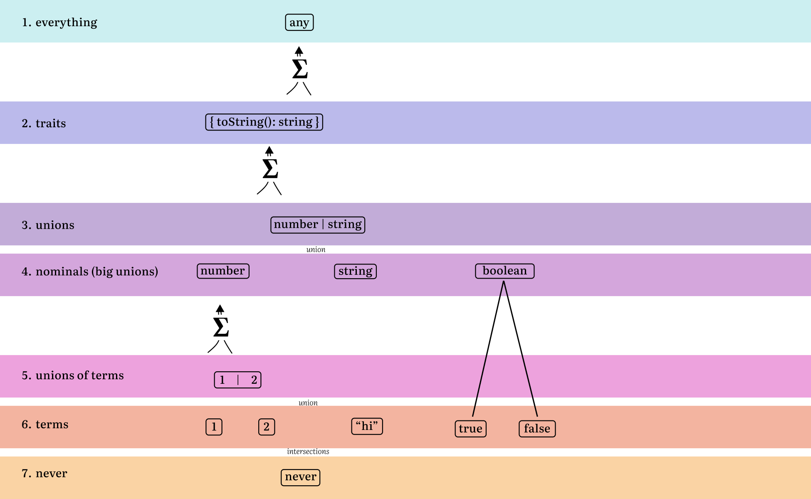

In the process of building [a type-checker](https://github.com/kaleidawave/ezno) I have learnt a lot of the details about the theory of types and sets. With all this information I thought I would unpack all the details I have encountered along the way.

This first part of this post explains why type-checking exists and what the abstraction of types enables. After some justification for type-theory, we delve deep into what types are and details on the common constructions. In the finale we will put the definitions to work and explain the implementation of type checking including operations on types.

> While not many people are building type checkers, a background of the implementation can help with being more effective when using (or dealing) with a type checker.
  
> I have a few upcoming posts on more advanced and niche type features. So I thought I would put together this post that lays the foundations so that I can refer to it the more advanced things. It has been quite fun recapping on some of the parts I have built along the way.

Some of this is relevant to TypeScript (and other structural systems) but there are parts that are apply generally to programming languages of all kinds of implementation of "typing". And in some of the wall of text there is real life analogies, interesting diagrams and some **interactive** gizmos!

This is my interpretation of type theory based on the things I have worked with or built. **Similar to the type checker, it is not complete and this post may evolve**. If you think I have not covered anything in this general post or alternatively have any cool resources on type theory, you can share them to the comment section at the bottom of this post!

## Types provide information
Before delving into the details, I thought it would be good to justify why the theory exists for all those asking the point of type theory?

The simplest way to put it is that what: types provide information about the structure of expressions, what parts of the programs take as input and what parts produces as output.

### Information for errors in invalid programs
The main association of "types" is in type-checking. Once the program types have been resolved, each individual type can be compared between other types and usage of the value to check that the program is sound.

For example here we find that a number is being multiplied by a string. In this example multiplication on strings is not defined and so we have a problem with the program. Information about this type can either be surfaced at runtime or like the below ahead-of-time. Either way, denoting the type of an expression has helped find an issue in the declaration of this program.



### Information for build optimisations
I will not go too much into it here, but type information is useful for making decisions for the program to run with less overhead. For example in C, giving type information about *numbers instructs more optimal registers to use in the CPU*.

> There are slightly more esoteric behaviours such as mutable aliases in Rust. But will not go too much into optimisations here and focus on checking aspects of types.

### Information for the programmer
Humans like characterising things and types provide a way to do that within programs and code. Not everything can benefit from the additional syntax, but for data based problems, writing out the types before the logic can help better structure the program and understand what needs to be accomplished. When coming back to code we can look for the key data structures and from there see how the methods connect up. Things like adding return types to function can help understand what the function generally does without having to delve into the full definition.

Types also help when understanding the unfamiliar. Whether that be a standard library or an external library, providing type information can help to see what some. For example the Rust [std.rs](https://doc.rust-lang.org/stable/std/) (and [docs.rs for a individual libraries](https://docs.rs/ezno-parser/latest/ezno_parser/)) is a encyclopaedia of structs, enums and traits which all come under the umbrella of type information.

Additionally types help with making changes to code. If we change a function, then we can see how that change affects code that it was relying on it. Additionally while changelogs are helpful, this abstraction is much more mechanised for upgrading 3rd party libraries.

> I won't go fully into the ergonomics of types, but I think it is good point that types are not just for the machine. That also goes that types should be accessible and issues relating to them should be understandable as a user.

> Types are not the only components for the abstraction program, other properties such as intermediate representation (IR), control flow graphs, concrete and abstract-syntax-trees etc parts all with for different things for parts of program synthesis (program synthesis = a machine understanding what a program does)

## What is a type?
Types describe data. Data represents things, properties, maps from data to other data, information about the relation of things. Types allow us to categorise data and this discernment and grouping allows  reasoning.

This categorisation is done based on properties. Here I use the word **property** in the abstract sense, something measurable of the data, some way about the data works in regards to the rest of the system. ([A sort of extension to fields and data members as in programming languages](https://en.wikipedia.org/wiki/Property_(programming))).

Some real world properties could be:
- Is red
- Puts out fires
- Is a fire-truck

Each of these properties is tailored to the language. For example some languages have "symbols" which are basically unique values for a program. We could define a type that requires the exact symbol. Similarly other languages have the concept of `asynchronous` functions, this property could be encoded into the features of a type. In Rust we could have a function which requires the inputs to be of type `&'static str` which are string slices valid throughout the lifetime of a program. We could also have restrictions such as the type implementing [Display](https://doc.rust-lang.org/stable/std/fmt/trait.Display.html) meaning that it has a can be printed to a user.

This encoding of properties as a types provides the information to reason about what data is throughout the lifetime of a program and so in the the cases show above can help catch issues and optimise programs ahead of time.

> Types are slightly different to sets in which they are based on construction rather than predicates. Construction refers to building something given some input. We have some data we can form a member of the type via some constructor. I will write about the differences in a future post. But for the most part sets can be considered equivalent to types, with the same rules and uses.

### Members
In the world there exist entities that fall under these properties
- Tomatoes, the YouTube logo and 🌉 are all red
- Carbon dioxide and 🧯 can put out fires
- 🚒 is a fire truck

To say that a value satisfies the property is often know as a typing judgement and we often write it as colon. For example `⊢ 🚒: fire truck`, or in the sense of programming language `⊢ 5 : number`.

> Note you will see the `:` come up a lot in type theory

#### Facts about members
Like sets, types can be by description have an infinite number of distinct members. However when it comes to programs on deterministic Turing machines (computers) there are only a finite amount of numbers that can be represented due to limitations of memory. Benefiting from exponential combinations, while finite it turns out even with 8 bytes of memory you can still [cover a very large amount of numbers](https://doc.rust-lang.org/std/primitive.u64.html#associatedconstant.MAX).

When encoding these sort of types we could treat them as collections of the individual members. However, storing the members of `u64` in some list would result in [`147 000 000 terabytes`](https://www.wolframalpha.com/input?i=2%5E64+*+8+bytes+as+terabytes) of data and individually I can't begin to count the CPU years it would take to iterate through all  members of the data and comparing that each entry is valid for the program. So instead for types like this it is easier to represent `u64` as a number type that is unsigned (no negative values, zeroed out bytes is the number zero) and is 64 bits wide. With this information it covers all members and we can more efficiently reason about the value, rather than querying each entry.

With members, we have a implication from a valid judgement. If we have that `x = y` and that `x: number` then we can conclude that `y` is a number. This is generally a property you want to uphold when defining equality. The equality operator should be testing the all properties are equal and thus we can say they have equal types.

Additionally a random last fact for members: It is harder to find members for types which have more properties (and so in general there are less members for types with more properties).

### Fundamental types: `any` and `never`
Two of the most fundamental types are `any` and `never`. These are polar opposites of each other.

`any` can be considered as a type which doesn't have a single required property. We can say a fire truck, a spoon or the string `"Hello World"` is an element of `any` thing because there are no properties to satisfy. (If it helps this is a case of the [vacuous truth](https://en.wikipedia.org/wiki/Vacuous_truth) with respect to the number of properties to satisfies being vacuous). Therefore `any` contains every value you can construct.

> `any` exists in TypeScript **but has slightly different behaviour in some cases** (explained later). But it is not just a property of the dynamically typed languages, Rust also has an [any type](https://doc.rust-lang.org/std/any/trait.Any.html) which works slightly differently but is used for general data. There also exists `unknown` which is `any` without the strange subtype behavior.

`never` on the other hand has all the possible constructed properties. To be an item of never is to be in London and on the moon and a single colour and be blue and and green and purple. Because it requires every property there will exist two properties that are mutually exclusive. (this will be covered later). You cannot be a single colour and blue and green at the same time. **Thus there is no constructable* item that satisfies `never`**. Thus we can say that the collection of items that satisfies never is empty.

`never` can be used to represent places where functions never exit. For example in an infinite loop or something that throws an exception. It exists in TypeScript under `never` and [*sort of* in Rust](https://doc.rust-lang.org/std/primitive.never.html).

> As will be explained later these two types have very important positions in the hierarchy of types

I don't think `never` is a good name. Maybe `impossible` or `CannotExist` is alternative better names for thinking about this type. We can reason that it has no members as if ask for something `impossible`, then you are stuck. You can't pass `5`, or a `"Hello World"` or a `Boat` *as they all exist*.

## Conjugations of types
There are two forms of binary conjugations of types and their properties. Binary here meaning that there are two types being joined. This results in its own type as so we can form a recursive definition of a type.

> For implementing the definition of this type: you can represent both of these as a vector or a binary tree of other types.

### And types (set intersections)
An `and / &` type represents a intersection of two types. This is equivalent to saying that members of this type satisfy properties of **both** the LHS and RHS. For example we can define a rainforest as having a continuous tree canopy and high humidity. For an item to be considered to a rainforest it must both satisfies the properties of having a continuous tree canopy **AND** having high humidity. If either of this conditions is unmet then it cannot be considered under this type.

```typescript
type RainForest = ContinousTreeCanopy & HighHumidity.
```



A definition of this type will be unique, however and types are symmetric. `A & B` is equivalent type to `B & A`.

#### JavaScript objects are why we have intersection types
You may be thinking what are the use cases for an intersection type?

The first thing to know if that in TypeScript, object type annotations only specify their required properties and can allow members to have more than specified. For example `⊢ { a: "hi", b: 4 }: { a: string }`. Just their definition doesn't require there to be an exact amount of properties.

Many languages don't have intersection type. Often the intersection types in set land are represented as products/tuples (fixed sized lists) in other languages.

For example `[{ a: "hi" }, { b: 4 }]` has the equivalent amount of data as `{ a: "hi", b: 4 }` (it even retains the order, which is a strange property of JS objects), but we want our type system to not allow `.push` on this item. **Hence we have intersections and don't resort to tuples to maintain the same semantics as JavaScript**.

With the intersection type we can build up objects `{ a: string } & { b: number } = { a: string, b: number }`.  While

#insert the colour SVG thing here

Also most of the time, they are stored in flat representation. For example while we can represent a structure definition as an intersection of single property objects, grouping them together just makes the implementation easier, especially in other languages that have to consider type layout which requires knowledge of the adjacent properties is required. **So instead and types are used to extend existing types**. If we have existing `Type` we can extend it with more properties with the and type operator `type Extended = Type & { property: string }`.

> In some languages this can be considered as a refinement type. We have a base type but we adjoin extra required properties on-top of the LHS.

#### Reducing intersection types
Intersection types have a *diagonal identity*. `A & A = A`, so if we try to build an intersection with the same type we can just return the initial result. Additionally `never & A` is always `never`. While there might be members for `A`, we don't have any members for `never` and so the nothing exists in `never & A` and therefore it is equivalent to `never`.

Additionally there are some other reductions we can do (these include operations that will be covered later). The first is that if A is a subtype of B we can consider the **smaller** type (subtype): `A & B = A`. For example `4 & number = 4`. Additionally if type A is disjoint from B we can consider the result to be `never`: `A & B = never`. For example `number & string = never`.

##### Why the intersection with `any` is always `any`
An important point here is when `any & X` is considered. From a set perspective it should say that `any` is always the super type (larger than `X`) so `any & X` is always `X` . However TSC has slightly different meaning for `any` in places and actually considers it a subtype as well (covered later). Therefore for TypeScript `any & X` is actually `any`. I am not sure if the subtyping reuse is why this is the result, or whether it is specified specially here but the general take that in cases of any, the result is mostly `any`.

### Or types (set unions or sum types)
An `or / |` type represents a union of two types. This means that this value can either have the properties of the left type **OR** the right type. For example we can define a train as either a `CargoTrain` or a `PassengerTrain`, which we can represent as `type Trait = CargoTrain | PassengerTrain`.

Note that this is not exclusive or relation. We can define sum type such as `blue | wet` then the sea `blue` so it is considered an entry, it isn't necessarily to check the `wet` property. Normally most sum types are between disjoint properties so this is not an issue.

Similar to intersection types, this can be recursive relation `A | B | C | D`. We can consider this as a list of a binary tree `((A | B) | C) | D`. This can be useful for things as `type TrafficColor = "red" | "amber" | "green"` (at least in the UK).

#### Equivalence rules
Similar to and types there are many equivalent representations:
- They are symmetric `A | B = B | A`.
- Satisfy a *diagonal identity* `A | A = A`.

Additionally, `never` types in unions can be removed/collapsed. Aka *Is it going to rain today or does it never rain in England* is equivalent to *Is it going to rain today* (and so is collapsed down to the left, because the case on the right is never held). Therefore constructing types we can just keep the never cases `A | never = A`.

> **You can think of `any` as being a union of all possible types**. Using the symmetric to rearrange and the diagonal identity we can therefore see `A | any = any`

Additionally like intersection types, we can reduce it based off of disjoint and subtyping. If two members are **not disjoint** we can pick the larger type. For example `string | "hi"` can be considered as the larger type `string`. (The interesting point is that intersections we can pick the **smaller** type (subtype) whereas with union types we pick the **larger** type (super type))

> Ezno does not do eager reduction or test subtypes when. I have found that at some point causes more problems than it solves just for minor visual clean up and potential to do slightly less subtypes per usage. Especially when you consider the combinatoric scale of checks when comparing all the items large unions.

#### Tagged vs untagged sum types
Rust has both untagged unions with [`union`](https://doc.rust-lang.org/reference/items/unions.html) and tagged with [`enum`](https://doc.rust-lang.org/reference/items/enumerations.html). This tag is called the `discriminant` and retrieved with the titular [discriminant](https://doc.rust-lang.org/stable/std/mem/fn.discriminant.html) function ([which extracts tag data under the hood](https://play.rust-lang.org/?version=stable&mode=debug&edition=2021&gist=f422553e049465b220d48b486f2ff514)). This value / tag is unique between each defined variant.

In JavaScript each variant (before optimisations) has a tag. You can consider it *globally tagged*. This isn't exposed through memory but operations like `typeof` and `instanceof` are based reading this tag (*some of the time*). In this crude example we can consider the first four bits of a value to include its tag. For example booleans are `0`, numbers are `1`, strings are `2` and objects are something different all together maybe referencing something else in memory that contains there shape.

```typescript
false    = 0b0000_0000
true     = 0b0000_0001
5        = 0b0001_0101
"hi"     = 0b0010_1010...
{ a: 1 } = 0b1010_0000...
```

> If you are interested in learning more about this I would recommend posts on V8 about how it represents objects.

#### Nullability and error handling
One of the more common usages of sum types is for representing some data which can be missing. For example we can represent the colour of a ships sail as `Color | null` as some boats do not have a sail.

```typescript
declare function getSailColor(boat: Boat): Color | null
```

> In Rust we have [`Option<T>`](https://doc.rust-lang.org/stable/std/option/enum.Option.html), which is equivalent to `T | null`

We can expand on the `null` variant with an type which has more information about the why the first value was not returned. For example we can expand on the above function with more information

```typescript
declare function getSailColor(boat: Boat): 
	Color | { message: "Boat has no sail", boat_kind: BoatKind }
```

> In Rust we have [`Result<T, E>`](https://doc.rust-lang.org/stable/std/result/enum.Result.html), which is equivalent to `T | E`

(I think) In Golang the is no definition of a sum of types. Instead you can use the fact that every value is adjoined with a `null` member. Instead to represent something like the error type above can use pairs of these values to represent sum types instead.

### Combinations of conjugations
Note that both of these are subject follow the roots of boolean algebra. Each operations is are symmetric and importantly they distribute.

`(A | B) & C = (A & C) | (B & C)`

In word terms: an apple or banana that is large is the same as a banana that is large or an apple that is large.

#### All types are unions of intersections

You can think of as all types as being a union of some intersection. These are cases of necessary conditions. The `{ a: string, b: number } | null` can be thought of as two cases `*object*` or `null`. In the first case there are two neccessary conditions that `obj.a: string` **and** `obj.b: number`. In a sense the reduction above is forming the minimum cases.

## Parametrised types
Often called generics and used to model structures that are dependent on some type: parameter can be added to various definitions to specifying insertion of types at certain places. This can be useful for providing templates for types.

> These are sometimes considered PI types or "big and types", which I might cover more in a future blog post.

`Array` is an example of a type that has some relation to an inner type or works over many types. While we could consider the items of an array to just be `any` we can refine this type by detailing the types of individual members.

One way would be to define a type for each kind of an array.

```typescript
interface StringArray {
	push(a: string);
	// ...
}

interface NumberArray {
	push(a: number);
	// ...
}

// ...
```

This has the problem that we now to duplicate the definition and each time are tweaking the same fields. It also means that if we create a new type such as `Boat`, the user has to create a whole new specific definition for `Array`.

Therefore we use generics to denote a sort of template for our general type

```typescript
interface Array<T> {
	push(a: T)
}
```

> We will see later how, but we can create equivalent definitions above by instantiating the above with `type StringArray = Array<string>; type NumberArray = Array<number>;`. We can also solve the problem when introducing new types as we can get our array of boats with `Array<boat>`.

We can add parameters via chevron notation `<T>`. They can be directly added structures like `interface` in TypeScript and on `struct` and `enum` in Rust. We can also add them for any type using type aliases. Our `Option` type from Rust we can represent as `type Option<T> = T | null`.

These are often used for general types, things that a bit *meta* that represent **modifications** of things in nature rather than existing in **nature** themselves. For example `Array<T>` for a list of values with an unspecified length, or `Set<T>` for the same without order specified and with the condition that values are uniquely added, or `Map<K, V>` for associations for data. (the latter two can be defined in terms of `Array<T>`)

> Often use `T` as the first letter in type. From there additional go up the alphabet into `U` etc. For things like `Map` we use `K` and `V` for `Key` and `Value` respectively. Sometimes `I` for item. But we normally have the convention of being a single character and like most type names for the first character to be uppercase.

### Parameter types
The parameters that we can give to our types are types themselves. They have names we can reference in annotations, used the intersection and union types shown above and also in everything following this.

Generally these types extend `any`. We can change that though with the `T extends Type` syntax in TypeScript and with `T: SomeTrait` in Rust. For example for our `Set<T>` definition we can require that the parameter `T` implements equality and maybe a hash operation (heuristic for equality) for the set to be to valid.

### Partially applied generics
With regards to parametric types we can instantiate them with type arguments. For example we can have an array but expand to that the elements of the array are strings with the `Array<string>` syntax.

This `string` tells us that if we have a expression of this array type then getting an element of it will return a `string`. It tells us more though, for example `push` must take strings as inputs for our array to still all be strings. it tells us that the functions passed to `.map`, `.every`, `.some` must all be defined for strings so that they can be evaluated against the elements.

This point is important: **a type parameter may be used many places including nested in other types such as parameters for functions on methods**. Therefore we need to handle these generics carefully as not create lots of instantiations based one argument.

#### Lazy lookup of generic types
In the above example we looked at the `Array` type, I have revealed a few more fields on the type to show how type parameters can be appear multiple times in difference places.

```ts
interface Array<T> {
	[item: number]: T;
	push(t: T);
	map<U>(mapped: (t: T) => U);
	// ...
}
```

When we have a reference such as  `Array<string>` we need to produce an internal representation of this specific type of `Array`. One method would be to take the `Array` definition and walking the structure, copying out each member substituting any references for `T` with `string`. Such would result in the following.

```ts
Array<string> = {
	[item: string]: number;
	push(t: string);
	map<U>(mapped: (t: string) => U);
	// ...
}
```

**However**, we can speed up this step and instead form a  *`PartiallyAppliedGenerics`* item. [`PartiallyAppliedGenerics`](https://docs.rs/ezno-checker/latest/ezno_checker/types/struct.PartiallyAppliedGenerics.html) is a pair of a type (with generic parameters such as our original unspecified `Array`) and a `Map` with arguments (`Vec<(TypeId, TypeId)>`). So `Array<string>` becomes `PartiallyAppliedGenerics { on: Array, arguments: { T = string } }`. This form is a lot more efficient as we just need to create a single wrapper `Type` and don't have to inspect or copy any of the internal structure when we instantiate a specific version of an `Array`.

> (aside from checking that it has matching parametrised and type arguments match `extends` clauses).

> I think *partially applied* is the correct term, we *fix* some types but don't fully evaluate everything.

This however means that using this type is a little bit more difficult to use. We can't just access a field in the regular field as it hasn't be specialised with the arguments.

So now when accessing information (a property, calling a function etc) we lazily compute it by unwrapping the pairing. Arguments is collected in a table like structure called `GenericChain` and the left side is run unfolded. If a generic is found, the table is queried (in the checker I am building it is with the method `.get_argument_covaraint`) and only the *closest* item needs to be substituted.

`PartiallyAppliedGenerics` wraps things like generic interfaces, methods which inherit parent terms and anonymous objects. Note that type aliases is not in this list as in TypeScript for type aliases (`type AliasName<T> = ...`) instantiating them eagerly substitutes them into the RHS, rather than leaving them as `AliasName<Argument>`.

> All type arguments on structures are considered restrictions for usage, so in type terms "covariant".

> This mechanism is reused for another feature around closed over variables. But that is for another post.

## Special root types
### Products of types / tuples / pairs
We can form concatenations of types with products. For example we can accept a number and string for a function with a tuple. This is normally defined by a comma separated list within either parenthesis `()` in Rust or `[]` brackets in TypeScript.

```typescript
function func(a: [number, string]) {}
```

> Products are different to type intersections as explained above for JavaScript objects. They do have equivalent properties though, but that is a for a future post.

Tuples can be heterogenous (of different types) whereas arrays normally are homogeneous with the same type (up to sum types). In TypeScript `Array` can heterogenous and so the tuples are not so much a completely different type but instead a special kind of array with more properties for the exact length and exact types at exact indices.

> In set theory, this is known as [Cartesian product](https://en.wikipedia.org/wiki/Cartesian_product).

#### Objects/structs are a special product types
With tuples we normally access items by their zero-based index. In the above example if we want the number data passed we retrieve it with `a[0]` (or in Rust `a.0`).

Structs and objects extend this idea by referring to these indexes by string keys (instead of numbers). In Rust

```rust
struct X {
	first: number,
	second: string
}
```

is equivalent to the `(number, string)` type but it has the additional compile time metadata which allows us to refer to the fields with more natural names (you can see how this especially helps when we have fields of the same type).

In TypeScript, it inherits that objects information exists at runtime and so the objects are slightly more complex. They also allow addition of properties that were not present at the time of declaration so the types become slightly more complex.

### Functions
Functions are a fundamental type in the theory. They represent transformations between lists of values to other values.

Function types abstract the code definition of the expression function and primarily focus on what the inputs and outputs are.

A function is defined as a sequence of parameters, which have required types. The types for inputs is called its codomain and the result of applying/calling the function is the domain.

> Parameters are the variables. Arguments are the values passed to the function at the call-site [Ahem](https://rust-lang.github.io/rust-clippy/master/index.html#/too_many_arguments)

#### Generic parameters
Similar to generic types, functions can also be parameterised with generics. Sometimes these values can come from above (such as the `T` in `Array.prototype.map`). Some are local and are set at the call-site. In later parts we will see how these come to take a value and how they affect the result. But for now these are considered on the same level as parameters with a fixed type.

There are however some special kind of parameters which make things a little bit trickier.
#### Default arguments
Default arguments are values used in place of an argument missing

```ts
function add(a: number, b: number = 1) {
	return a + b
}

add(1, 2) // 1 + 2 = 3
add(1) // 1 + 1 = 2
```

This is equivalent to after some de-sugaring

```ts
function add(a: number, b_before_: number | undefined) {
	const b = b_before ?? 1;
	return a + b
}

add(1, 2) // 1 + 2 = 3
add(1, null) // 1 + 1 = 2
```

> For reasons it is simpler to write the internals in terms of default arguments inline with language and to not apply this transformation. But you can see from this rewriting how it functionally works.

> Note that the parameter changes type here. Despite the annotation, the resulting function parameter type is union-ed with `undefined` which is the value it has in JavaScript when an argument is not passed

#### Variadic arguments
Rest/spread/variadic parameters is the fact that at a call site it can take a non-fixed amount of arguments such that the later are collected in a collection type like an array

```ts
function getLastArgument(...a: Array<string>) {
	return a.at(-1)
}

getLastArgument(1, 2) // 2
getLastArgument(1) // 1
```

This is equivalent to after some de-sugaring

```ts
function getLastArgument(a: Array<string>) {
	return a.at(-1)
}

getLastArgument([1, 2]) // 2
getLastArgument([1]) // 1
```

> Similar to default arguments and especially because of the call site transform for a list this again does not apply this transformation and instead this *property* is encoded into the function type.

#### Multiple parameters and currying
We can consider it under the currying to transform

> Repeating myself again. It is closer to the language to treat the parameters as a list. While finding more canonical representations can help simplify cases. Here we want to preserve a form closer to the syntactical representation as it helps in printing and calling. In a language such as Lean the forms are equivalent (the latter is desugared into the former).

```typescript
(a: string) => (b: string) => a + b
(a: string, b: string) => a + b
```

> Currying is named after the great [Haskell Curry](https://en.wikipedia.org/wiki/Haskell_Curry) a renowned logician. [Curry](https://en.wikipedia.org/wiki/Curry) is also great too.

#### Free variables and closures
Sometimes a function can use reference something outside of its inner scope. When a variable is used above it is considered "free" as it is not bound by a parameter.

> Difficult situations can arise when these can be mutated

```ts
let b = 2;
function add(a: number) {
	return a + b;
}

add(1) // 3
b = 6;
add(1) // 7
```

Closures are the level above free variables. It is where a function is returned that uses a free variable in the above scope.

```typescript
function closure(a: number) {
	return function () {
		return a++
	}
}
```

Closures are hard as they implicitly store state. Unlike objects we don't construct a definition for what this data is like. It is sort handled implicitly build from the context. Closures have problems in lifetime based languages and so that is why the `move` keyword exists in Rust.

> [I think free-variables is the correct terminology](https://en.wikipedia.org/wiki/Free_variables_and_bound_variables)

> I have a further work on closures but will skip over for now.

#### Other functional properties
Async functions can be considered to return their result as a `Promise` (in TypeScript) or a `Future` in Rust. These are considered as just modifications to their return type without much else effect.

> Okay enough of the complications added by functions, back to type theory

### Conditional types
We can define types (such as this return type for a function) whose properties depend on a condition

```ts
function func<T>(t: T): T extends string ? "is string" : "not string" { .. }
```

Here the type is `T extends string ? "is string" : "not string"` with the condition `T extends string` (which is a typing judgement slightly abused as a predicate here).

As we will see later, when we call this function we substitute the return type. In this case we evaluate the judgement `extends string` against our resolved value for `T`. For the condition we can resolve one of the branches or both if this proposition is not resolved discretely into either `true` or `false`.

This type is a union type with a little bit more information of what the result is. If we drop the conditional information it can be treated as `"is string" | "not string"` in many cases.

> In fact sometimes `A | B` can be thought of as `*free condition* ? A : B`, where the condition is unknown and unresolvable inside the system.

Sometimes, when using this type we might want to carry the condition data forward. If we index the first character here (with `item[0]`) we can result with the more informed `T extends string ? "i" : "n"` (rather than the weaker `"i" | "n"`). This can sometimes better narrowing.

### Implied conditions with example in Rust
Rust does not have conditional types. You can imitate this with generic associate types but not in the same way as you have to have implementations for each possible input type. It is not possible to cover all the types like in TypeScript because of colliding implementations with `impl`. Even with `#![feature(negative_bounds)]` [it does not seem possible](https://play.rust-lang.org/?version=nightly&mode=debug&edition=2021&gist=2ea33373e65671f1621a0d91099866ad).

#### Conditional types distribute across their condition
An important thing is that for conditional types, if there condition is a sum type, then it is distributed.

```typescript
type MyConditional = (A | B) extends C ? X : Y;
// Immediately interpreted as
type MyConditional = (A extends C ? X : Y) | (B extends C ? X : Y);
```

> This is an immediate transformation and **not an equivalent type**. This is also applied during generic substitution

> This distribution added (I think) enables some fancy filtering of types. In the future I will show another way that this is possible.

> You can use the undistributed version by wrapping the two sides in unit tuples. `[A | B] extends [Type] ? X : Y`;

### Type hierarchy


<span style="color: #cceff1;">1 ∎</span> `any` contains everything below it. <span style="color: #bbbaeb;">2 ∎</span> here is where type classes (called traits in Rust which I think is a good name) exist. They are big unions of nominal types. <span style="color: #c2acd8;">3 ∎</span> is where smaller unions exist which are useful for representing data up of <span style="color: #d4a6dc;">4 ∎</span> nominal types. Boolean takes two to build its union. But `number` (which is normally a 64-bit floating point number has  members in the union). Exact object types could be considered here. <span style="color: #eda2dd;">5 ∎</span> is useful for tags and small amounts of types. <span style="color: #f3b4a0;">6 ∎</span> is dependent types. we know all the information about them and there is one entry. <span style="color: #fad3a4;"> 7 ∎</span> the `never` type. Can be considered as an intersection as anything on the row above

> I haven't included functions, generics or some of the other previously seen types but just the basics to see how this lattice sort of representation holds

## Operations on types
### Subtyping
Subtyping around set types is basically asking this question:

Does this set fit into this other set?

#### When and why subtyping
Before asking how to do subtyping we need to ask when it is done and why it is required. The following is a function with a parameter with type `number`.

```ts
function addOne(a: number) {
  return a + 1;
}
```

A call to this function is only valid when it is valid to **substitute**/swap the arguments for parameters.

```ts
function func(parameter: string) {
//   		  ^^^^^^^^^
//            parameter
}

func("argument")
//    ^^^^^^^^
//    argument
```

When we call this function we ask whether `"argument"` is in the `string` set (technically the singleton type is a subtype). The rules for which will be shown later, but in this example it is simple to see this call is valid as the string `"argument"` has all the properties of being a string.

From this we know that this call is valid. However if it were the case that we had `func(4)` we find that type `4`  does not have the properties of being a `string` and so here we would raise a type error.

There are many times questions this "subtype" question is asked, so here is a long list of all the places where a subtyping happens. In each case I have linked to where `is_subtype` (or a wrapper function) is used in the ezno-checker.

The first is in return types. When we return a value, we check that it is a subtype of the annotation specified in the function declarations.

```ts
function func(): number {
	return "hi"; // "hi" < number
}
```

[Variable initial values](https://github.com/kaleidawave/ezno/blob/925cec9bd1cf03a7b845b84629c3b6f54b77fe5f/checker/src/features/variables.rs#L99) (including [default values](https://github.com/kaleidawave/ezno/blob/925cec9bd1cf03a7b845b84629c3b6f54b77fe5f/checker/src/features/functions.rs#L198)) are another case

```ts
const x: number = "hi"; // "hi" < number
```

[Assignments after declaration](https://github.com/kaleidawave/ezno/blob/925cec9bd1cf03a7b845b84629c3b6f54b77fe5f/checker/src/context/environment.rs#L671) ([including properties](https://github.com/kaleidawave/ezno/blob/925cec9bd1cf03a7b845b84629c3b6f54b77fe5f/checker/src/types/properties/assignment.rs#L122>)) is an extension of the case above

```ts
let x: number = 4;
x = "hi"; // "hi" < number

let y: { a: number } = { a: 4 };
y.a = "hi"; // "hi" < number
```

Others include: [`satisfies`](https://github.com/kaleidawave/ezno/blob/925cec9bd1cf03a7b845b84629c3b6f54b77fe5f/checker/src/features/mod.rs#L566),  [Try-catch](https://github.com/kaleidawave/ezno/blob/925cec9bd1cf03a7b845b84629c3b6f54b77fe5f/checker/src/features/exceptions.rs#L164) (special to ezno-checker),  [Function overloads](https://github.com/kaleidawave/ezno/blob/925cec9bd1cf03a7b845b84629c3b6f54b77fe5f/checker/src/synthesis/functions.rs#L799),[Generic arguments to parameter extends in type annotations](https://github.com/kaleidawave/ezno/blob/925cec9bd1cf03a7b845b84629c3b6f54b77fe5f/checker/src/synthesis/type_annotations.rs#L198), [This constraint](https://github.com/kaleidawave/ezno/blob/925cec9bd1cf03a7b845b84629c3b6f54b77fe5f/checker/src/types/calling.rs#L1425) (special parameter case),
[Type based keys](https://github.com/kaleidawave/ezno/blob/925cec9bd1cf03a7b845b84629c3b6f54b77fe5f/checker/src/types/properties/mod.rs#L506) (which will get more of a mention in a future post), [Operator checking](https://github.com/kaleidawave/ezno/blob/925cec9bd1cf03a7b845b84629c3b6f54b77fe5f/checker/src/features/operations.rs#L253-L254) (this uses a wrapper method) and of course the above mentioned [Function arguments to parameters](https://github.com/kaleidawave/ezno/blob/925cec9bd1cf03a7b845b84629c3b6f54b77fe5f/checker/src/types/calling.rs#L1788).

Subtyping allows us to reason whether about a substitution or assignment is valid. Like the fact we do not test each individual entry, subtyping of function parameters allows skipping all the individual checks already done in the function body.

```ts
function func(x: string) {
	const a: string = x; // string <= string here
	const b: string = x; // string <= string and again
	const c: string = x; // string <= string and here
}

func("a") // Single check against parameter (aka doesn not result in 4 checks)
func("a") // Single check again
```

#### How to do subtyping
Subtyping is the asking of a question whether one type is contained in another two. We can extend our Venn diagrams with an extra dimension and consider by considering one type being overlaid by another type. *If I have it all working correctly*, you should be able to drag the sliders to move the sets each other. For the overlaid set to be a subtype we want to see no red colour here at the end of the end of the translation. We see that sets on the right end with items that don't fit into the base type and therefore is not a subtype. If we have no red, then we have that the top type is a subtype.



> Note that this is a relation not an equality. At the end of the transition we can have left over yellow.

Sometimes the notation `<=:` is used to denote this relation (the underline to denote that they can be equal and the `:` which crops up all around type theory).

X is a subtype of Y is equivalent to saying X is assignable to Y.

From the above diagram we can conclude from the top-left case that `4` is assignable to `number` so `4 <=: number` **but not the top-right case** `"hello" <=: number`. Similarly on the bottom row, from the left side we find that `number <=: number | string` **but not the other way round in the bottom right case** `number | string <=: number`.

##### Subtyping is recursive
Because of the structural system, an individual test for relation can end up in many nested subtyping questions.

> Sometimes cases can occur where subtyping can end up being cyclic. For this case a list of "currently checking pairs" is built so that subtyping can exit and not stack overflow.

##### The details
Here is the table specification

| Left                           | Right                 | Result                                  | Also          | Why                         |
| ------------------------------ | --------------------- | --------------------------------------- | ------------- | --------------------------- |
| Type X                         | Type X                | Subtype                                 |               | They are equivalent         |
| Primitive                      | Constant of primitive | Subtype                                 |               |                             |
| Constant of primitive          | same constant         | Subtype                                 |               | Equal (same as first case)  |
| Constant of primitive          | anything else         | Not subtype                             |               | Only that value             |
| A & B                          | X                     | A subtype X && B subtype X => subtype   |               |                             |
| A \| B                         | X                     | A subtype X \|\| B subtype X => subtype |               |                             |
| A                              | X & Y                 | A subtype X \|\| A subtype Y => subtype |               |                             |
| A                              | X \| Y                | A subtype X && A subtype Y => subtype   |               |                             |
| Parameter with type constraint | *                     | Subtype                                 | Set parameter |                             |
| Parameter                      | Parameter             | Subtype                                 | Set parameter |                             |
| `never`                        | *                     | Not subtype                             |               | Nothing is in the empty set |
| `any`                          | *                     | Subtype                                 |               |                             |
| *                              | `never`               | Subtype                                 |               |                             |
| *                              | `any` in TypeScript   | Not subtype                             |               |                             |
| *                              | `any`*                | Not subtype                             |               |                             |
| functions                      | functions             | explained below                         |               |                             |
| objects                        | objects               | explained below                         |               |                             |

From the first row in this table we see that subtyping is a reflexive relation. This sort of thing is the *fast path* of [subtyping where we can skip any inspection of types](https://github.com/kaleidawave/ezno/blob/8ce921e39c3d4e947063f206347b2932cee456ec/checker/src/types/subtyping.rs#L242-L244).

Note when we have a conjugation of the **left hand side of this relation** its logic follows its name. However when they are on the **right hand side** it gets swapped.

##### Function subtyping
Sometimes functions end up on either side of this comparison. For example call-backs in parameters

```ts
function map(array: Array<number>, cb: number => string): Array<string> {
	// ...
}

map(() => {})
//  ^^^^^^^^ subtyping here
```

Similar to standard values, we also need to check that the function is also valid to be passed here.

`number => string <=: *our function*`

The first property to check is that the function on the right hand side has less than or equal to the same number of parameters. If our function has more (required) parameters than the left-hand-side it means that we could call out function with missing data. If we have less then it will be fine as despite calls with extra arguments, it doesn't produce a runtime error, the arguments are simply discarded.

> In Rust which is much stricter the counts have to be equal.

One of the most interesting things is that: Comparing parameters happens in reverse. If we have the following.

```typescript
((a: "hi"): number => 2) satisfies (a: string) => number
```

If we compare the types of the first parameters in the normal way for the rest of the types like `"hi" <=: string` , then we see it is valid. **However** this function on the left-hand-side is **not** `(a: string) => number` as it does not accept the whole set of strings as inputs (or as its codomain).

For example for the following, if we subtype the same direction we end up with an error when we call it with argument `5`

```typescript
const func: (item: string | number) => number = (item: string): number => string.length;

func(5)
```

The *fix* for this is to *swap* around the conventional subtyping operands. So instead we subtype `string <=: string | number` which holds in the revised below case.

```typescript
const func: (item: string) => number = (item: string  | number): number => typeof item === "string" ? item.length : item;

func("Test")
```

> This form is known as covariance and contravariance (I think)

> Note that for default parameters and rest parameters the similar process is held.

The return type subtyping happens the normal way around. In the cases above we have `number <=: number` which is fine because of the reflexive property of subtyping.

#### Object subtyping
When subtyping an against an object, we iterate over all the keys in the left hand side and check that
1. It exists in the right hand side object
2. That it indexed result has the subtype

The following are all valid

```typescript
{ a: "hi" } <=: { a: string }
{ a: "hi" } <=: { a: string | number }
{ a: "hi", b: false } <=: { a: string | number }
```

> This can mean that our right hand side can contain properties not in the right hand side. (explained near the start). This does cause some problems but that is for future posts as I think there is some progress that can be made in some of these cases.

However these are invalid

```typescript
{ a: "hi" } <=: { a: boolean } // "hi" is not a subtype of boolean
{ a: "hi" } <=: { a: string, b: string } // missing a required property
```

##### Collecting mismatches during subtyping
In the above cases for object you can see there is some reasoning why the the results are not subtypes. Two good features to aim for in subtyping are
1. No early returns: collect as many property mismatches as possible (this is further justified/explained at the end of this post)
2. Non-binary output: it is useful to know what exact property is missing. If the subtyping just returned a `bool` then it would miss out on information that could be helpful to the user in fixing this issue.

> In the future there should be better printing of this result in `ezno-checker`. [Currently some of the details are there but it needs some finishing touches](https://github.com/kaleidawave/ezno/issues/167)

> There is one other thing collected during this process, which you can read about in the inference section.

#### Subtyping: Nominal types vs structural type systems
One of the key differences between Rust and TypeScript is the fact that in Rust types are nominal. With nominal types while every type has *properties*, the difference is that the above subtyping cases is condensed to just `is_subtype = A == B` and does not look at individual properties in the definition of `A` and `B`.

This is done because in Rust types have layouts and so when substituting an object: the properties and discriminant values and offsets all have to line up. This can happen occasionally for types equal by definition but most of the time is just simpler to define it by instance rather than unfolding the definition.

> And Rust can do this because they started the language and could add syntax for definitions of types and didn't add general object types.

In TypeScript being a superset of JavaScript we have to deal with users being able to create objects without a schema, thus structural systems are needed to handle for `{ a: "hi" }` or `JSON.parse` being used as a value.

Apart from the primitives (`string`, `number`, `boolean`) there are no nominal types in TypeScript. If not for the equality shortcut, subtyping has to compare properties of sides to decide whether a value is assignable.

> While nominal systems better define boundaries of values and result in less edge cases, structural systems can be simpler to work with especially in the design of something. Many times in Rust I end up having to define sum types for small amount of types which be cumbersome and could be made simpler with a structural system which unfolds the unions during assignment.

> However, in Flow and [Ezno](https://kaleidawave.github.io/ezno/comparison/#nominal-ness) classes are nominal

### Disjoint-ness
Alongside subtyping, another less-referenced but equally important type comparison function is disjoint-ness.

While subtyping tests subsets. Disjoint-ness is a test that the intersection is empty. This is equivalent to saying there does not exist an element that satisfies both of the types or that the properties of the types are mutually exclusive.

If you consider these two in the Venn diagrammatic way you can consider two sets disjoint when there is no overlap.

> I don't think this works on mobile for now :(



#### Implementation
Similarly as subtyping we can resolve the results based on their definition

| left           | right          | result                                                | example                                          |
| -------------- | -------------- | ----------------------------------------------------- | ------------------------------------------------ |
| nominal type A | nominal type B | A != B                                                | `"hi" === 4`                                     |
| A \| B         | X              | A is disjoint with X && B is disjoint with X          | `2 \| 4` is disjoint with `3`                    |
| A & B          | X              | A is disjoint with X \|\| B is disjoint with X        | `number & 3` is disjoint with `2`                |
| object         | *              | properties that reside in both having disjoint values | `{ a: string }`  is disjoint with `{ a: number}` |
| never          | *              | true                                                  | ...                                              |
| any            | *              | false                                                 | ...                                              |

Here nominal is the same as mentioned above can be a `number`, `string` or a constant `1`, `"hi"`, `false` etc. again for the type intersection and union the result ends up involving recursion.

Similar to the right hand side of subtyping, the `or` and `and` type use the opposite operator (this is probably because it is being framed from the point of view of disjoint-ness, if I reversed the name with "has some intersection" and changed the other cases then because of De Morgan identities it would use the result would be based on the same terminology as the inputs).

Unlike subtyping, disjoint is symmetric (`disjoint A B = disjoint B A`), which is why I only put in members for the first column because the results still stand swapping the left and right columns. This is why some of the [code looks repetitive](https://github.com/kaleidawave/ezno/blob/925cec9bd1cf03a7b845b84629c3b6f54b77fe5f/checker/src/types/disjoint.rs#L103-L114) but  it is the simplest way to account for both sides.

> Functions and objects do not have disjoint-ness implementations are not implemented in the ezno-checker, [you can help add them](https://github.com/kaleidawave/ezno/issues/212).

#### Uses for the disjoint relation test
This relation has slightly more esoteric uses that subtyping. But it can help resolve issues

##### Equality well defined
Most programming languages have an equality operator. In most systems you can only use equality is only defined for the *same type*.

In JavaScript we have an open book of values that equality operates on as equality always yields boolean no matter what operands.

We can however deduce some cases where say an object is compared to a number, `{ name: "Josh" } === 4` or even `"s" === false` (although this is handled slightly differently in ezno-checker for constants).

These cases are decided by the disjoint test. If they are not disjoint (aka have some overlap) then there must be at least one element that is in both and so this equality can be true or false.

On the other hand if we find that they are disjoint we know that there cannot exist a pair that satisfies the equality and so we know that this expression is always false.

> This behaviour extends to not equal. If we consider the operation `x !== y` as  `!(x === y)` we perform the same test (just the diagnostic prints that it is always true rather than always false).

##### Intersection types well defined
If you can remember all the way back in the beginning when we discussed some of the rules we around intersection types, we said if the two were disjoint then it was equivalent.

When writing a intersection type reference, it is probably the writers intention to write a valid combination. So in the following case [it is a probably a good idea to warn them their construction is invalid](https://kaleidawave.github.io/ezno/playground/?id=9zlky). (if they did want the `never` type the could just refence it directly)

```typescript
type MySpecialType = string & number;
```

> Sometimes you can construct a disjoint type in places such as return type substitution and that is totally fine and normally valid. This warning is only for definitions.

##### Finding cycles in type aliases
Type aliases are a little complicated because they have to be defined before they have a value (this will be covered in a minute).

Because of this, it can become a problem that a type can be defined in-terms of itself.

```typescript
type X = X;

// or mututally
type Y = Z;
type Z = Y;
```

This is a problem, the type isn't `never` or `any` or any other type. It is an invalid construction and not well defined. If it was well defined then it could break.

Thus [check disjoint-ness](https://github.com/kaleidawave/ezno/blob/8ce921e39c3d4e947063f206347b2932cee456ec/checker/src/context/environment.rs#L1490-L1505)between the type alias and its value [to catch the issue](https://kaleidawave.github.io/ezno/playground/?id=tysci).

> Note we do not have to worry about generics.  We can't form this loop `type X<T> = T;` because the alias always requires an argument. The initial problem  equivalent to `X<X<X<X<X<...>>>>>` which we can't construct.

> There are still some edge cases that just [checking disjoint-ness doesn't account for](https://github.com/kaleidawave/ezno/issues/211).

### Reading "properties" of types
The subtype and disjoint operations are great. But other times they don't quite fit into our general type checking. Sometimes we need more manual lower level specific approaches to deal with types.

The first place where we need do some more manual process if with object properties. Because in JavaScript objects are collections of properties, we can get fields from them through access expressions

```typescript
obj.property
// or
obj["property"]
```

Depending on the type, we either have quite a straight-forward time calculating this object property (e.g. `({ property: string }).property => string`) or quite a hard time.

---

The following are cases where we need to do some more manual inspection (rather than just disjoint or subtype operators) when working with types
- Property access. Covered above.
- Getting the *callable* aspect of type. The details covered later.
- Numeric, bitwise, binary and relation operations computation on dependent types
- `await`
- `instanceof`, `typeof` etc. Easier just to look at the type, rather than do easier

> Note that subtyping and disjoint uses the property reading methods to do the subtyping and disjoint conclusion. For property access: we could define property access as subtype with `{ [*property*]: T }` and return whatever the paired value of `T` is but you can see how this becomes 1. a recursive definition and 2. is a lot more overhead than just looking up the property directly.

#### Reading properties on conjugations
With intersection types we pick the first result from either the left or the right (none else). With union types we have to check that both types have the property.

#### Retrieving and calling functions
Similar to retrieving properties, getting the function has to look at conjugations in the same way.

When calling the function we have to handle both value arguments and type arguments. The first step is to handle the type arguments if they exist. In the following call we match them up (like regular parameters), this results in type arguments as `[(T, number), (U, string)]`.

```typescript
function func<T, U>(a: T, b: U) {}

func<number, string>(1, "hello") // [T = number, U = string]
```

After any type arguments, we match up value arguments against regular parameters and check that they valid via subtyping (shown above). If type arguments were missing in the call-site then there is an additional inference step combined into subtyping which will be covered in due course.

#### Type argument substitution
When calling a function with generics the output type can be based on the type arguments. After all the value and type parameters are dealt with, we need to come up with a type for the result and thus the entire call expression, so that we can find faults in the following.

```typescript
function id<T>(t: T): T { return t }

// cannot assign string to number
const x: number = id<string>("hello");
// cannot assign "hello" to number
const y: number = id("hello"); // covered later :)
```

To do this we take our domain type `T` and we walk its structure (in this case quite simple as there is no conjugations) and if find a generic type like `T` we look in our parameter-argument pair array (which is `[(T, string)]` in this case) and if any of the first pair items is type-equal (has exactly the same identifier) then we *replace* the type in the output with the second pair item (in this case the `string`).

> In cases of objects, functions/methods etc we can apply the partially applied generic optimisation so that we don't walk the properties and substitute everything eagerly.

> Substitution also happens for property access, for example `array1[4]` we substitute `T` as the value for `T` on the array

## The type checking process
Technically type checking is really just the process of doing all the operations above (subtyping, disjoint-ness, property inspection, etc). The process of type checking on a module/file involves lots of small type checks on all the parts such as deep down to single expressions and single declarations.

To do this we walk the AST in a recursive descent sort of way starting at the smallest expressions first. The type checking process is quite involved as we will see so we don't use standard walkers. Instead there is some technical details to walking that will be covered in the next few steps.
- It needs to do several passes in blocks
- An expression needs to pass down an expected type
- An expression needs to return a value type

### Contexts
So far we have been talking about bringing together random types. Contexts are the structure to the system, it is what allows us to reference types and reason about expressions in the system.

Contexts store things, the fundamental information is based around two namespaces
- Variable names to types for expressions
- Named types to types for type annotations

```typescript
function func(parameter: number) {
	//                   ^^^^^^ get "number" type from the type namespace
	return parameter
	//     ^^^^^^^^^ get type of parameter from the variable namespace
}
```

> Rust has a third for macros

Contexts are contained within other contexts. We start off with a root context. Subsequent contexts have a reference to their parent context. Once a scope has been exited the contents of the namespaces are dropped as they are no longer needed (unless stored for LSP work).

Sometimes a item can have a variable representation and a type representation (for example `class` has a general prototype type and a variable constructor type)

```typescript
class MyClass {
	constructor(n: number) { this.n = n }
}

const x: MyClass = new MyClass()
//       ^^^^^^^                 used as a prototype type equivalent to { n: number }
//                     ^^^^^^^   used as a value to mark the constructor
```

> This comes with the confusing thing that the variable `MyClass` is not the type of `MyClass`. My class the expression when used produces objects of type `MyClass` when constructed using the `new C(values)`  syntax.

### Types vs type annotations
Every term has a type. We can add notations for types.

By convention many language instantiate parameters using chevrons `<>` rather than parenthesis like regular function calls. Golang added (square) brackets. Lean has consistent syntax for both.

>Languages that have chevron groupings for `<>` generic arguments and `>>` for the shift operator can create havoc for parsers that are not completely context aware.

Every term has a type that can be resolved from the context. Type annotations allow places to add type information (in the form of constraints).

Slightly different to type annotations, there are also type declarations in the form of aliases and interfaces.

These annotations behave differently to normal syntax in that (for the most part) they just denote information to the compiler. They can be totally erased ([or replaced with whitespace](https://bloomberg.github.io/ts-blank-space)).

It is the sort of thing the `+` operator will end up in the output as something like [addsd](https://www.felixcloutier.com/x86/addsd).. But you won't normally be able to find the origins of the types of data.

> Reflection can change this. Things like `enum` have runtime meaning so there are edge cases where types

### Gradual typing with elided annotations
Type annotations assign types to variables, parameters and function return types.

>In languages that are supersets of a language that doesn't have types. Also sometimes types can become verbose to write and not applicable for non-foundation work (demos, experiments etc) and so systems which don't require any annotations.

`any` is used as the type for missing annotations. Because of this it simultaneously acts as `never` and `any` in the subtyping in an attempt to make it easier to adopt in codebases that don't have type annotations already.

> I think parameter constraint inference could be a lot better in languages. The [Hegel checker had a cool approach to this](https://hegel.js.org/docs/type-inference#arguments) and [there is some WIP things coming to ezno-checker](https://github.com/kaleidawave/ezno/pull/197), where we can be a lot smarter about missing annotations

## Inference
The inference process normally means forming a type based in its context.

### Inferred variable constraints
In the following there is no constraint on variable `a`. We could say that it type is `"hello"` but that would break the later reassignment, therefore we instead chose the basis of `"hello"` which is the `string` type.

```ts
let a = "hello";
a = "world"
```

Because there are no nominal types, inferring this restrictions can become a little bit complicated. For example while totally valid JavaScript `a = 2` would not be allowed because of the inferred constraint.

> In Ezno the variable constraint and values have a special implementation thanks to aware-ness of re-assignments in side-effects. So this sort of "inference" doesn't have to be implemented. From this the system can just say that variables can be reassigned to `any` and can be more flexible in cases (that you should probably not create anyway). However in some cases simpler to and more realistic (for example `for (let x = 0; ...)`)

### Inferred type arguments
While functions can have generics parameters, we don't require them to be specified at call-sites. Show above before but we can have.

```typescript
function identity<T>(t: T): T { return t }

const x: number = identity(5);
```

He we *infer* that the `T` type parameter is a `number`. This is done during subtyping, when we check `T <=: 5` we see that `T` does not have a value yet and so pick on out based on our RHS type `5`.

> TSC has a two pass system first the bind phase. In Ezno I combined the two, merging it into the subtyping.

> More on how this works for in other cases in a future blog post.

### Inferred function parameter types
When we do the checking stage scanning expressions and other AST, we can "pass" down a expected type. This allows for adding types to parameters without them.

#### Return type "inference"
Similar to variable reassignment, we might also not have a return type for a function. There is probably many ways to handle this but in ezno-checker, a return type is picked based on control flow analysis when checking the inner block

```typescript
function func()     {
    //          ^^^ no return annotation here
	return 256
//  ^^^^^^ ^^^ returns `256` so we will say that number is the return type
}
// func: () => number
```

> Actually in Ezno a "second" return type is always built under a slightly different mechanism. So you always sort of infer the return type. [You can try that out here](https://kaleidawave.github.io/ezno/playground/?id=am2o2).

### Reflection and narrowing / refining a type
I will do a whole blog post on my approach to narrowing and more but I will give a brief overview.

In JavaScript there are various expression level operations that allow us to inspect a type such as `typeof` and `instanceof`. Because there is no pattern matching (👀) the way to do things conditionally based on types is using these expressions.

> Inspection of values for type information is known as reflection. You can see the wording when you think of a program telling you about itself.

```typescript
function func(param: any) {
	if (typeof param === "string") {
	//  ^^^^^^^^^^^^^^^^^^^^^^^^^ based on this expression
		const x: string = param;
		//                ^^^^^ we decide this is of type string 
		//                       inside this conditional block
	}
}
```

The full approach involves build union types when the expressions involve logical or s `||`  and unions when looking at logical ands `&&`. Things get slightly more complicated with negation and predicate functions, so I will leave that for a future blog post.

### Representing types
So we know we have seen how we might operate on types. But one of the hardest things for me what figuring out how to represent these in a checker. Writing the checker in Rust was initially challenging because of the constraints. Here are a few things about types that should be considered.

#### Types can be cyclic
Types can be recursive they can have properties that represents themselves. This proves difficult in Rust because the non-mark sweep garbage collector approach puts limits on what can be represented.

> While I call it an Arena, its just a [Vec](https://github.com/kaleidawave/ezno/blob/8ce921e39c3d4e947063f206347b2932cee456ec/checker/src/types/store.rs#L23-L24)

> Initially I thought just a `Rc` would work, but that can run into deadlocks where a type which references itself *somehow* cannot ever be freed because there is cycle in the reference. While not an issue in the CLI, in the situation of a LSP (the checking done in an editor) which stays around for a while, this memory leaking could crash the LSP over time

> Arenas also are a good fit here because the types stay around for a while after passes. We know when they are no longer used and we can do the clean-up manually. Individual counting would amount to a lot of increments and decrements here and there and would be too fine grained of an operation. If I do ever get around to a more efficient store for types, it will also be linked to the module and based on the lifetime of that.

### Short-circuiting and continuing on errors
One consideration with type checking is around short-circuiting.

For example "type checking" the current file we find a issue with the first variable declaration

```ts
function func(): number {
	const variable: string = 4;
	const something: number = "Hello World";
	return variable
}
```

Now one way is to walk the tree and on the first issue we find we `return TypeError`. But that would be pretty annoying to use this checker. We fix the issue (in this case either the RHS expression is incorrect or maybe our annotation isn't correct for this situation) and then re-run the checker to see it is fixed. This now shows a second issue with the `const something` declaration.

It would have been nice if this issue could have be presented to us on the first run. So we can improve the checker by rather than returning an error, we **append to a list of errors**. So now on the first run we get three errors.

---

There is a decision to be made here about the type of `const variable` here? Do we make it of type `string` or of type `4` (aka `number`). We could not define it at all but that seems invalid as the variable is defined.

Here I decided to treat the annotation `: string` as the type `const variable` has (with a marker on the type to say it is an error).

But there are cases when we can't rely on the annotation.

```typescript
const x: NonExistantType = 2;
```

Here we take up unknown annotation as `any` (with a marker)

but there are other times where there isn't an annotation at all

```ts
const obj = { prop: 1 }
const variable = obj.property;
//                   ^^^^^^^^ "property" does not exist on { "prop": number }
```

Here we take up the value is `never` (with a marker)

> This is also a tricky problem for syntax parsing. If we encounter syntax that doesn't look right such as `function func() { = if }`, do we parse the RHS as only an expression or as full statements? There is a trade-off in flooding the user with a block of errors some of which might be dependent on a original step VS the original problem of only surfacing. Some of this can be negated by one-syntax error per file etc.

> While it might be good in CI to fail fast, when you are working live in an editor it is often common that some syntax might be incorrect. This handling of partially valid sources is needed for autocomplete etc. We actually need an AST to check before we can do this `let x = ;`. Will be covered in a post all about parsing. Syntax errors are much more of a problem than with types.

> These set of features is current under the term ["stability"](https://github.com/kaleidawave/ezno/blob/main/checker/specification/specification.md#stability).

## Types vs values and unknown-ness
### Dependent types
Dependent types were added to TSC because JavaScript does not have a specific structure for tagged unions of data. Instead a so a lot of existing APIs used these "tagging" pattern to discern between objects.

```typescript
declare function getUserActivity(): Array<
	| { kind: "follow", from: ..., to: ... }
	| { kind: "comment", on: ..., comment: ... }
	| { kind: "post", id: ..., caption: ... }
>;

const activity: ...
if (activity.kind === "follow") {
	// ...
} else if (activity.kind === "comment") {
	// ...
} else if (activity.kind === "post") {
	// ...
}
```

> This pattern is a lot easier to understand than using `from in activity` checks.

> You can also use unions of classes with `instanceof`. But functions such as `JSON.parse` and `Response.prototype.json` return objects without a prototype.

### `5` as a type
In a sense `5` as a type is the number type **with** a identity type from *itself* to the term `5`. For simplicity  sake and because ezno-checker is a not based on something that supports propositions-as-types is simpler just to define `Constant` as a variant of `Type` and say that similar to `number` having *properties*, the type `5` is something with all the behaviour/properties you would expect for a `5` term.

#### `const` systems
In some systems they allow dependent types only in certain places. Because in Rust, generics must extend specifically trait *types*, there is a special `const` modifier for parameters that reference types as the extends constraints instead so that these generic parameters expect arguments to be values rather than types. In Rust `const` parameters are used to set the number of *lanes* in its upcoming SIMD API. While you could create a `struct Eight;` etc. Using this `const` version means that you can use operators.

> In TypeScript there is also the `const` modifier for generic parameters which tells TypeScript to handle the arguments a little bit more tightly in these cases.

> The Zig language also has some interesting ways of handling types at compile time that I unfortunately didn't have the time to look at for this post. If you have some interesting posts about Zigs type system features (especially around `comptime`) leave them in the comments.

### Wrapping up
And that is all for now, hopefully you enjoyed this mostly high level overview of types and found some of the subtyping rules interesting.

If you liked the diagrams interactive or not, let me know whether I should do them in the future?

I would like to talk about the Curry-Howard isomorphism and Rust lifetime types in the future which are the more advanced parts of type theory. I also have *left over* material on reflection and the taking a more interpretation/computational based approach to type checking. If either of those sound interesting you can thumbs up the comments and I will add it in.

This post was suggested by one of my sponsors. If you want to read drafts of upcoming blog posts you [can sponsor for $5 a month](https://github.com/sponsors/kaleidawave).

I am also [now on Bluesky, if that interests you can follow on there](https://bsky.app/profile/kaleidawave.bsky.social).

This is the first in the trilogy of posts deep into type checking. In the next posts I will build on some of this with more on the advanced parts of TypeScript as well as some things I have been working on in my own approach for a type system. So stay tuned!
