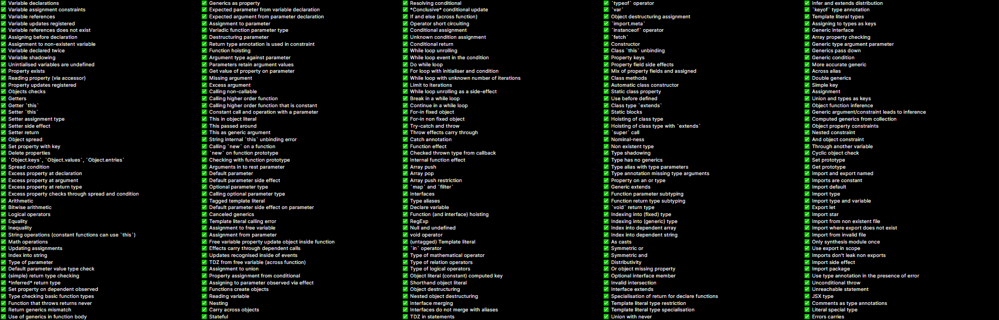

It has been nearly a year since the last post so thought it would be good to do a much-needed status of the project! **While not production-ready yet** there has been some great recent progress in the last year. **The project has passed 2000 stars, 10 external contributions and it now passes over 200 checker tests**.

If you haven't heard of it yet, Ezno is a new TypeScript type checker that experiments with deeper analysis to raise new errors and find new optimisation opportunities!

This post will go over more of the state of the compiler and tooling. While there has been some huge technical progress on the checking and compilation side, I will leave it out of this post and split the technical details across future blog posts!

### There is a new web-based playground

This can be used to try the checker. You can see some of my favourite features here
1. [Triangle number constant calculation](https://kaleidawave.github.io/ezno/playground/?id=tys5c)
2. [Tracking a value across a closure](https://kaleidawave.github.io/ezno/playground/?id=klo1s)
3. [`Object.entries`](https://kaleidawave.github.io/ezno/playground/?id=am2gw)

> Note the playground is WIP. Identifiers for sharing currently use a sequential index, which may change in the future.

> *You can also try the checker locally with the CLI from the [latest GH release](https://github.com/kaleidawave/ezno/releases)*

### The test suite

Since last year, I have started on a new collection of type-checking tests for the checker. In its latest release, the [checker passes 235 tests](https://github.com/kaleidawave/ezno/blob/main/checker/specification/specification.md)!

There have been a lot of improvements in TypeScript features: [complex subtyping](https://kaleidawave.github.io/ezno/playground/?id=ul98g), [mapped types](https://kaleidawave.github.io/ezno/playground/?id=9zle0) and [`extends` annotations](https://kaleidawave.github.io/ezno/playground/?id=tys5k). There is now a good foundation for the checker but there is a still a lot to do. There are some general JavaScript and TypeScript features to finish:

- [Inference](https://github.com/kaleidawave/ezno/issues/35) (*was working, now being redone to work around Rust's mutability*)
- [Narrowing](https://github.com/kaleidawave/ezno/issues/122) (*got some parts working, working on getting more edge cases narrowed*)
- More collection logic (`Array`, `Map`, `Set` etc) (*array methods have been added, but are yet to work perfectly*)
- Generators (*require storing and partially evaluating events*)
- For-of (*should work by de-sugaring iterator calls, but a bit complex*)
- Recursion
- Functioning queuing/non-synchronous calls and promises (*requires more unknown-ness and coordination between events*)
- [Improving how types are stored](https://github.com/kaleidawave/ezno/issues/120) (*current implementation doesn't scale for larger projects*), which should [then allow for more of the standard library to be used](https://github.com/kaleidawave/ezno/issues/121)
- `node_modules` imports (*files work, zipping source up with definition files is left to do*)

and there is a general need to improve all the different edge cases in which break the checker.

There is no time frame or deadline for these. But as long as I can continue with the current trajectory they will eventually be all good!

At the moment there are [235 passing tests](https://github.com/kaleidawave/ezno/blob/main/checker/specification/specification.md). **The hope is that the checker should be ready for simple projects at around 300 passing tests and larger projects at around 500 passing tests**. You can see a [collection of things that do not work in `to_implement.md`](https://github.com/kaleidawave/ezno/blob/main/checker/specification/to_implement.md).

> **I am looking for more contributors to the checker tests**. If you have a favourite TypeScript or JavaScript feature not included in the current specification (or `to_implement.md`) it would [be really helpful to contribute it](https://github.com/kaleidawave/ezno/issues/100)

These tests are authored as markdown and automatically built into tests that Rust can run. You can find out [how a markdown file works as a test suite here](https://github.com/kaleidawave/ezno/tree/main/checker/specification).

### New additions from contributors

Thanks to [Charles Taylor](https://github.com/CharlesTaylor7) for adding [default value checking](https://github.com/kaleidawave/ezno/pull/132) and [checking for the type of catch variables](https://github.com/kaleidawave/ezno/pull/131).

Thanks to [Lemuel DLS](https://github.com/lemueldls) for [checking the edge case for destructuring with `this`](https://github.com/kaleidawave/ezno/pull/127)

Thanks to [Patrick Laflamme](https://github.com/PatrickLaflamme) for [adding excess property checking](https://github.com/kaleidawave/ezno/pull/139) (including across conditionals which TS does not check currently as was pointed out [in a this issue](https://github.com/kaleidawave/ezno/issues/42))

and again for [setters](https://github.com/kaleidawave/ezno/pull/138)

Thanks to [Apika Luca](https://github.com/Brayan-724) for adding [`import.meta`](https://github.com/kaleidawave/ezno/pull/141)

Additionally, there have been improvements internally to the project. [Wan](https://github.com/wzwywx) [added positions to events](https://github.com/kaleidawave/ezno/pull/69) which have enabled emitting some new errors (that will be featured in the future). [Jules Guesnon](https://github.com/JulesGuesnon) added [`export type` parsing](https://github.com/kaleidawave/ezno/pull/84) and [improved the clippy configuration](https://github.com/kaleidawave/ezno/pull/91), which has helped keep things in order as the project grows. There are now [fuzzing tests for the parser](https://github.com/kaleidawave/ezno/pull/3) thanks to [Caleb Jasik](https://github.com/jasikpark) and [Addison Crump](https://github.com/addisoncrump), which has caught some problems in parser and to string-ing (turning the AST back to a string). [Nathan](https://github.com/nathanbabcock) added the parsing for [try-catch-finally](https://github.com/kaleidawave/ezno/pull/23). [markthree](https://github.com/markthree) added CJS support for the [JS library](https://github.com/kaleidawave/ezno/pull/15) and [Nicholas Roberts](https://github.com/H-Plus-Time) [added type definition generation for the JS library](https://github.com/kaleidawave/ezno/pull/114) (the type definitions have been very useful when building the playground). [You can see these contributions and more here](https://github.com/kaleidawave/ezno/pulls?q=is%3Apr+-author%3Akaleidawave+).

Despite Rust being a *non-trivial* language to author and the type checker being very complicated and entangled, I have been impressed at the contributions to the type checker and project!

#### Bad news

Unfortunately, the first half of the year has been a bad month for JavaScript type checkers. First, the [STC (speedy type checker) was abandoned](https://github.com/swc-project/swc/issues/571#issuecomment-1915966297) and now [Hegel is over](https://jsmonk.github.io/2024-01-29-last-days-of-hegel/). As someone who knows the difficulties of building a type checker, I commend the incredible work put into the two. [Hegel](https://hegel.js.org/) is especially impressive with its parameter constraint inference, which is an incredible feature [I am hoping to implement as well in the checker](https://github.com/kaleidawave/ezno/issues/35).

I am hopeful that Ezno's wider feature scope compared to STC is more of a safe option (Ezno is not exclusively focused on checking performance). While I thought Hegel made some great trade-offs to provide better checking it seemed [maybe too much for potential users](https://hegel.js.org/try#MYewdgzgLgBAJiArgIwDYFMIC4YEEBO+AhgJ4A8YiAtsuvgHwwC8MA2gLJFQAWAdAAoBJADQxOPXgFEAugG4AUPID0SmJMIh8OACokADuhgAiAsXKUadekZgBLCHbCgqerrbSGA7rZ4wo+wxNCUgpqWnwYAB8YaHxbMABza3lQSFgLcIhtEABlbhBPHFMQjLoomKg4xMYWBBQMCAVS-Czc-M9ePUQIbgAKXoAWACYASl4oXMr4hN7RkYVU6Bh8JDA4dDhmeCQPCF4qIj1+uo8R5kYTjHGQADFbAA8N3pH5+SA) compared to TSC. I will explain more of how I think you can add better checking behavior while not breaking existing valid cases allowed by TSC in future blog posts!

Also, the [ezno-checker](https://crates.io/crates/ezno-checker) is no longer included under [Oxc](https://github.com/oxc-project/oxc) and the only current way to use Ezno is through its own *toolchain*. [Oxc](https://github.com/oxc-project/oxc) is an [impressive project for performance](https://oxc-project.github.io/blog/2023-12-12-announcing-oxlint.html#_50-100-times-faster-than-eslint) but differences in timelines and targets meant that it didn't make sense to put the work in maintaining the AST bindings. That is just for the moment though, the checker crate still keeps the checking logic separate from the AST/syntax implementation. Hopefully in the future when more of the language is implemented other tooling can consider reusing or copying parts!

#### Supporting the project

I have written some [good first issues in the issue tracker](https://github.com/kaleidawave/ezno/labels/good-first-issue). If there is something you want to contribute then I can help explain certain nuances in the checker and give steps to start! You also don't need to be good at Rust to contribute, [adding more checking tests](https://github.com/kaleidawave/ezno/issues/100) is useful for knowing how to approach new features! Type checkers are hard and Rust is not an easy language to write in. However, at this stage, you can have a really big impact by adding fundamental features! I appreciate all pull requests no matter how *ready* they are (I would rather have some code that doesn't quite work than none at all).

I have [GitHub sponsors](https://github.com/sponsors/kaleidawave), which very generous people have signed up for! I have uploaded the LSP (a plugin for doing type checking in editors like vscode) to a sponsors-only repository and plan to also commit other experiments and early blog posts there. That is available at [any level of sponsorship](https://github.com/sponsors/kaleidawave) and I also plan to add code contributors to the main repository there as well!

Unfortunately, a lot has come up in the last year which is why it has been a while since the last update. Again, a lot of progress has been made internally so I hopefully can share some amazing progress on type-checking and compilation soon!
